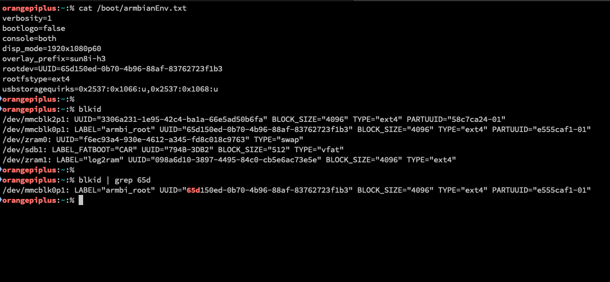

STATUS: DRAFT

## Install Raspbian on a microSD card

Download Xfce desktop (Jammy) or cli version (Bookworm) from [the archive](https://armbian.hosthatch.com/archive/orangepiplus/archive/)

Balena Etcher kept giving me errors.

Download the `.img.xz` file.

[Download usbimager](https://gitlab.com/bztsrc/usbimager)

On macOS, i got an error saying `"USBImager.app" is damaged and can't be opened.`. Could not run it even after clearing the quarantine tag `/usr/bin/xattr -crv /Applications/USBImager.app`. In the end the solution was to [run it from the Terminal with `sudo`](https://gitlab.com/bztsrc/usbimager/-/issues/149)

```bash
sudo /Applications/USBImager.app/Contents/MacOS/usbimager -v
```

Sudo runs it as root (so there should be no permission issues) and `-v` enables verbose mode where USBImager prints details to stdout. Those messages might shed some light on the issue. (However this sounds like a Mac AppKit issue rather than an USBImager issue at first.)

**Writing Image File to Device** [ref](https://gitlab.com/bztsrc/usbimager#writing-image-file-to-device)

- select an image by clicking on "..." in the 1st row
- select a device by clicking on the 3rd row
- click on the first button (Write) in the 2nd row

On Allwinner devices after switching to boot from NAND or eMMC clearing the boot loader signature on the SD card is recommended:

```bash
dd if=/dev/zero of=/dev/mmcblkN bs=1024 seek=8 count=1
```

(replace `/dev/mmcblkN` with the correct device node -- in case you run this directly after `armbian-install` without a reboot in between then it's `/dev/mmcblk0`). When booting from eMMC to get SD cards auto-detected on Allwinner legacy images please consider changing `mmc0`'s `sdc_detmode` from 3 to 1 in the board's fex file (see [here](https://forum.armbian.com/topic/1702-orange-pi-plus-2e-where-is-16ghz-and-sd/?tab=comments#comment-13163) for details).

## How to install to NAND?

While in theory writing to NAND should still be possible using `armbian-installer`, this requires running a very old 3.4.y kernel which Armbian has dropped support for several years ago. Therefore this feature is to be considered as deprecated and no support for either 3.4.y systems or NAND installations will be provided.

## Backup install on eMMC to SD Card

- `$(uname -n)-$(date +%Y%m%d)-$(uname -r).img.gz` will output`orangepiplus-20250226-6.1.63-current-sunxi.img.gz`
- `ls /dev/mmcblk*boot0 | cut -c1-12` will give you the eMMC Node (e.g. `/dev/emmcblk2`)

```bash
LOCATION="/media/amna/794B-3DB2"
sudo dd bs=4M status=progress if=$(ls /dev/mmcblk*boot0 | cut -c1-12) | gzip > ${LOCATION}/$(uname -n)-$(date +%Y%m%d)-$(uname -r).img.gz
```

## Move install to eMMC

http://www.orangepi.org/orangepiwiki/index.php/Orange_Pi_5_Plus#How_to_burn_Linux_image_to_eMMC

Find the parameters for `if` (input file) and `of` (output file)

Confirm what device is mounted with `df -h /`, `lsblk -o NAME,FSTYPE,MOUNTPOINT,SIZE` or `cat /proc/cmdline | grep root=`

```bash
sudo /usr/sbin/nand-sata-install

# reboot, then verify
sudo fdisk -l
```

```bash
# confirm the device node of eMMC
# for example: /dev/mmcblk1
ls /dev/mmcblk*boot0 | cut -c1-12 # gave me /dev/mmcblk2
```

If Orange Pi is booting from SD card then the card will be `mmcblk0` and eMMC will be `mmcblk1`. (It has to do with the hardware wiring and the order in which they're detected during boot)

- In Android / Linux kernel drivers `mmcblk` is the naming convention for eMMC flash storage block devices.

- `mmcblk0` corresponds to internal memory. partitions will be listed as `mmcblk0p1`, `mmcblk0p2` etc. If you add an SD card a new block device `mmcblk1` will become available.

If you only see `mmcblk0` and `mmcblk2`, and no `mmcblk1`, that is okay. It shows the device that you are booting from and not list the other one. `mmcblk0` will always be the device that you're booting from?

`/dev/mmcblk*boot0 | cut -c1-12` gave me `/dev/mmcblk2`

---

```bash
# Clear the eMMC
# make sure you UPDATE the of= parameter to match the output of the command above
sudo dd bs=1M if=/dev/zero of=/dev/mmcblk1 count=1000 status=progress

sudo sync
```

```bash
# copy from sd card to emmc
sudo dd bs=1M if=Orangepi5plus_x.x.x_debian_bullseye_desktop_xfce_linux5.10.110.img of=/dev/mmcblk1 status=progress

sudo sync
```

---

Yes, you can make a bootable USB with an Armbian image . Use "ddbr" then “b” to make a backup of the internal EMMC. The backup file will be in /ddbr of the USB device.

Restore that image file with "ddbr" then "r" to another device with same hardwares.

## Backup install from eMMC

## How to upgrade distribution (like Focal to Jammy or Bullseye to Bookworm)?

Fire up `armbian-config` to freeze your firmware packages (if not frozen already, select `System` and `Freeze`).  
Then follow generic upgrade instructions specific to your userspace:

- Like for Debian: [https://www.debian.org/releases/bookworm/arm64/release-notes/ch-upgrading.en.html](https://www.debian.org/releases/bookworm/arm64/release-notes/ch-upgrading.en.html)
- Or Ubuntu: launch `do-release-upgrade`

**Attention:** Userspaces distribution upgrades are neither tested nor supported. Therefore Armbian cannot provide support if something goes wrong.

https://www.cyberciti.biz/faq/apt-get-hold-back-packages-command/

## Post install troubleshooting

**Web Browser quit.**

```
failed to execute web browser input/output error
```

quiet possibly because you (see it listed under Application but) don't actually have a browser installed. Installing one should fix it.

**Failed to eject**

```
Failed to eject “XX GB Volume”.

Error ejecting /dev/sdb: Error spawning command-line ‘eject’/dev/sdb”: Failed to execute child process “eject” (No such file or directory) (g-exec-error-quark, 8).
```

One solution is to use the command line `sudo umount /pathtoyourmountpoint`. Eject is more for DVD/CD drives, which the Orange Pi does not have. If you want to eject from the file manager, you can install the missing dependency

```bash
sudo apt install eject
```

---

Example `dd` commands

- `$(uname -n)-$(date +%Y%m%d)-$(uname -r).img.gz` will output`orangepiplus-20250226-6.1.63-current-sunxi.img.gz`
- `ls /dev/mmcblk*boot0 | cut -c1-12` will give you the eMMC Node (e.g. `/dev/emmcblk2`)

```bash
LOCATION="/media/amna/794B-3DB2"
sudo dd bs=4M status=progress if=$(ls /dev/mmcblk*boot0 | cut -c1-12) | gzip > ${LOCATION}/$(uname -n)-emmc-backup-$(date +%Y%m%d)-$(uname -r).img.gz

# example emmc device: /dev/emmcblk2
# example filename: orangepiplus-20250226-6.1.63-current-sunxi.img.gz
```

```bash
dd bs=4M if=/dev/sdb | gzip > image1-`date +%d%m%y`.img.gz

# dd if=<armbian.img> of=/dev/mmcblkX

sudo dd if=/media/USB/emmc_backup.img of=/dev/mmcblk1 bs=1M conv=fsync
```

https://gitlab.com/bztsrc/usbimager

```bash
# RESTORE from eMMC to SD Card
# create a backup image
sudo dd if=/dev/mmcblk1 bs=1M status=progress | xz > /media/USB/emmc_backup.img.xz

# reset eMMC
# this will erase all data
dd if=/dev/zero of=/dev/mmcblk1

# restore from USB to eMMC
sudo dd if=/media/USB/emmc_backup.img of=/dev/mmcblk1 bs=1M conv=fsync
```

---

Backup internal eMMC with `ddbr` command

Yes, you can make a bootable USB with an Armbian image . Use "ddbr" then “b” to make a backup of the internal EMMC. The backup file will be in /ddbr of the USB device.

Restore that image file with "ddbr" then "r" to another device with same hardwares.

The backup is the emmc partition and can only be used in emmc.

When i tried to take a backup of eMMC while booting from SD card, `ddbr` gave me the error `UNABLE TO FIND YOUR EMMC DRIVE OR YOU ALREADY RUN FROM EMMC!!!`. I know I was running from SD card, and not eMMC because the operating system versions and the usernames are different on both.

```bash
dmesg | grep mmc
```

look for `ubootsource=`

Mine was `mmcblk2` when i had Armbian running from the SD Card (new) and already had it on eMMC as well (old). I was trying to backup the operating system on the eMMC before i could reset it and install on eMMC again from the SD card

Debugging Armbian

```bash
sudo armbianmonitor -u
```

```
[sudo] password for userfoo:
System diagnosis information will now be uploaded to https://paste.armbian.com/epiyudimal
Please post the URL in the forum where you've been asked for.
```

```bash
dpkg -l | egrep "armbian| linux-"
```

```
ii  armbian-bsp-cli-orangepiplus-current     23.11.1                                 armhf        Armbian CLI BSP for board 'orangepiplus' branch 'current'
ii  armbian-bsp-desktop-orangepiplus-current 23.11.1                                 armhf        Armbian bsp-desktop for release jammy, common for all desktop environments on armhf orangepiplus machines on current branch
ii  armbian-config                           23.11.1                                 all          Armbian configuration utility
ii  armbian-firmware                         23.11.1                                 all          Armbian - Linux firmware
ii  armbian-jammy-desktop-xfce               23.11.1                                 all          Armbian desktop for Ubuntu jammy xfce
ii  armbian-plymouth-theme                   23.11.1                                 all          boot animation, logger and I/O multiplexer - Armbian theme
ii  armbian-zsh                              23.11.1                                 all          Armbian improved ZShell (oh-my-zsh...)
ii  linux-base                               4.5ubuntu9                              all          Linux image base package
ii  linux-dtb-current-sunxi                  23.11.1                                 armhf        Armbian Linux current DTBs in /boot/dtb-6.1.63-current-sunxi
ii  linux-image-current-sunxi                23.11.1                                 armhf        Armbian Linux current kernel image 6.1.63-current-sunxi
ii  linux-libc-dev:armhf                     5.15.0-88.98                            armhf        Linux Kernel Headers for development
ii  linux-u-boot-orangepiplus-current        23.11.1                                 armhf        Das U-Boot for orangepiplus
```

The root device is set in a file called `armbianEnv.txt` under `/boot`

```bash
cat /boot/armbianEnv.txt
```

```
verbosity=1
bootlogo=false
console=both
disp_mode=1920x1080p60
overlay_prefix=sun8i-h3
rootdev=UUID=65d150ed-0b70-4b96-88af-83762723f1b3
rootfstype=ext4
usbstoragequirks=0x2537:0x1066:u,0x2537:0x1068:u
```

```bash
blkid
```

```
/dev/mmcblk2p1: UUID="3306a231-1e95-42c4-ba1a-66e5ad50b6fa" BLOCK_SIZE="4096" TYPE="ext4" PARTUUID="58c7ca24-01"
/dev/mmcblk0p1: LABEL="armbi_root" UUID="65d150ed-0b70-4b96-88af-83762723f1b3" BLOCK_SIZE="4096" TYPE="ext4" PARTUUID="e555caf1-01"
/dev/zram0: UUID="f6ec93a4-930e-4612-a345-fd8c018c9763" TYPE="swap"
/dev/sdb1: LABEL_FATBOOT="CAR" UUID="794B-3DB2" BLOCK_SIZE="512" TYPE="vfat"
/dev/zram1: LABEL="log2ram" UUID="098a6d10-3897-4495-84c0-cb5e6ac73e5e" BLOCK_SIZE="4096" TYPE="ext4"
```


