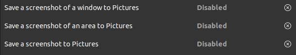
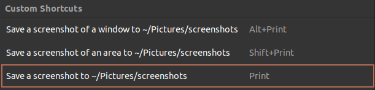

NOTE: This is no longer relevant. Ubuntu 22.04 saves screenshots in `~/Pictures/Screenshots` by default. If you're using the old `gnome-screenshot` utility, you can change the location by running `gsettings set org.gnome.gnome-screenshot auto-save-directory "/home/aamnah/Pictures/Screenshots"` and adding custom keyboard shortcuts to take your screenshots [read more](/change-default-screenshot-save-location)

---

I previously [changed default location](link-to-other-article) for where Screenshots are saved on Ubuntu. Originally, i used the GUI for changing location and setting keyboard shortcuts. Because i'm efficient, i scripted it so i could do it in the Terminal. I'm not doing 30+ GUI clicks again..

Here are the custom keyboard shortcuts we'll be adding

| Shortcut                          | Description                                             | gnome-screenshot command | Key mapping    |
| --------------------------------- | ------------------------------------------------------- | ------------------------ | -------------- |
| <kbd>Alt</kbd>+<kbd>Print</kbd>   | Save a screenshot of a window to ~/Pictures/screenshots | `gnome-screenshot -w`    | `<Alt>Print`   |
| <kbd>Shift</kbd>+<kbd>Print</kbd> | Save a screenshot of an area to ~/Pictures/screenshots  | `gnome-screenshot -a`    | `<Shift>Print` |
| <kbd>Print</kbd>                  | Save a screenshot to ~/Pictures/screenshots             | `gnome-screenshot`       | `Print`        |

---

Here's the full script

```bash
#!/bin/bash

###################################################################
#         Author: Aamnah Akram
#           Link: http://github.com/aamnah/bash-scripts
#    Description: Changes the directory where screenshots are saved
#            Run:
###################################################################

update_screenshots_directory() {
  # 1. Set custom path for Screenshots
  #-------------------------------------------------------------------
  SCREENSHOT_SAVE_LOCATION="${HOME}/Pictures/Screenshots"

  # make sure the save location exists
  mkdir ${SCREENSHOT_SAVE_LOCATION}

  # update location
  # gsettings set org.gnome.gnome-screenshot auto-save-directory "file:///${SCREENSHOT_SAVE_LOCATION}"
  gsettings set org.gnome.gnome-screenshot auto-save-directory "${SCREENSHOT_SAVE_LOCATION}"
}

disable_default_screenshot_keyboard_shortcuts() {
  # Optioal: Disable default key mapping
  # You can do it by passing an empty array
  gsettings set org.gnome.settings-daemon.plugins.media-keys window-screenshot []
  gsettings set org.gnome.settings-daemon.plugins.media-keys area-screenshot []
  gsettings set org.gnome.settings-daemon.plugins.media-keys screenshot []
}

add_custom_shortcuts() {
  # 2. Add custom key mappings to the list of shortcuts
  #-------------------------------------------------------------------
  # Make sure you don't already have keyboard
  # gsettings set org.gnome.settings-daemon.plugins.media-keys custom-keybindings "[<altered_list>]"
  #['/org/gnome/settings-daemon/plugins/media-keys/custom-keybindings/custom0/', '/org/gnome/settings-daemon/plugins/media-keys/custom-keybindings/custom1/']

  # TODO: append custom shortcuts to the list
  # while making sure any existing ones aren't affected
}

configure_custom_shortcuts() {
  # 3. Cofigure each custom shortcut
  #-------------------------------------------------------------------
  # custom1
  gsettings set org.gnome.settings-daemon.plugins.media-keys.custom-keybinding:/org/gnome/settings-daemon/plugins/media-keys/custom-keybindings/custom1/ name 'Save a screenshot to ~/Pictures/screenshots'
  gsettings set org.gnome.settings-daemon.plugins.media-keys.custom-keybinding:/org/gnome/settings-daemon/plugins/media-keys/custom-keybindings/custom1/ command 'gnome-screenshot'
  gsettings set org.gnome.settings-daemon.plugins.media-keys.custom-keybinding:/org/gnome/settings-daemon/plugins/media-keys/custom-keybindings/custom1/ binding 'Print'

  # custom2
  gsettings set org.gnome.settings-daemon.plugins.media-keys.custom-keybinding:/org/gnome/settings-daemon/plugins/media-keys/custom-keybindings/custom2/ name 'Save a screenshot of an area to ~/Pictures/screenshots'
  gsettings set org.gnome.settings-daemon.plugins.media-keys.custom-keybinding:/org/gnome/settings-daemon/plugins/media-keys/custom-keybindings/custom2/ command 'gnome-screenshot -a'
  gsettings set org.gnome.settings-daemon.plugins.media-keys.custom-keybinding:/org/gnome/settings-daemon/plugins/media-keys/custom-keybindings/custom2/ binding '<Shift>Print'

  # custom3
  gsettings set org.gnome.settings-daemon.plugins.media-keys.custom-keybinding:/org/gnome/settings-daemon/plugins/media-keys/custom-keybindings/custom3/ name 'Save a screenshot of a window to ~/Pictures/screenshots'
  gsettings set org.gnome.settings-daemon.plugins.media-keys.custom-keybinding:/org/gnome/settings-daemon/plugins/media-keys/custom-keybindings/custom3/ command 'gnome-screenshot -w'
  gsettings set org.gnome.settings-daemon.plugins.media-keys.custom-keybinding:/org/gnome/settings-daemon/plugins/media-keys/custom-keybindings/custom3/ binding '<Alt>Print'
}

update_screenshots_directory
disable_default_screenshot_keyboard_shortcuts
add_custom_shortcuts
configure_custom_shortcuts
```

---

Configuring one custom shortcut involves setting a `name`, `command` and `binding`

```bash
# CUSTOM
# Setting one custom shortcut (name, command, binding)
# name
gsettings set org.gnome.settings-daemon.plugins.media-keys.custom-keybinding:/org/gnome/settings-daemon/plugins/media-keys/custom-keybindings/custom1/ name '<newname>'
# command
gsettings set org.gnome.settings-daemon.plugins.media-keys.custom-keybinding:/org/gnome/settings-daemon/plugins/media-keys/custom-keybindings/custom1/ command '<newcommand>'
# key combination
gsettings set org.gnome.settings-daemon.plugins.media-keys.custom-keybinding:/org/gnome/settings-daemon/plugins/media-keys/custom-keybindings/custom1/ binding '<key_combination>'
```

| Key   | Mention                    | Description                                                                                      |
| ----- | -------------------------- | ------------------------------------------------------------------------------------------------ |
| PrtSc | `Print`                    |                                                                                                  |
| Shift | `<Shift>`                  |                                                                                                  |
| Alt   | `<Alt>`                    |                                                                                                  |
| Ctrl  | `<Control>` or `<Primary>` |                                                                                                  |
| Super | `<Super>`                  | The logo or system key, `⊞ Win` on Windows, `⌘ Command` on Macs, magnifying glass on Chromebooks |

You can get a list of ALL keyboard shortcuts (their keys and values) with the following command

```bash
gsettings list-recursively org.gnome.settings-daemon.plugins.media-keys
```

and the keys and values for a custom command (e.g. `custom1`) with

```bash
gsettings list-recursively org.gnome.settings-daemon.plugins.media-keys.custom-keybinding:/org/gnome/settings-daemon/plugins/media-keys/custom-keybindings/custom1/
```

```bash
org.gnome.settings-daemon.plugins.media-keys.custom-keybinding command 'gnome-screenshot -a'
org.gnome.settings-daemon.plugins.media-keys.custom-keybinding name 'Save a screenshot of an area to ~/Pictures/screenshots'
org.gnome.settings-daemon.plugins.media-keys.custom-keybinding binding '<Shift>Print'
```

### Disabling default screenshot shortcuts

These are the default screenshot shortcuts which i'm disabling

```bash
# Defaults enabled
org.gnome.settings-daemon.plugins.media-keys window-screenshot ['<Alt>Print']
org.gnome.settings-daemon.plugins.media-keys area-screenshot ['<Shift>Print']
org.gnome.settings-daemon.plugins.media-keys screenshot ['Print']
```

The values will become this after they are disabled

```bash
# Disabled
org.gnome.settings-daemon.plugins.media-keys window-screenshot @as []
org.gnome.settings-daemon.plugins.media-keys area-screenshot @as []
org.gnome.settings-daemon.plugins.media-keys screenshot @as []
```




You can restore defaults with

```bash
# Restore default Screenshot shortcuts
gsettings reset org.gnome.settings-daemon.plugins.media-keys window-screenshot
gsettings reset org.gnome.settings-daemon.plugins.media-keys area-screenshot
gsettings reset org.gnome.settings-daemon.plugins.media-keys screenshot
```

### dconf settings after making all the changes

```sh
[org/gnome/settings-daemon/plugins/media-keys]
area-screenshot=@as []
custom-keybindings=['/org/gnome/settings-daemon/plugins/media-keys/custom-keybindings/custom0/', '/org/gnome/settings-daemon/plugins/media-keys/custom-keybindings/custom1/', '/org/gnome/settings-daemon/plugins/media-keys/custom-keybindings/custom2/']
screenshot=@as []
window-screenshot=@as []

[org/gnome/settings-daemon/plugins/media-keys/custom-keybindings/custom0]
binding='Print'
command='gnome-screenshot'
name='Save a screenshot to ~/Pictures/screenshots'

[org/gnome/settings-daemon/plugins/media-keys/custom-keybindings/custom1]
binding='<Shift>Print'
command='gnome-screenshot -a'
name='Save a screenshot of an area to ~/Pictures/screenshots'

[org/gnome/settings-daemon/plugins/media-keys/custom-keybindings/custom2]
binding='<Alt>Print'
command='gnome-screenshot -wb'
name='Save a screenshot of a window to ~/Pictures/screenshots'
```

## Relevant

- [dconf and gsettings notes](/dconf-gsettings-notes)

## Links

- [Docs: Keybindings](https://wiki.ubuntu.com/Keybindings)
- [How to set custom keyboard shortcuts from terminal?](https://askubuntu.com/a/597414/897311)
