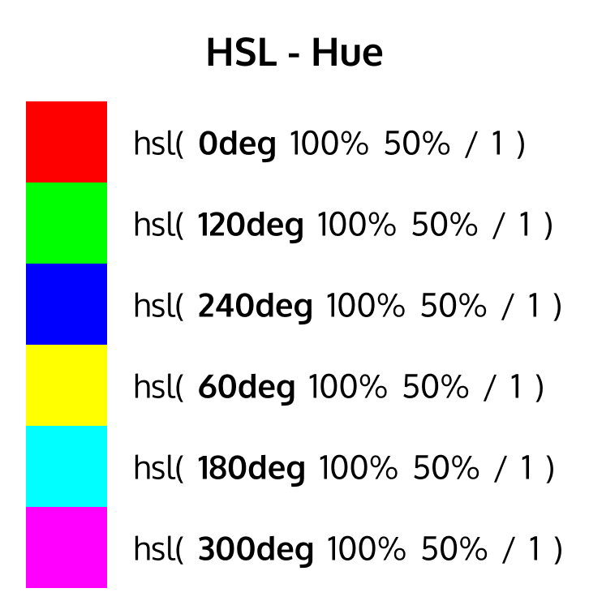
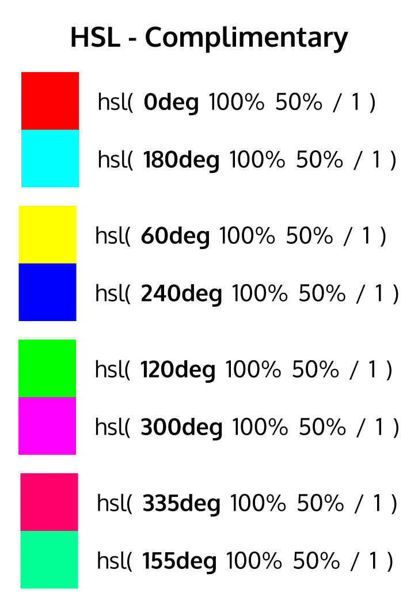
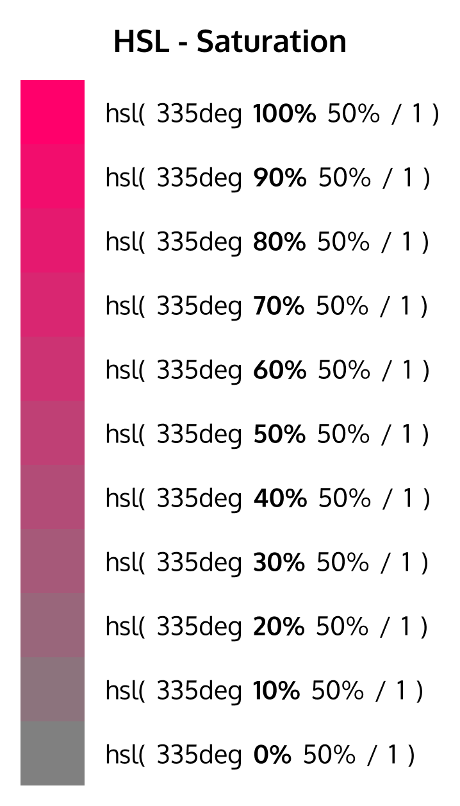
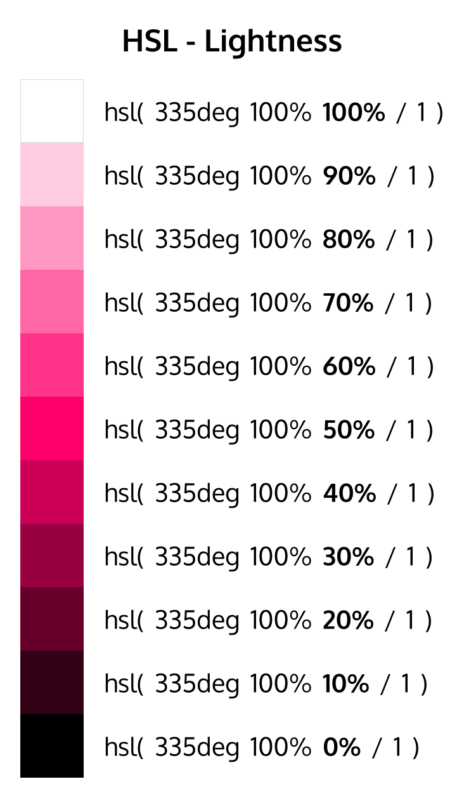
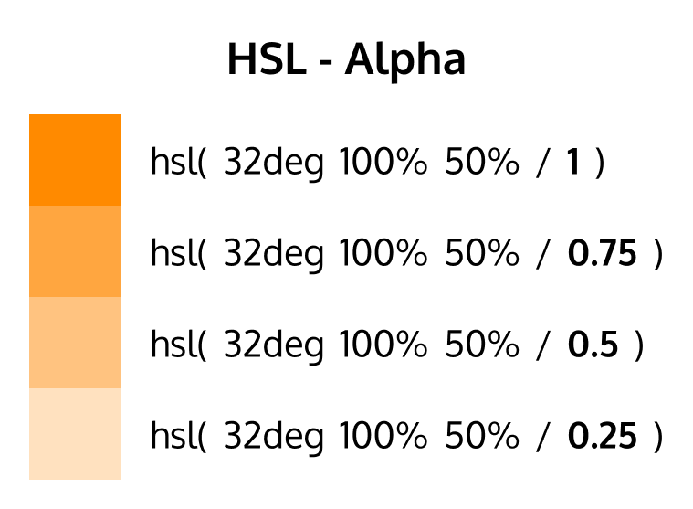

### But why?

- working with opacity is really simple, just provide the `alpha` value (0-1 or 0%-100%)
- getting complimentary colors on the wheel is really simple, just subtract your hue value from 180 `180deg+hue` if hue is less than 180, and `180deg-hue` if hue is less than 180
- getting lighter/darker colors for soft backgrounds or borders or box shadows is really simple, just change the _saturation_ or _lightness_. This would usually require a color function like `lighten()` or `darken()` in Sass. 
- You can get 10 different values for an entire gray scale with basic increments/decrements of 10%. Same for any other color. No need to go to _Figma_ to get the colors or using _Sass_ color function to do the calculation

There are two syntaxes. The modern one was introduced in 2016 and is widely supported. The other one works in IE.

```css
/* 
Modern syntax introduced in 2016
space separated values
opacity is provided to hsl() as the fourth value and can be written after a `/` separator

hsl(hue saturation lightness / opacity)
hsl(hue, saturation, lightness, opacity)
*/
.colorful-thing {
  color: hsl(200deg 100% 50%);
  border-bottom: 3px solid hsl(100deg 75% 50% / 0.2);
}
```

```css
/* 
IE supported 
comma separated values
opacity can only be provided with hsla()

hsl(hue, saturation, lightness)
hsla(hue, saturation, lightness, opacity)
 */
.colorful-thing {
  color: hsl(200deg, 100%, 50%);
  background-color: hsla(200deg, 100%, 50%, 0.2);
}
```

> HSL stands for hue, saturation, and lightness - and represents a **cylindrical-coordinate representation of colors**.

It helps if you imagine the color picker as a wheel instead of a slider.


##### hue	
Defined the color pigment as a degree on the color wheel (from 0 to 3359)
  - 0 (or 360) is red
  - 120 is green 
  - 240 is blue





##### saturation	
Defines the saturation percentage on Y-axis, deciding how vibrant the color should be
  - `0%` is completely unsaturated (gray)  
  - `100%` is the full color (full saturation)



##### lightness	
Defines the lightness percentage on X-axis, deciding how light or dark the color should be
  - `0%` is black
  - `50%` is normal
  - `100%` is pure white



##### opacity 
Defined the alpha value (transparency)
  - `1` or `100%` is fully opaque
  - `0` or `0%` is fully transparent
  - `0.5` or `50%` is translucent



Code sample

```html
<div class="first box"></div>
<div class="second box"></div>
<div class="third box"></div>
<div class="fourth box"></div>
```

```css
.box {
  width: 50px;
  height: 50px;
}

.first.box {
  background-color: hsl(335deg 100% 50% / 1);
}
.second.box {
  background-color: hsl(335deg 100% 50% / 0.75);
}
.third.box {
  background-color: hsl(335deg 100% 50% / 0.5);
}
.fourth.box {
  background-color: hsl(335deg 100% 50% / 0.25);
}
```


```css
.green { background-color:hsl(120,100%,50%); } 
.green-dark { background-color:hsl(120,100%,25%); }
.green-light { background-color:hsl(120,100%,75%); }
.green-pastel { background-color:hsl(120,60%,70%); }
```

Links
---

- [MDN: hsl()](https://developer.mozilla.org/en-US/docs/Web/CSS/color_value/hsl)