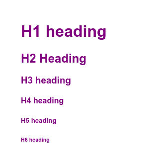

**tl;dr**

#### Sass variables
- can not be manipulated in JavaScript
- do not work for media query values
- sass variables, when re-assigned values, do not update all instances of that variable with the new value. if a value has been assigned, and _used_, 3 times before being assigned a 4th time, you will have 4 different values for the same `$variable`. (Example code below referenced from the Sass docs)

#### CSS variables
- do not work in Sass color functions


> CSS custom properties are much more powerful than pre-processor ones, as they can be changed at runtime with javascript and be used in all sorts of awesome ways, but when you're using them as regular variables, pre-processor variables are always better for compatibility. [ref](https://stackoverflow.com/a/48615476)

Here's an excerpt on the difference between the two from the [Sass documentation on variables](https://sass-lang.com/documentation/variables):

> CSS has variables of its own, which are totally different than Sass variables. Know the differences!
>  - Sass variables are all compiled away by Sass. CSS variables are included in the CSS output.
> - CSS variables can have different values for different elements, but Sass variables only have one value at a time.
> - Sass variables are _imperative_, which means if you use a variable and then change its value, the earlier use will stay the same. CSS variables are _declarative_, which means if you change the value, it’ll affect both earlier uses and later uses.


```scss
$color-text: black;

h1 { color: $color-text; }
h2 { color: $color-text; }
h3 { color: $color-text; }

$color-text: purple;

h4 { color: $color-text; }
h5 { color: $color-text; }
h6 { color: $color-text; }
```

will generate

```css
h1 { color: black; }
h2 { color: black; }
h3 { color: black; }
h4 { color: purple; }
h5 { color: purple; }
h6 { color: purple; }
```


`h1`, `h2`, `h3` will be black, and `h4`, `h5`, `h6` will be purple. 

Whereas the following CSS code with CSS custom properties

```css
:root { --color-text: black; }

h1 { color: var(--color-text); }
h2 { color: var(--color-text); }
h3 { color: var(--color-text); }

:root { --color-text: purple; }

h4 { color: var(--color-text); }
h5 { color: var(--color-text); }
h6 { color: var(--color-text); }
```

will result in 

```css
h1 { color: purple; }
h2 { color: purple; }
h3 { color: purple; }
h4 { color: purple; }
h5 { color: purple; }
h6 { color: purple; }
```



All links will be purple.

This difference between imperative and declarative matters when you're building themes and typography systems

Links
---

- [Sass Docs: Variables](https://sass-lang.com/documentation/variables)
- [Why we prefer CSS Custom Properties to SASS variables](https://codyhouse.co/blog/post/css-custom-properties-vs-sass-variables)
- [CodePen: CSS custom properties - declarative](https://codepen.io/aamnah/pen/yLEPgBP)
- [Sass variables - imperative](https://codepen.io/aamnah/pen/YzvENZP)