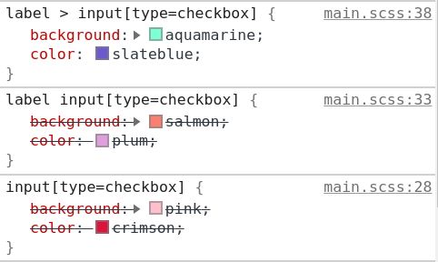

Here's a quick run down of child and sibling selectors

- `>` child combinator selector (direct descendant)
- `+` adjacent sibling combinator (directly after)
- `~` general sibling combinator (anywhere after as long as it's on the same level)

the `+` is for adjacent sibling elements. `checkbox[type='radio']:checked + label` will actually select the `label` next to the `radio` input that is `checked`.

#### Specificity

```css
/* Block 1 */
input[type='checkbox']:checked {
  background: pink;
  color: crimson;
}

/* Block 2 */
label input[type='checkbox'] {
  background: salmon;
  color: plum;
}

/* Block 3 */
label > input[type='checkbox'] {
  background: aquamarine;
  color: slateblue;
}
```

Which style block will be applied?



The order of specificity is this:

- `input[type='checkbox']:checked`

```css
p + p {
  font-size: smaller;
} /* Selects all paragraphs that follow another paragraph */
#title + ul {
  margin-top: 0;
} /* Selects an unordered list that directly follows the element with ID title */
```

```css
/* 
Descendant selector
will select any li inside ui
 */
ul li {
  margin: 0 0 5px 0;
}

/* 
Child combination selector
direct descendants, looks only 1 level down
 */
ul > li {
  margin: 0 0 5px 0;
}
```

## Links

- [Child and Sibling Selectors](https://css-tricks.com/child-and-sibling-selectors/)
