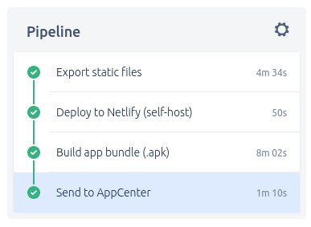
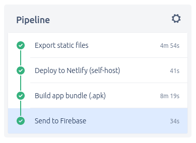

- Expo lets you deploy and test your app
- Bitbucket Pipelines lets you run commands in a Docker container

### `bitbucket-pipelines.yml`

`bitbucket-pipelines.yml` is the file that you need to commit to the root of your repo in order to enable Pipelines. I'd recommend going to the Pipelines page for your repo and generate one from there. It'll commit it to your repo and you can edit the configuration later in your code editor. 


### Variables in your pipeline

You can set your variables and their values under Repository Settings (and other places). They'll be available for you to reference in your scripts like so

```
$AWS_SECRET
```

You can only set Repository Variables after you have added the `bitbucket-pipelines.yml` file

### Configuration

Here's my `bitbucket-pipelines.yml` file:

- The file is heavily commented to give an idea of what's happening at each step and why
- I'm deploying `master`, `develop` and `feature/*` branches on Bitbucket to `production`, `staging`, `test` channels on Expo respectively.
- Because i have mentioned `deployment` values, the builds will also show under the _Deployments_ page in Bitbucket, giving you an overview of all your deployments.
- You can configure deployment environments under _Settings > Deployemnt_
- I'm not using tests at the moment so the _Test with Jest_ step is fairly useless. But i have left it there for reference later.
- Inside the Docker _build container_, you can install any app and run any command you want. This gives you a lot of freedom when defining your `script`

```yaml
# This is the build configuration for React Native Expo project using Bitbucket Pipelines.
# Configuration options: https://confluence.atlassian.com/bitbucket/configure-bitbucket-pipelines-yml-792298910.html
# Only use spaces to indent your .yml configuration.
# -----
# You can specify a custom docker image from Docker Hub as your build environment.
---
image: node:latest

definitions:
  caches: # configure caches to speed up builds. more: https://confluence.atlassian.com/bitbucket/caching-dependencies-895552876.html
    npm: '${HOME}/.npm'
    jest: .jest

pipelines: # contains all your pipeline definitions. you can define multiple pipelines in the configuration file
  default: # contains the steps that run on every push for any branche that isn't specifically added in this config.
    - step: # each step starts a new Docker container with a clone of your repository, then runs the contents of your script section.
        name: Test with Jest
        caches:
          - npm
          - jest
        script: # a list of commands that are executed in sequence.
          - npm ci
          # - npx jest --ci

  branches:
    master: # This script runs only on commit to the master branch.
      - step:
          name: Deploy to Expo # https://exp.host/@USERNAME/PROJECT?release-channel=CHANNEL
          deployment: production # used in the Deployments dashboard. Valid values are: test, staging, or production.
          caches:
            - npm # keep the npm cache around to speed up installs
          script:
            # Modify the commands below to build your Expo project
            - unset NPM_CONFIG_USER # see: https://github.com/expo/sentry-expo/pull/26#issuecomment-453822980
            - npm ci # ci = clean install
            - npm i -g --unsafe-perm expo-cli # install Expo globally cz npx wasn't working
            - expo login -u ${EXPO_USERNAME} -p ${EXPO_PASSWORD} # Use variables defined in Repository Settings
            - expo publish --non-interactive --clear --release-channel production

    develop: # This script runs only on commits to develop branch
      - step:
          name: Deploy to Expo
          deployment: staging
          caches:
            - npm
          script:
            - unset NPM_CONFIG_USER
            - npm ci
            - npm i -g --unsafe-perm expo-cli
            - expo login -u ${EXPO_USERNAME} -p ${EXPO_PASSWORD}
            - expo publish --non-interactive --clear --release-channel staging

    feature/*: # This script runs only on commit to branches with names that match the feature/* pattern.
      - step:
          name: Deploy to Expo
          deployment: test
          caches:
            - npm
          script:
            - unset NPM_CONFIG_USER
            - npm ci
            - npm i -g --unsafe-perm expo-cli
            - expo login -u ${EXPO_USERNAME} -p ${EXPO_PASSWORD}
            - expo publish --non-interactive --clear --release-channel test
```



### Notes

- Ended up using `latest` instead of `alpine` to get rid of common issues like git not being installed and such
- Had to add `unset NPM_CONFIG_USER` because of Sentry's permission errors during install
- Publishing to Expo with `--clear` to make sure it clears the bundler's cache and doesn't deploy cached stuff
- Ended up instaling `expo-cli` globally and not running `npx` because of errors
- The entire build takes `4m 09s` for me
- If you have Gitflow setup and are used to creating `feature` branches, make sure you push (and edit) your `bitbucket-pipelines.yml` in the `master` branch. Otherwise you'll end up doing a lot of cherry-picking like me to get the changes back in master to see if the pipeline worked..

### Trubleshooting

Ended up troubleshooting quite a bit as the build kept failing. It's different running things in Docker containers..

##### Sentry issues

```
Bitbucket Pipeline: Error: EACCES: permission denied, mkdir '/root/.npm/sentry-cli' #47
```

resolved by adding `unset NPM_CONFIG_USER` before runnig any `npm` install commands

##### Opencollective

```
sh: ./node_modules/.bin/opencollective: not found
```

It's some stupid dependency of a dependency to invite people to donate, causing CI/CD scripts to fail. `react-native-router-flux` uses it.. see [npm install fails on 1.0.4](https://github.com/opencollective/opencollective-cli/issues/3). The workaround was to install the bloody thing manually before installing the rest of the packages and make it shutup.

```bash
npm i opencollective
# or following depending on what version a package is depending on
# npm i opencollective-postinstall
```

I ended up removing `react-native-router-flux` altogether from my project because:

- It's not being actively developed, last change was to a beta version in 2017..
- I can't use the same knowledge for my React web projects - _learn once, route anywhere principle_.
- npm ads will be [banned](https://www.zdnet.com/article/npm-bans-terminal-ads/)
- It's causing my build to fail!

##### Expo

Got the following error when trying to run Expo commands with `npx`. 

```
This command requires Expo CLI.
Do you want to install it globally [Y/n]? 
```

Resolved this by not using `npx` and installing Expo globally

### NOTES

- You can manually `trigger` deploys for branches that are not `master` to save up on your 50 free build minutes per month.

Links
---

- [Get started with Bitbucket Pipelines](https://confluence.atlassian.com/bitbucket/get-started-with-bitbucket-pipelines-792298921.html)
- [Variables in pipelines](https://confluence.atlassian.com/bitbucket/variables-in-pipelines-794502608.html)
- [Configure bitbucket-pipelines.yml](https://confluence.atlassian.com/bitbucket/configure-bitbucket-pipelines-yml-792298910.html)