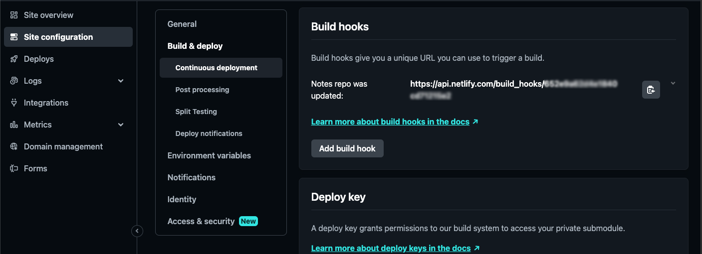
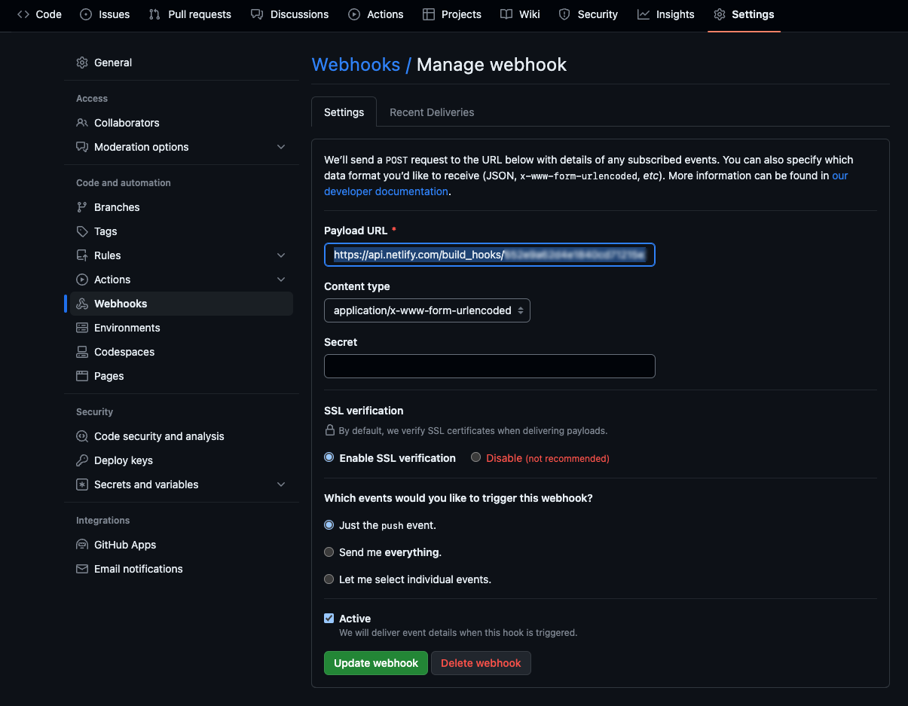
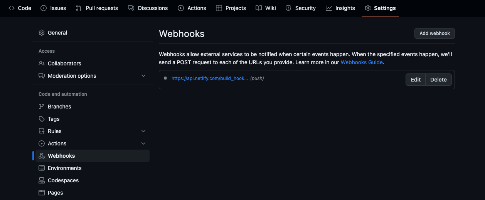
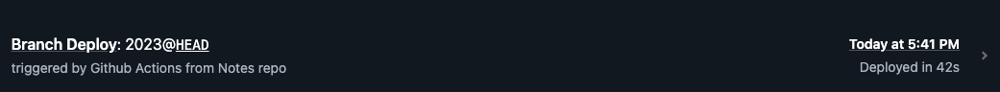

## Why?
I have a separate repo linked to my Hugo site as a Hugo module. That repo contains all the content for my notes section and is separate from the repo for my main website. The main website gets automatically deployed by Netlify.

What does not happen right now is that whenever i update the content for the notes section, the main site does not get updated as a deployment is not triggered by Netlify.

## How?
**Build hooks**. Build hooks give you a unique URL you can use to trigger a build.

Netlify allows you to trigger deploys when a webhook is called, and Github allows you to call webhooks after a `push` is made. We link the two and that should take care of triggering deploys for us.


You can find Netlify build hooks on [Site configuration > Build & deploy > Continuous deployment > Build hooks](https://app.netlify.com/sites/aamnah/configuration/deploys#build-hooks)

Create a new hook in Netlify



Add a webhook in Github repo settings so that it notifies Netlify when changes are pushed to the repo





You can pass URL parameters to the URL too. I added a `trigger_title=triggered+by+Github+Actions+from+Notes+repo`

```bash
https://api.netlify.com/build_hooks/5c23354f454e2580f8543e24?trigger_title=triggered+by+Github+Actions+from+Notes+repo
```




Links
---

- [Github Webhooks](https://docs.github.com/en/webhooks)
- [Netlify Build hooks](https://docs.netlify.com/configure-builds/build-hooks/)