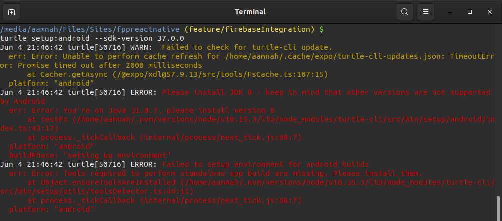
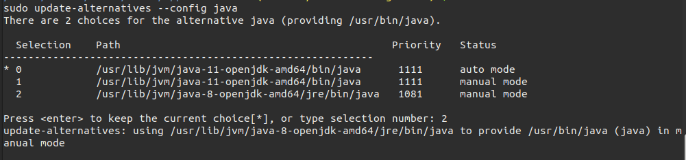

**tl;dr**

1. Get a secure URL to publish project to `ngrok http 127.0.0.1:8080 -host-header="127.0.0.1:8080"`
1. Export project to secure URL `rm -rf dist/ && expo export --public-url https://XXXXXXXXXXXX.ngrok.io`
1. Run project on secure local server `cd dist/ && npx http-server` and confirm it's running `curl https://XXXXXXXXXXXX.ngrok.io/android-index.json`
1. Build project using `turtle-cli` with `--public-url` pointing to the secure server

```bash
EXPO_ANDROID_KEYSTORE_PASSWORD="XXXXXXXX" \
EXPO_ANDROID_KEY_PASSWORD="XXXXXXXX" \
turtle build:android \
  --keystore-path /PATH/TO/YOUR/KEYSTORE_FILE.jks \
  --keystore-alias PUT_KEYSTORE_ALIAS_HERE
  --public-url https://XXXXXXXXXXXX.ngrok.io/android-index.json
```

---

Right now when you run the expo build command, it puts you into a queue, and stores the build on Expo servers. I obviously don't want that because a queue slows me down (the build keeps failing..) and once the build is done i have to manually download it in order to be able to upload it somewhere else..

The answer to this is [turtle](https://github.com/expo/turtle), the standalone app builder service by Expo

```bash
npm install -g turtle-cli

turtle setup:android --sdk-version 37.0.0
```

On first run it'll start downloading and installing Android SDK, which will take a good while (download took 4 minutes.. install for Android SDK went on for ~70 minutes.. after which i gave gave up.. ).

## Export app

Run a local server and note the URL, i used `http-server` whose default URL is `http://127.0.0.1:8080`. Then use `ngrok` to serve that over an HTTPS link. (I tried running http-server with SSL but got a `Error: self signed certificate` in the end)

```bash
# run http-server
npx http-server

# run ngrok over http-server to get an HTTPS secure URL
ngrok http 127.0.0.1:8080 -host-header="127.0.0.1:8080"
```

Copy the `https` forwarding URL `ngrok` gives you. For example: `https://XXXXXXXXXXXX.ngrok.io`

```bash
#expo export --dev --public-url http://127.0.0.1:8080
expo export --public-url https://XXXXXXXXXXXX.ngrok.io
```

Exporting takes less than a minute..

(the `--dev` is supposed to get rid of `--public-url must be a valid HTTPS URL.` error, which it doesn't..)

```
dist
├── android-index.json
├── assets
│   ├── 02bc1fa7c0313217bde2d65ccbff40c9
│   ├── 0886a6b127c6057cee83f9c65c7ffd62
│   ├── 09dd345dbd4ec5a0874841d5749ac153
│   ├── fdc01171a7a7ea76b187afcd162dee7d
│   └── ff31215218cf59699e34b7db3a479e6c
├── bundles
│   ├── android-28379830c4e0f74b22adc7bd243f273d.js
│   └── ios-802a95f67ffeeffac160346ff41e54a1.js
└── ios-index.json
```

Run the exported app `dist/` on local server and confirm it's running ..

```bash
cd dist/
npx http-server
curl https://XXXXXXXXXXXX.ngrok.io/android-index.json
```

```bash
#cd dist/

# create a key and run http-server with SSL
#openssl req -newkey rsa:2048 -new -nodes -x509 -days 3650 -keyout key.pem -out cert.pem
#npx http-server -S -C cert.pem
```

NOTE: I went with publishing the app using a Netlify URL. And the site gets automatically published when i push code to the repo.. No fussing with `ngrok` and `http-server` (which are both local). This URL is called by the app, so it needs to be publicly available over the internet.. Something like `http://build.myapp.com` is awesome

## Build

If you have previously published an Android app with Expo, get the keystore

```bash
expo fetch:android:keystore
```

```
Keystore credentials
  Keystore password: xxxxxxxxxxxxxx98a9a42e1cxxxxxxxx
  Key alias:         xxxxxxxxxxxxxxxxxxxxxnBwcmVhY3Ruxxxxxxxx
  Key password:      xxxxxxxxxxxxxxxxxxxxxx9bcxxxxxxx

  Path to Keystore:  /media/aamnah/Files/Sites/fppreactnative/fppreactnative.jks
```

From the project root, run the following

```bash
EXPO_ANDROID_KEYSTORE_PASSWORD="XXXXXXXX" \
EXPO_ANDROID_KEY_PASSWORD="XXXXXXXX" \
turtle build:android \
  --keystore-path /PATH/TO/YOUR/KEYSTORE/XXXXXXXX.jks \
  --keystore-alias PUT_KEYSTORE_ALIAS_HERE
  --public-url https://XXXXXXXXXXXX.ngrok.io/android-index.json
```

- The `--public-url` here is the secure URL we git with `ngrok` which is forwarding to `https-server` running inside `dist/`
- This will generate an app bundle `.aab` file. To get an APK, pass it as a flag `--type apk`

Build failed after 10 minutes.. =( [Removed `~/.turtle/workingdir`](https://github.com/expo/turtle/issues/92#issuecomment-501234902) and ran the build again. Build failed again because of node version incompatibility. Upgraded node and ran the build again.. Build failed because of an invalid keystore error.. Fixed that, ran the build again. Success! Took around 5 minutes to give me an app bundle `.aab` file. Yesssss!

The build is saved inside a folder called `expo-apps` inside the user's `Home` directory (Ubuntu).

## Java 8

You need to install Java 8 SDK as `turtle-cli` [only works with JDK 8](https://github.com/expo/turtle/issues/45#issuecomment-484444687). I had 11.0.7 (openjdk) installed on my Ubuntu machine..



The easy way is to install `openjdk` and change your Java version

```bash
sudo apt install -y openjdk-8-jdk-headless openjdk-8-jre
```

```bash
sudo update-alternatives --config java
```



The more complicated way is to download it from the Oracle website. See [this gist] for instructions on how to download without having to create and login to an Oracle account. Basically, you go to the downloads page, click the download you want, accept the checkbox for license, and instead of clicking the green download button you copy link location, and then you change the `otn` part to `otn-pub` and open that link in order to download.. (blekh)

```
https://download.oracle.com/otn-pub/java/jdk/8u251-b08/3d5a2bb8f8d4428bbe94aed7ec7ae784/jdk-8u251-linux-x64.tar.gz
https://download.oracle.com/otn-pub/java/jdk/8u251-b08/3d5a2bb8f8d4428bbe94aed7ec7ae784/jdk-8u251-windows-x64.exe
```

## Troubleshooting

```
ERROR: Failed to build standalone app
  err: Error: --public-url is invalid - only HTTPS urls are supported
```

Using `--dev` exports the app but i kept getting error when trying to build standalone app with turtle. Ended up installing `http-server` in order to [configure SSL](https://github.com/http-party/http-server#tlsssl).

```
Jul 1 11:22:10 turtle[424759] ERROR: Failed to build standalone app
  err: Error: Couldn't find app.json.
      at Object.loadAppJSON (/home/aamnah/.nvm/versions/node/v12.18.0/lib/node_modules/turtle-cli/src/bin/utils/project.ts:14:11)
      at /home/aamnah/.nvm/versions/node/v12.18.0/lib/node_modules/turtle-cli/src/bin/utils/builder.ts:77:23
      at Command.<anonymous> (/home/aamnah/.nvm/versions/node/v12.18.0/lib/node_modules/turtle-cli/src/bin/index.ts:23:12)
  platform: "android"
```

Turtle only works with `app.json` and not `app.config.js` or `app.config.ts`. Changed back to `app.json` and it worked.

## Links

- [Building Standalone Apps on Your CI](https://docs.expo.io/distribution/turtle-cli/)
- [Turtle CLI](https://github.com/expo/turtle)
- [Build Standalone Expo .apk and .ipa with Turtle CLI](https://www.robincussol.com/build-standalone-expo-apk-ipa-with-turtle-cli/)
- [turtle build creating apk with old version](https://forums.expo.io/t/turtle-build-creating-apk-with-old-version/37135/4)
- [Expo: Hosting An App on Your Servers](https://docs.expo.io/distribution/hosting-your-app/)
- [Bitbucket pipeline reuse of code](https://community.atlassian.com/t5/Bitbucket-questions/Bitbucket-pipeline-reuse-of-code/qaq-p/1134797)
- [App Center: API-First CI/CD for iOS and Android App Development](https://devblogs.microsoft.com/appcenter/app-center-api-first-cicd-for-ios-and-android-app-development/)
- [AppCenter CLI](https://github.com/Microsoft/appcenter-cli)
