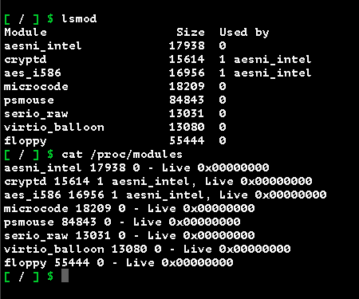

Building on previous lessons in this section, we will learn how to probe our kernel with the appropriate device driver and determine whether it is loaded and functioning as expected. We will also discuss how we can use the configuration of modprobe to blacklist or prevent some device drivers from loading even if the hardware is present on our system as well as why we might need to do that.

### modprobe

```bash
modprobe -l # list modules
modprobe -r moduleName # remove modules e.g. `modprobe -r floppy`
modprobe moduleName # insert modules e.g. `modprobe floppy`
```

- `modprobe -l` works on CentOS 6.6 and Ubuntu 12 or before.
- `modprobe`, unlike `insmod` can add modules without specifying complete module file paths. `modprobe` fully understands where the kernel modules are installed on the system.
- When compiling our kernel, we used to be able to use `modprobe` to not only insert and remove modules but also query (list) the modules that were already installed on the system (by using `modprobe -l`).
- `modprobe` is replaced by `lsmod` in modern systems (CentOS 7, RHEL 7, Ubuntu 13+, basically any modern distribution that has come out in late 2014, early 2015). We can still use `modprobe` to remove modules though.
- Modern systems are unifying the toolset into anything that lists modules or hardware or devices on your system is now part of the `ls` type kernel and system management tools, like `lspci` (all the PCI devices that are connected), `lsusb` (all the USB devices that are connected), and in this case `lsmod` is replacing `modprobe -l`.
- `modprobe` still works for adding and removing modules but we can no longer use it to list modules that are installed or available on our system.

### lsmod

- `lsmod` is what we use to look for kernel modules that are installed on our system. It tells us what modules are installed and we can grep for different modules as well. It will not tell us all of the modules that are _available_ on our system, like `modprobe -l` did.
- `lsmod` nicely formats the info that is listed in _/proc/modules_
- You can use the `grep` utility to look for particular modules, like the sound modules for example:

```bash
lsmod | grep snd
```

- The `lsmod` is a very basic utility for listing modules, it has no advanced options or flags. It hides the hexadecimal info (that we generally won't care about) which is in the actual _/proc/modules_ file. _/proc/modules_ has the same info in a space delimited format that is read by various utilities like `insmod`, `modprobe`, `lsmod` etc.



You can grep _/proc/modules_ just like you can grep `lsmod`.


### insmod

- `insmod` = **Ins**ert **Mod**ule.
- `modprobe moduleName` still works for adding modules and is simpler to use. Use `modprobe`, `insmod` is a chore.
- `insmod` needs a full path to the actiual binary object file that's loaded into the kernel. `insmod` is not smart enough, nor is it configured by default, to look for the kernel object without passing in a full path.

An example command would be like this:

```bash
insmod /lib/modules/Kernel-Version/kernel/drivers/block/floppy.ko

insmod /lib/modules/3.13.0-40-generic/kernel/drivers/block/floppy.ko
```

### rmmod

- `rmmod` = **R**e**m**ove **Mod**ule
- `rmmod` does not require a full path because it looks at the current kernel objects that are running
- `modprobe -r moduleName` still works for removing modules.

#### Misc. Commands

- check CentOS version: `cat /etc/issue`
- check kernel version: `uname -a`

## Links

- [Linux Academy: Linux+ LPIC Level 1 Exam 1](https://linuxacademy.com/cp/courses/lesson/course/26/lesson/4/module/1)
