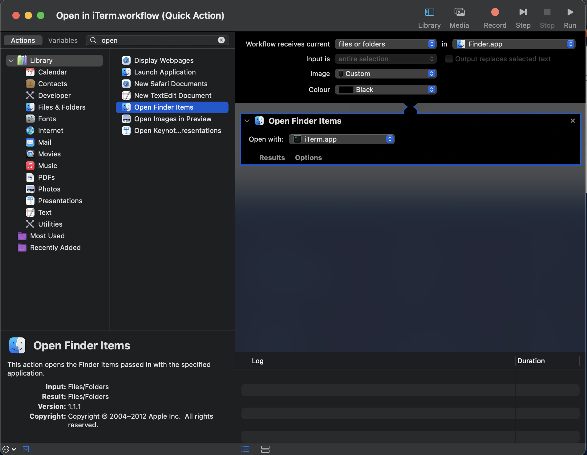
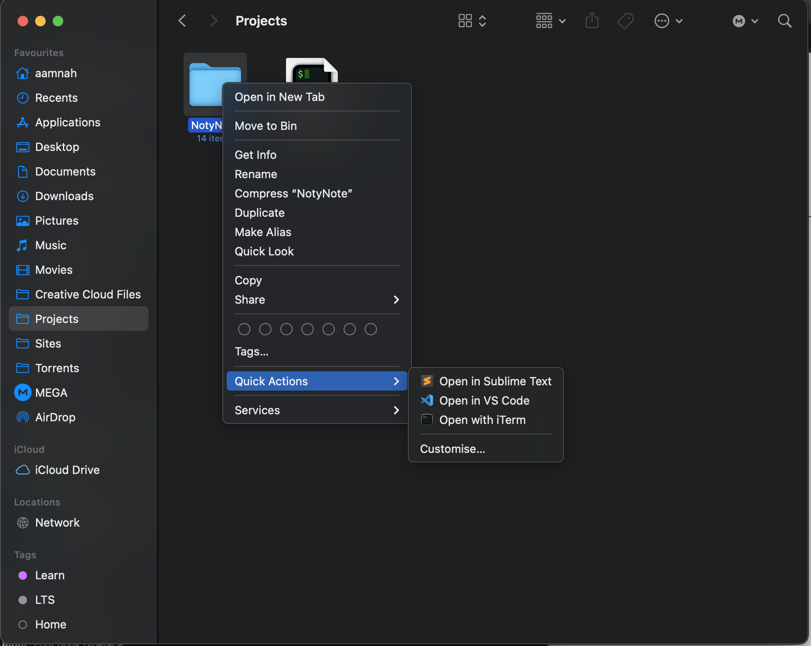

- Open **Automator**
- Choose **Quick Action** as the document type
- Change _Workflow receives current_ to **files or folders** in **Finder.app**
- For Action, choose **Open Finder items** from the left hand sidebar
- Change _Open with_ to **Visual Studio Code.app** (find it in _Other..._ )
- For the Icon, change _Image_ to "Choose..." and select the Visual Stuido Code app. It'll automatically pick the icon
- Save it (Cmd+S) as something like "Open in VS Code"

Quick Actions are saved as workflows in `~/Library/Services`

Links

---

- [Use Quick Action workflows on Mac](https://support.apple.com/en-gb/guide/automator/aut73234890a/mac)
- [What are the storage locations of the various types of Automator workflows](https://apple.stackexchange.com/a/24027)
