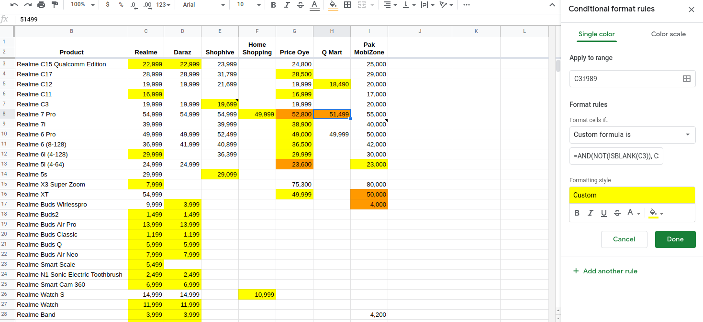

### Notes

- The conditional formatting rules are processed in order. You can adjust the order of the rules by dragging the three dots that appear when you hover over the rule
- You can negate a statement with `NOT()`. For example `NOT(ISBLANK())` will look up non-empty values
- You can check for multiple conditions with `AND(value1, value2, value3)`

### Highlight prices that are lower than reference price

```
=(AND(NOT(ISBLANK(D3)), D3<$C3))
```

- Highlights all cells that have price lower than the official price column.
- Only highlights non-empty cells

#### `C3` vs `$C3`

[ref](https://support.google.com/docs/thread/5592506?hl=en&msgid=5593381)

`$C3` will keep the column constant. otherwise it kept comparing later columns with the immediately next neighbour instead of column `C`. (comparing E with D, F with E, G with F and so on instead of comparing them all to C)

- `$C$3` - keep row and column constant, i.e. this particular cell only, don't adjust this
- `C$3` - keep row constant
- `$C3` - keep column constant

### Highlight the lowest value in row

```
=C3=MIN($C3:$I3)
=AND(NOT(ISBLANK(C3)), C3=MIN($C3:$I3))
```

- Navigate to conditional formatting. Set the conditional formatting range to include all the values you are checking

- In the custom formula field, enter `=A1=MIN($A1:$N1)`. Substitute `A1` for the first cell in the first row you are checking, and `N1` with the last cell in the first row you are checking.



## Links

- [Google Sheets function list](https://support.google.com/docs/table/25273?hl=en&ref_topic=3105625)
- [ISBLANK()](https://support.google.com/docs/answer/3093290?hl=en&ref_topic=3105471#)
