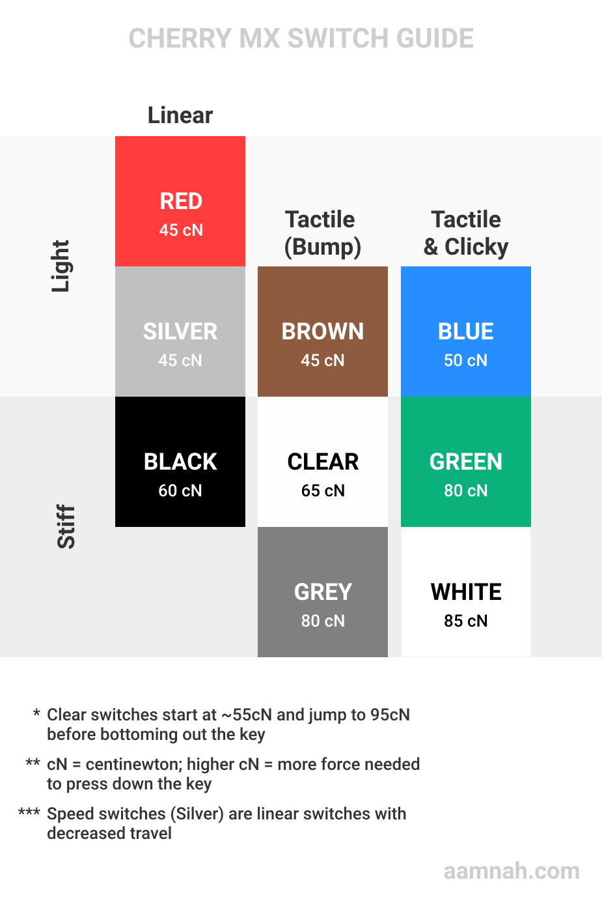
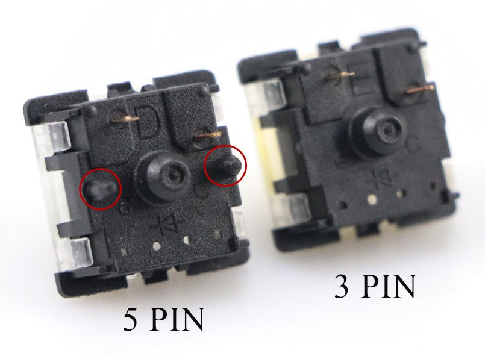
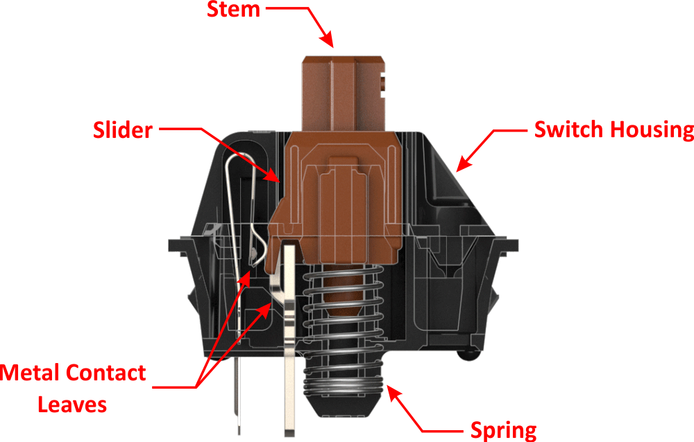

Stuff you need

- PCB ($35-$60)
- Case
- Plate ($18-$40) (optional - use 5-pin switches and leave the plate out)
- Switches ([\$3.85](https://dailyclack.com/collections/switches/products/gateron-yellow-switches) for pack of 10, $5.15 on AliExpress - around $30 for 110 switches)
- Stabilizers ($14-$19)
- Keycaps

Optional

- [Teflon grease - \$11](https://www.amazon.com/dp/B002L5UL92/ref=as_li_ss_tl?cv_ct_id=amzn1.idea.30QJOPDITFI5D&cv_ct_pg=storefront&cv_ct_wn=aip-storefront&ref=exp_cov_taehatypes_dp_vv_d&linkCode=sl1&tag=nathantaehaki-20&linkId=041fd3fa809f71e3ee260d43f66cdf46&language=en_US) for lubing (plastic on plastic)
- [Dielectric grease - \$7](https://www.amazon.com/dp/B000AL8VD2/ref=as_li_ss_tl?cv_ct_id=amzn1.idea.30QJOPDITFI5D&cv_ct_pg=storefront&cv_ct_wn=aip-storefront&ref=exp_cov_taehatypes_dp_vv_d&linkCode=sl1&tag=nathantaehaki-20&linkId=9ca8a8ee47d0d5e4e8ca150ecdad20a5&language=en_US) for stabilizers

Software is also needed to customize the keyboard (e.g. QMK, [Karabiner](https://karabiner-elements.pqrs.org/) for macOS)

A DIY kit on KBDfans cost $129-$299

Also, [watch this](https://www.youtube.com/watch?v=0c8UdKX6GBA)

## PCB

- hot swap or solder?
- RGB or no lights?
- sizes: 40%. 60%, 65%, 75%, 80%, 95%

The PCB will decide which size your case would be, whether your keycaps need to account for backlight (in-switch backlighting) and how many keys you're going to need..

The PCB needs to fit in the case and the screw holes need to match on both.

Could be _hot swap_ or normal one. Hot swap is where you don't have to solder the switches to the board.

I'm gonna go with a hot swap one, because i want to try different switches.

Definitely an RGB, because i can't touch type and need backlighting. Preferably Per-key RGB and in-switch backlighting

60% size = Tenkeyless (TKL) = Don't have numberpad

Options

| Model | Lighting | Hot swap | Layout | Price |
| ----- | -------- | -------- | ------ | ----- |
| GK64  | RGB      | Hot swap | 60%    | \$45  |
| iGK61 | RGB      | Hot swap | \$60   |       |

## Key layout

- ANSI
- ISO (fat Enter)

I need a dedicated PrtScr button, i use it too much
I'd lke macro buttons. So in places of Home/End have macro keys

## Case

is it too high and fat?
how much can the feet be adjusted?
will it last 10 years?

## Switches

Check out the [Cherry MX website](https://www.cherrymx.de/en/) for a good overview of all switches. Most of the competitors use the same naming convention. You can easily figure out what a switch would be like in any brand if you know the main characteristics of a switch. Gaterons are the most popular MX copy and the plastic they use is apparently really good quality.

Here are the two main things that matter

- Do you want a tactile bump when you press the button (Tactile) or do you want the switch to smoothly go down (Linear)?
- How much force do you want to exert when pressing the key? Actuation force.
- How much noise do you want it to make? (Clicky)

Other things to consider

- Low profile switches (decreased height of the switch, for low profile keyboards)
- Silent switches (Cherry MX Silent Red and Silent Black - minimises bottom-out and top out noise)
- Speed switches (Cherry MX Speed Silver - linear switches with decreased pre-travel (1-1.2mm) and travel (3.2-3.4mm))

I like linear switches with about 50g actuation. That is a Cherry MX Red (or a Gateron Yellow).

The type of _stem_ on the switch will determine the keycaps

Options

| Model                                                                                                  | Price | Mechanism | Force | Pre-travel | Travel |
| ------------------------------------------------------------------------------------------------------ | ----- | --------- | ----- | ---------- | ------ |
| Gateron Yellow                                                                                         | \$45  | Linear    | 50g   |
| [Cherry MX Brown](https://www.cherrymx.de/en/mx-original/mx-brown.html)                                | \$45  | Tactile   | 55g   | 2mm        | 4mm    |
| [Cherry MX Low-Profile RGB Red](https://www.cherrymx.de/en/mx-low-profile/mx-low-profile-red.html)     | \$45  | Linear    | 45g   | 1.2mm      | 3.2mm  |
| [Cherry MX Low-Profile RGB Speed](https://www.cherrymx.de/en/mx-low-profile/mx-low-profile-speed.html) | \$45  | Linear    | 45g   | 1mm        | 3.2mm  |

When ordering, order extra switches. For every 10 that work, 1 may not.

### Gateron switches

- milky top - 2st revision - The tops are slightly too small for GMK sets, the caps sometimes catch when pressing down
- clear top, black/gray bottom - 3rd revision - fixes these issues

#### Pins 3 or 5

Only 2 of the pins are conductors. The rest are plastic feet for stability.

If you use a plate, you are okay with using 3-pins. If you want extra stability, go for a 5-pin.

#### Leaf type?

_Leaf_ means the pin.

#### SMD or not?

You need an SMD switch if you're using SMD LEDs on the PCB. Clear housings help.

## Stabilizers

These are the mounty things you find under keys like Space, Shift, Backspace etc. Longer keys need stabilizers..

## Plate

- [DZ60 CNC Aluminum - \$18](https://kbdfans.com/collections/plate/products/dz60-cnc-aluminum-plate)

## Misc.

## Resources

- **KBDfans** seems to be dropshipping from China, just buy from AliExpress instead.
- [Daily Clack](https://dailyclack.com/)

## Links

- [How to Clip, Lube, and Band-aid Mod Your Stabilizers](https://www.youtube.com/watch?v=cD5Zj-ZgMLA)
- [Gateron Milky top vs Gateron SMD ( Clear top ) switches?](https://www.reddit.com/r/MechanicalKeyboards/comments/5r80f9/gateron_milky_top_vs_gateron_smd_clear_top/?utm_source=share&utm_medium=web2x)
- [My Gaming Peripheral Setup](https://www.youtube.com/watch?v=2vpA8av3F-U)

## Further research

- Look into [Gateron Ink switches](https://novelkeys.xyz/products/gateron-ink-v2-switches) use a different type of (non-standard) plastic
- Look into bottom out force, Gateron Yellows bottom out at around 170g. That's heavy!
- Is the light in the switch or in the PCB?
- Bottoming out. You can use plastic O-rings to reduce the noise from bottoming out

# My Build

- some switches with high bottoming out force, e.g. for the Spacebar to reduce that spacebar thud.
- lubed switches
- stabilizer mods
- At least 75% keyboard, preferably a 87-key TKL. I want those six Ins/Del/Home/End/PgUp/PgDn keys, i use them on a daily basis, for Del, and for changing workspaces. Ins is also required for some shortcuts. And dedicated arrow keys. Who even uses an arrow-key less keyboard?!
- Backlit

## Retrofitting an existing keyboard

[watch this](https://www.youtube.com/watch?v=hdds7D-vW9s)

The plan: buy an existing cheap mechanical keyboard with RGB and swap the swicthes and keycaps. You would not need the casing, plate, PCB and cable. Instead of buying a $160 something kit (the fancy ones, like R2 Zephyr 65%, cost $600. yikes. Keycult No. 2 Classic is $885, Keycult No. 2 Rev. 1 is $900.. wow.) and getting it shipped and paying for shipping as well, i could just get a cheap mech keyboard (\$30-50) with cheap switches and swap it. KBDfans sells just the PCB for \$35 minimum, excluding shipping

- [T-DAGGER Bora T-TGK315 - 87-key TKL](https://www.t-dagger.com/collections/keyboard/products/t-dagger-bora-t-tgk315-gaming-mechanical-keyboard-rgb-backlighting) (Rs. 5900)
- [T-DAGGER Destroyer T-TGK305-G - 104-key](https://www.t-dagger.com/collections/keyboard/products/t-dagger-destroyer-t-tgk305-gaming-mechanical-keyboard) (Rs. 5420, [used - 3500](https://www.olx.com.pk/item/t-dagger-mechanical-keyboard-tgk-305-destroyer-iid-1009368900))

The T-DAGGER Destroyer comes with detachable OUTEMU blue switches by default (it's a hot swap PCB? =D ). Cable is not detachable, wrist rest is

The T-DAGGER Bora also comes with detachable OUTEMU switches, and the cable is a micro-USB detachable. No wrist-rest and no numpad.

note: make sure the leaaves match, i.e. the yellow gaterons can fit in place of outemu blues..
