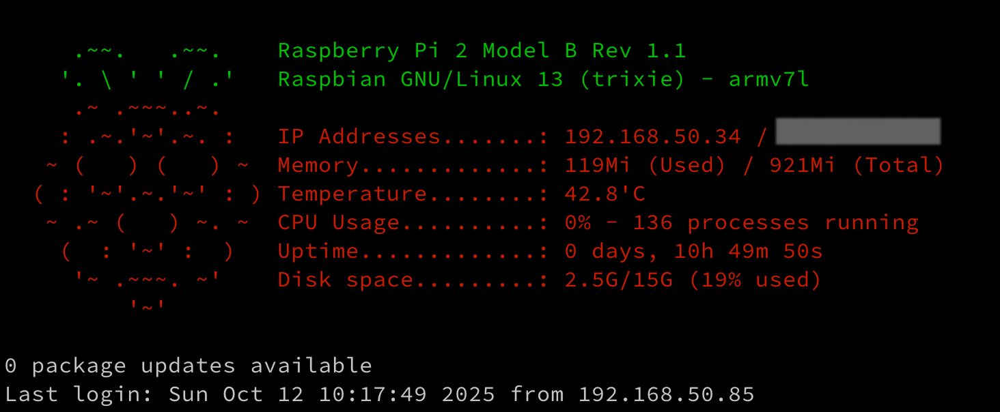

MOTD = **M**essage **O**f **T**he **D**ay, is the message that shows when you login to the raspberry pi.

See the [Bash scripts repo](https://github.com/aamnah/bash-scripts/tree/master/misc/motd) for up to date scripts

```bash
# Disable existing scripts
sudo chmod -x /etc/update-motd.d/10-uname

# Remove GNU free software text
echo "" | sudo tee /etc/motd > /dev/null
```

```bash
# Create new MOTD script and make it executable
sudo touch /etc/update-motd.d/20-sysinfo
sudo chmod +x /etc/update-motd.d/20-sysinfo
```

You can use any of the scripts below. You can either save them in `/etc/profile.d/` or in `/etc/update-motd.d/`. If placing in `/etc/profile.d/`, the file should have a `.sh` extension. The contents of the script can also be placed in `~/.bashrc`. Recommended place is `/etc/update-motd.d/`.

If you are using `tput` in a script in `/etc/update-motd.d/`, the colors will not show.

`tput` uses the **terminfo database** to output control codes (escape sequences) that tell your terminal to do things like: change text color, move the cursor, clear the screen, bold or underline text, reset formatting, etc. It’s terminal-independent — meaning it works correctly across xterm, Linux console, SSH, macOS Terminal, etc.

When PAM (Pluggable Authentication Modules) runs the MOTD scripts (those in `/etc/update-motd.d/`), it runs them non-interactively — there’s no real terminal (tty) attached yet. `tput` needs the `TERM` environment variable (e.g. `xterm`, `vt100`, `linux`) to know which escape sequences to use.

If `TERM` is missing or invalid, `tput` quietly fails to output anything — so you get no colors.

```bash
#!/bin/bash
# desc: Custom MOTD for Raspberry Pi
# link: https://github.com/aamnah/bash-scripts/tree/master/misc/motd
# file: /etc/profile.d/pi-motd.sh

# Installation
# Save the script: sudo nano /etc/profile.d/pi-motd.sh
# Paste the script and save.
# Make it executable: sudo chmod +x /etc/profile.d/pi-motd.sh
# Log out and log back in — you should see the MOTD automatically

let upSeconds="$(/usr/bin/cut -d. -f1 /proc/uptime)"
let secs=$((${upSeconds}%60))
let mins=$((${upSeconds}/60%60))
let hours=$((${upSeconds}/3600%24))
let days=$((${upSeconds}/86400))
UPTIME=`printf "%d days, %02dh %02dm %02ds" "$days" "$hours" "$mins" "$secs"`
DISK=$(df -h / | awk 'NR==2{print $3 "/" $2 " (" $5 " used)"}')
MEMORY_USED=$(free -h | awk '/Mem/{print $3}')
MEMORY_TOTAL=$(free -h | awk '/Mem/{print $2}')
IP_LOCAL=$(hostname -I | awk '{print $1}')
IP_PUBLIC=$(wget -q -O - http://icanhazip.com/ | tail)
PROCESSES_RUNNING=$(ps ax | wc -l | tr -d " ")

# get the load averages
read one five fifteen rest < /proc/loadavg

echo "$(tput setaf 2)
     .~~.   .~~.    `date +"%A, %e %B %Y, %r"`
    '. \ ' ' / .'   `uname -srmo`$(tput setaf 1)
     .~ .~~~..~.
    : .~.'~'.~. :   Uptime.............: ${UPTIME}
   ~ (   ) (   ) ~  Memory.............: ${MEMORY_USED} (Used) / ${MEMORY_TOTAL} (Total)
  ( : '~'.~.'~' : ) Load Averages......: ${one}, ${five}, ${fifteen} (1, 5, 15 min)
   ~ .~ (   ) ~. ~  Running Processes..: ${PROCESSES_RUNNING}
    (  : '~' :  )   IP Addresses.......: ${IP_LOCAL} / ${IP_PUBLIC}
     '~ .~~~. ~'    Disk space.........: ${DISK}
         '~'
$(tput sgr0)"
```


```bash
#!/bin/bash
# desc: Custom MOTD for Raspberry Pi
# link: https://github.com/aamnah/bash-scripts/tree/master/misc/motd
# file: /etc/update-motd.d/20-sysinfo

# Installation
# Save the script: sudo nano /etc/update-motd.d/20-sysinfo
# Make it executable: sudo chmod +x /etc/update-motd.d/20-sysinfo
# Log out and log back in — you should see the MOTD automatically

# Clear the Debian free software text: echo "" | sudo tee /etc/motd > /dev/null
# Clear uname: sudo rm -rf /etc/update-motd.d/10-uname

# ─── Colors for pretty output ───────────────────────────────────────────────
GREEN="\e[32m"
CYAN="\e[36m"
YELLOW="\e[33m"
RESET="\e[0m"

# ─── Raspberry Pi Model ─────────────────────────────────────────────────────
MODEL=$(tr -d '\0' < /proc/device-tree/model)

# ─── CPU Usage
# Calculate CPU usage by comparing /proc/stat over a short interval
CPU=$(awk -v RS="" '{print $2+$4, $2+$4+$5}' /proc/stat | awk 'NR==1{u1=$1; t1=$2} NR==2{u2=$1; t2=$2} END{print (u2-u1)/(t2-t1)*100 "%"}' <(cat /proc/stat; sleep 0.5; cat /proc/stat))

# ─── RAM Usage
MEM_USED=$(free -h | awk '/Mem/{print $3}')
MEM_TOTAL=$(free -h | awk '/Mem/{print $2}')

# ─── Package Updates ────────────────────────────────────────────────────────
# Uses apt to count available updates
PKG_UPDATES=$(apt list --upgradable 2>/dev/null | grep -v Listing | wc -l)

# ─── Network Info ───────────────────────────────────────────────────────────
IP_LOCAL=$(hostname -I | awk '{print $1}')
IP_PUBLIC=$(wget -q -O - http://icanhazip.com/ | tail)
HOSTNAME=$(hostname)

# ─── OS and Architecture ───────────────────────────────────────────────────
OS=$(grep PRETTY_NAME /etc/os-release | cut -d= -f2 | tr -d '"')
ARCH=$(uname -m)

# ─── Temperature and Disk ──────────────────────────────────────────────────
DISK=$(df -h / | awk 'NR==2{print $3 "/" $2 " (" $5 " used)"}')
TEMP=$(vcgencmd measure_temp | cut -d= -f2)

# ─── Uptime --------------──────────────────────────────────────────────────
UPTIME=$(uptime -p | sed 's/^up //')

# ─── Display MOTD ───────────────────────────────────────────────────────────
echo -e "${CYAN}──────────────────────────────────────────────${RESET}"
echo -e "${YELLOW}Model:${RESET}        $MODEL"
echo -e "${YELLOW}OS:${RESET}           $OS"
echo -e "${YELLOW}Architecture:${RESET} $ARCH"
echo -e "${YELLOW}IP addresses:${RESET} $IP_LOCAL / $IP_PUBLIC"
echo -e "${YELLOW}Hostname:${RESET}     $HOSTNAME"
echo -e "${YELLOW}Temperature:${RESET}  $TEMP"
echo -e "${YELLOW}Disk:${RESET}         $DISK"
echo -e "${YELLOW}CPU Usage:${RESET}    $CPU"
echo -e "${YELLOW}Memory:${RESET}       $MEM_USED / $MEM_TOTAL"
echo -e "${YELLOW}Uptime:${RESET}       $UPTIME"
echo ""
echo -e "${YELLOW}$PKG_UPDATES${RESET} packages need updating."
echo -e "${CYAN}──────────────────────────────────────────────${RESET}"
```


And here is one that combines the two above. This one will work in both `/etc/profile.d/` and `/etc/update-motd.d/` directories because a fallback for `tput` has been added. If placing in `/etc/profile.d`, save the sript with a `.sh` extension

```bash
#!/bin/bash
# desc: Custom MOTD for Raspberry Pi
# link: https://github.com/aamnah/bash-scripts/tree/master/misc/motd
# file: /etc/update-motd.d/30-sysinfo-with-logo

# Installation
# Save the script: sudo nano /etc/update-motd.d/30-sysinfo-with-logo
# Make it executable: sudo chmod +x /etc/update-motd.d/30-sysinfo-with-logo
# Log out and log back in — you should see the MOTD automatically

# Clear the Debian free software text: echo "" | sudo tee /etc/motd > /dev/null
# Clear uname: sudo rm -rf /etc/update-motd.d/10-uname

# COLOR SETUP
# ------------------------------------------------------------
# Fallback for TERM if undefined
export TERM=${TERM:-xterm}

# Safe color setup
if [ -t 1 ]; then
  GREEN=$(tput setaf 2)
  RED=$(tput setaf 1)
  YELLOW=$(tput setaf 3)
  CYAN=$(tput setaf 6)
  RESET_COLOR=$(tput sgr0)
else
  GREEN="\e[32m"
  RED="\e[31m"
  YELLOW="\e[33m"
  CYAN="\e[36m"
  RESET_COLOR="\033[0m"
fi

# GATHER SYSTEM INFORMATION
# ------------------------------------------------------------
MODEL=$(tr -d '\0' < /proc/device-tree/model)

# Calculate CPU usage by comparing /proc/stat over a short interval
CPU=$(awk -v RS="" '{print $2+$4, $2+$4+$5}' /proc/stat | awk 'NR==1{u1=$1; t1=$2} NR==2{u2=$1; t2=$2} END{print (u2-u1)/(t2-t1)*100 "%"}' <(cat /proc/stat; sleep 0.5; cat /proc/stat))
PROCESSES_RUNNING=$(ps ax | wc -l | tr -d " ")

MEMORY_USED=$(free -h | awk '/Mem/{print $3}')
MEMORY_TOTAL=$(free -h | awk '/Mem/{print $2}')

# Uses apt to count available updates
PKG_UPDATES=$(apt list --upgradable 2>/dev/null | grep -v Listing | wc -l)

IP_LOCAL=$(hostname -I | awk '{print $1}')
IP_PUBLIC=$(wget -q -O - http://icanhazip.com/ | tail)
HOSTNAME=$(hostname)

OS=$(grep PRETTY_NAME /etc/os-release | cut -d= -f2 | tr -d '"')
ARCH=$(uname -m)

DISK=$(df -h / | awk 'NR==2{print $3 "/" $2 " (" $5 " used)"}')
TEMP=$(vcgencmd measure_temp | cut -d= -f2)

# UPTIME=$(uptime -p | sed 's/^up //')
let upSeconds="$(/usr/bin/cut -d. -f1 /proc/uptime)"
let secs=$((${upSeconds}%60))
let mins=$((${upSeconds}/60%60))
let hours=$((${upSeconds}/3600%24))
let days=$((${upSeconds}/86400))
UPTIME=`printf "%d days, %02dh %02dm %02ds" "$days" "$hours" "$mins" "$secs"`


echo -e "${GREEN}
     .~~.   .~~.    ${MODEL}
    '. \ ' ' / .'   ${OS} - ${ARCH} ${RESET_COLOR}${RED}
     .~ .~~~..~.
    : .~.'~'.~. :   IP Addresses.......: ${IP_LOCAL} / ${IP_PUBLIC}
   ~ (   ) (   ) ~  Memory.............: ${MEMORY_USED} (Used) / ${MEMORY_TOTAL} (Total)
  ( : '~'.~.'~' : ) Temperature........: ${TEMP}
   ~ .~ (   ) ~. ~  CPU Usage..........: ${CPU} - ${PROCESSES_RUNNING} processes running
    (  : '~' :  )   Uptime.............: ${UPTIME}
     '~ .~~~. ~'    Disk space.........: ${DISK}
         '~'
${RESET_COLOR}"

echo "${PKG_UPDATES} package updates available"
```



### Remove GNU/Linux text

The GNU/Linux text is coming from the `/etc/motd` file. You can clear the Debian free software text by emptying the file

```bash
echo "" | sudo tee /etc/motd > /dev/null
```

### Remove uname

`uname` text is:

```
Linux raspi 6.12.47+rpt-rpi-2712 #1 SMP PREEMPT Debian 1:6.12.47-1+rpt1 (2025-09-16) aarch64
```

which is not needed because the `uname` command can be run any time if we need to see that info

either delete the `/etc/update-motd.d/10-uname` file

```bash
sudo rm -rf /etc/update-motd.d/10-uname
```

or make it not executable

```bash
sudo chmod -x /etc/update-motd.d/10-uname
```

### Remove last login text

The _last login_ is coming from the SSH daemon. You can remove last login text if you want by changing `PrintLastLog yes` in `/etc/ssh/sshd_config` to `PrintLastLog no`

```
PrintLastLog no
```

## Sources:

- [Custom MOTD - Message of the Day](http://www.raspberrypi.org/forums/viewtopic.php?f=91&t=23440)
- [Customize your MOTD - Linux](http://www.mewbies.com/how_to_customize_your_console_login_message_tutorial.htm)
