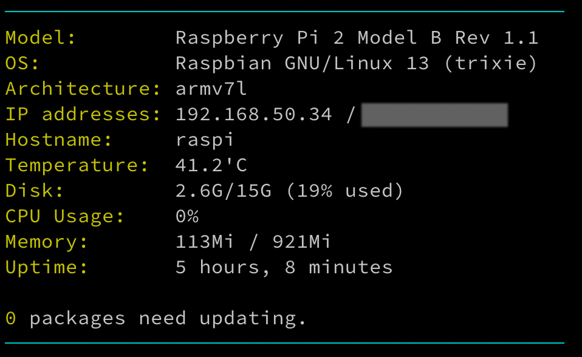

```bash
# Disable existing scripts
sudo chmod -x /etc/update-motd.d/10-uname

# Remove GNU free software text
echo "" | sudo tee /etc/motd > /dev/null

# Create new MOTD script and make it executable
sudo touch /etc/update-motd.d/20-sysinfo
sudo chmod +x /etc/update-motd.d/20-sysinfo
```

```bash
#!/bin/bash
# file: /etc/update-motd.d/20-sysinfo

let upSeconds="$(/usr/bin/cut -d. -f1 /proc/uptime)"
let secs=$((${upSeconds}%60))
let mins=$((${upSeconds}/60%60))
let hours=$((${upSeconds}/3600%24))
let days=$((${upSeconds}/86400))
UPTIME=`printf "%d days, %02dh %02dm %02ds" "$days" "$hours" "$mins" "$secs"`
DISK=$(df -h / | awk 'NR==2{print $3 "/" $2 " (" $5 " used)"}')
MEMORY_USED=$(free -h | awk '/Mem/{print $3}')
MEMORY_TOTAL=$(free -h | awk '/Mem/{print $2}')
IP_LOCAL=$(hostname -I | awk '{print $1}')
IP_PUBLIC=$(wget -q -O - http://icanhazip.com/ | tail)
PROCESSES_RUNNING=$(ps ax | wc -l | tr -d " ")

# get the load averages
read one five fifteen rest < /proc/loadavg

echo "$(tput setaf 2)
     .~~.   .~~.    `date +"%A, %e %B %Y, %r"`
    '. \ ' ' / .'   `uname -srmo`$(tput setaf 1)
     .~ .~~~..~.
    : .~.'~'.~. :   Uptime.............: ${UPTIME}
   ~ (   ) (   ) ~  Memory.............: ${MEMORY_USED} (Used) / ${MEMORY_TOTAL} (Total)
  ( : '~'.~.'~' : ) Load Averages......: ${one}, ${five}, ${fifteen} (1, 5, 15 min)
   ~ .~ (   ) ~. ~  Running Processes..: ${PROCESSES_RUNNING}
    (  : '~' :  )   IP Addresses.......: ${IP_LOCAL} / ${IP_PUBLIC}
     '~ .~~~. ~'    Disk space.........: ${DISK}
         '~'
$(tput sgr0)"
```


```bash
#!/bin/bash
# file: /etc/update-motd.d/20-sysinfo
# pi-motd.sh — Custom Raspberry Pi MOTD Script

# Installation
# Save the script: sudo nano /etc/update-motd.d/20-sysinfo
# Make it executable: sudo chmod +x /etc/update-motd.d/20-sysinfo
# Log out and log back in — you should see the MOTD automatically 🎉

# Clear the Debian free software text: echo "" | sudo tee /etc/motd > /dev/null
# Clear uname: sudo rm -rf /etc/update-motd.d/10-uname

# ─── Colors for pretty output ───────────────────────────────────────────────
GREEN="\e[32m"
CYAN="\e[36m"
YELLOW="\e[33m"
RESET="\e[0m"

# ─── Raspberry Pi Model ─────────────────────────────────────────────────────
MODEL=$(tr -d '\0' < /proc/device-tree/model)

# ─── CPU Usage
# Calculate CPU usage by comparing /proc/stat over a short interval
CPU=$(awk -v RS="" '{print $2+$4, $2+$4+$5}' /proc/stat | awk 'NR==1{u1=$1; t1=$2} NR==2{u2=$1; t2=$2} END{print (u2-u1)/(t2-t1)*100 "%"}' <(cat /proc/stat; sleep 0.5; cat /proc/stat))

# ─── RAM Usage
MEM_USED=$(free -h | awk '/Mem/{print $3}')
MEM_TOTAL=$(free -h | awk '/Mem/{print $2}')

# ─── Package Updates ────────────────────────────────────────────────────────
# Uses apt to count available updates
PKG_UPDATES=$(apt list --upgradable 2>/dev/null | grep -v Listing | wc -l)

# ─── Network Info ───────────────────────────────────────────────────────────
IP_LOCAL=$(hostname -I | awk '{print $1}')
IP_PUBLIC=$(wget -q -O - http://icanhazip.com/ | tail)
HOSTNAME=$(hostname)

# ─── OS and Architecture ───────────────────────────────────────────────────
OS=$(grep PRETTY_NAME /etc/os-release | cut -d= -f2 | tr -d '"')
ARCH=$(uname -m)

# ─── Temperature and Disk ──────────────────────────────────────────────────
DISK=$(df -h / | awk 'NR==2{print $3 "/" $2 " (" $5 " used)"}')
TEMP=$(vcgencmd measure_temp | cut -d= -f2)

# ─── Uptime --------------──────────────────────────────────────────────────
UPTIME=$(uptime -p | sed 's/^up //')

# ─── Display MOTD ───────────────────────────────────────────────────────────
echo -e "${CYAN}──────────────────────────────────────────────${RESET}"
echo -e "${YELLOW}Model:${RESET}        $MODEL"
echo -e "${YELLOW}OS:${RESET}           $OS"
echo -e "${YELLOW}Architecture:${RESET} $ARCH"
echo -e "${YELLOW}IP addresses:${RESET} $IP_LOCAL / $IP_PUBLIC"
echo -e "${YELLOW}Hostname:${RESET}     $HOSTNAME"
echo -e "${YELLOW}Temperature:${RESET}  $TEMP"
echo -e "${YELLOW}Disk:${RESET}         $DISK"
echo -e "${YELLOW}CPU Usage:${RESET}    $CPU"
echo -e "${YELLOW}Memory:${RESET}       $MEM_USED / $MEM_TOTAL"
echo -e "${YELLOW}Uptime:${RESET}       $UPTIME"
echo ""
echo -e "${YELLOW}$PKG_UPDATES${RESET} packages need updating."
echo -e "${CYAN}──────────────────────────────────────────────${RESET}"
```


