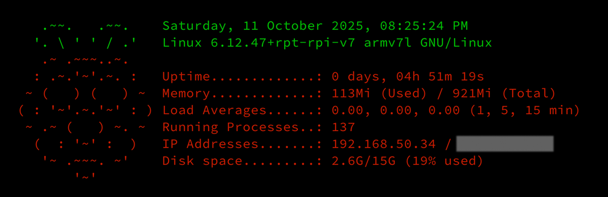

```bash
# Disable existing scripts
sudo chmod -x /etc/update-motd.d/10-uname

# Remove GNU free software text
echo "" | sudo tee /etc/motd > /dev/null

# Create new MOTD script and make it executable
sudo touch /etc/update-motd.d/20-sysinfo
sudo chmod +x /etc/update-motd.d/20-sysinfo
```

```bash
#!/bin/bash
# file: /etc/update-motd.d/20-sysinfo

let upSeconds="$(/usr/bin/cut -d. -f1 /proc/uptime)"
let secs=$((${upSeconds}%60))
let mins=$((${upSeconds}/60%60))
let hours=$((${upSeconds}/3600%24))
let days=$((${upSeconds}/86400))
UPTIME=`printf "%d days, %02dh %02dm %02ds" "$days" "$hours" "$mins" "$secs"`
DISK=$(df -h / | awk 'NR==2{print $3 "/" $2 " (" $5 " used)"}')
MEMORY_USED=$(free -h | awk '/Mem/{print $3}')
MEMORY_TOTAL=$(free -h | awk '/Mem/{print $2}')
IP_LOCAL=$(hostname -I | awk '{print $1}')
IP_PUBLIC=$(wget -q -O - http://icanhazip.com/ | tail)
PROCESSES_RUNNING=$(ps ax | wc -l | tr -d " ")

# get the load averages
read one five fifteen rest < /proc/loadavg

echo "$(tput setaf 2)
     .~~.   .~~.    `date +"%A, %e %B %Y, %r"`
    '. \ ' ' / .'   `uname -srmo`$(tput setaf 1)
     .~ .~~~..~.
    : .~.'~'.~. :   Uptime.............: ${UPTIME}
   ~ (   ) (   ) ~  Memory.............: ${MEMORY_USED} (Used) / ${MEMORY_TOTAL} (Total)
  ( : '~'.~.'~' : ) Load Averages......: ${one}, ${five}, ${fifteen} (1, 5, 15 min)
   ~ .~ (   ) ~. ~  Running Processes..: ${PROCESSES_RUNNING}
    (  : '~' :  )   IP Addresses.......: ${IP_LOCAL} / ${IP_PUBLIC}
     '~ .~~~. ~'    Disk space.........: ${DISK}
         '~'
$(tput sgr0)"
```


