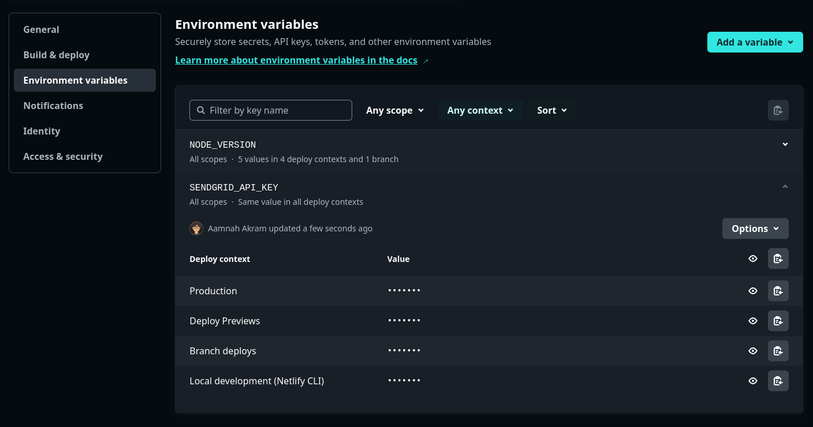

Summary

- how to create a function file
- how to save and use environment variables
- how to install and use third party packages
- how to run your functions locally and on live remote
- how to pass data to netlify functions

---

## Functions vs. Edge Functions
There are _functions_ and there are _edge functions_. Both are serverless functions, with _edge_ function being served from CDN server locations closest to the user [ref](https://www.netlify.com/blog/edge-functions-explained/). 

- Function can be created in TS, JS and Go; and are based on a **Nodejs runtime**. (Tip: the Node version can be configured from the dashborad or `netlify.toml` or `.nvmrc`)
- Edge Functions on the other hand are based on a **Deno runtime** and can only be in TypeScript and JavaScript. [`.jsx`, `.tsx` are also supported](https://docs.netlify.com/edge-functions/get-started/#edge-functions-with-jsx-or-tsx) for SSR (server-side-handling)
- There will be minor differences between the two function types as the code will need to be adjusted for that particular runtime. For example, module imports are done differently.

Function or Edge Function? Which one to choose? Personally, i always go with `edge-functions` because they're simpler and i don't have to worry about module formats. The only reason i would choose `functions` is if i wanted to write Go functions

```
netlify                                                                                       
├── edge-functions    <-- Directory for Edge Functions     
│   └── fetch_users.ts                                                                  
│   └── foo.js
│   └── bar.tsx 
│   └── baz.jsx  
└── functions         <-- Directory for Functions            
│   └── send_email.ts  <-- ES module if type:module in package.json, otherwise CommonJS                                                                     
│   └── send_email.mts <-- ES module  
│   └── send_email.cts <-- CommonJS module      
            
```

```toml
# netlify.toml

[build]
	functions = "netlify/functions"
  edge_functions = "my-custom-directory"

[functions]
  node_bundler = "esbuild"
```

```bash
# .nvmrc
lts/*
```

## Creating a function

Creating both types of functions is the same, just the folder name changes. Creat a file with the relevant file extension (.ts/.mts/.cjs for Functions or .ts/.js/.tsx/.jsx for Edge Functions) in the relevant directory (inside `BASE_DIR/netlify/functions` for Functions or in `BASE_DIR/netlify/edge-functions` for Edge Functions)


The default directories are `YOUR_BASE_DIRECTORY/netlify/edge-functions` and `YOUR_BASE_DIRECTORY/netlify/functions`. You can change these defaults in `netlify.toml` or the Netlify dashboard

```toml
# netlify.toml

[build]
  base = '/'
	functions = "netlify/functions"
  edge_functions = "my-custom-directory"

[functions]
  node_bundler = "esbuild"
```

Create the directory and the file

```bash
mkdir -p netlify/edge-functions
cd netlify/edge-functions

touch testfunction.ts
```

## Anatomy of a function

## Install and use third party npm packages
Edge Functions support using npm modules inside your functions

```bash
npm install @sendgrid/mail
```


## Running the functions

In order to run the functions, we need to install a bunch of packages. Node should already be installed

```bash
npm install netlify-cli --global
```

If you're using TypeScript and want type-safety inside your functions, install `@netlify/edge-functions` and/or `@netlify/functions`

```bash
npm install @netlify/edge-functions
npm install @netlify/functions
```

```bash
# test locally 
netlify dev
```


## Environment Variables

You can set environment variables from the Netlify dashborad area.



Note that environment variables declared in a Netlify configuration file (`netlify.toml`) are not available to functions. `process.env` vars are also not available. You would use `Netlify.env.get()` instead to use these variables inside your function

```ts
export const OWM_API_KEY = Netlify.env.get("OPENWEATHER_API_KEY")
```

## URLs and Paths

The default URLs for Netlify Functions are:

```
# Directory
YOUR_BASE_DIRECTORY/netlify/functions

# Local (Netlify Dev)
http://localhost:8888/.netlify/functions/<FUNCTION NAME>

# Deployed
https://<YOUR DOMAIN>/.netlify/functions/<FUNCTION NAME>
```

and for Netlify Edge Functions:

```
# Directory
YOUR_BASE_DIRECTORY/netlify/edge-functions

# Local (Netlify Dev)
http://localhost:8888/<FUNCTION PATH>

# Deployed
yoursitename.netlify.app/<FUNCTION NAME>
```


## Code samples

- [mawsome](https://github.com/aamnah/mawsome/tree/main/netlify) is using Netlify Edge Functions to get weather data from the OpenWeatherMap API. It handles being passed a city name and gets weather data for that city.
- [tmdb-movies](https://github.com/aamnah/tmdb-movies/tree/main/netlify) is using Netlify Edge Functions to get movie data from the TMDB API

## Troubleshooting

### Returning HTML instead of expected JSON
Check the URL for the function. It is most likely not hitting the right URL and the function is not being called.

### 404 not found
Check if you are actually returning a response inside your function


Links
---

- [Intro to Serverless Functions](https://www.netlify.com/blog/intro-to-serverless-functions/)
- [Get started with functions: Module format](https://docs.netlify.com/functions/get-started/?fn-language=ts#module-format)
- [Get started with Edge Functions](https://docs.netlify.com/edge-functions/get-started/)
- [Support for npm modules in Edge Functions](https://www.netlify.com/blog/support-for-npm-modules-in-edge-functions/)