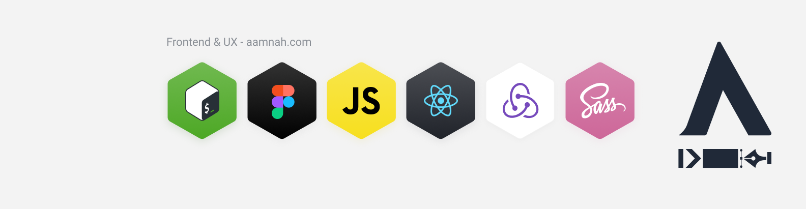
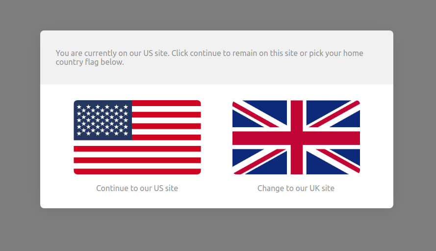
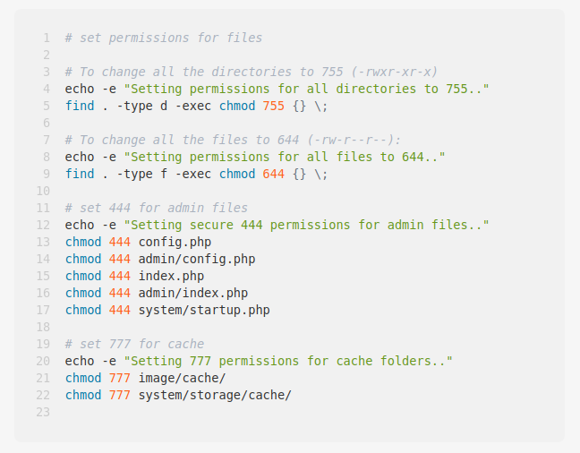
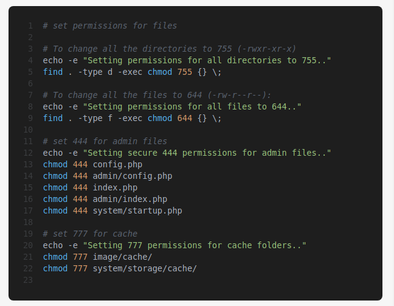

I have started working remotely from today because of the COVID-19 outbreak. Even if i'm young and healthy and do not fit the profile of people dying, i know and love people that do fit the profile and i don't want to be the ignoramous who carried the virus to them.

So, brought my system home yesterday, spent some time setting things up, and now i'm sitting in my home office/bedroom writing this up.

Figured i'd document things as i experience them.

I am going out today though, have to meet the bestie who's leaving, and also need to pickup the eukulele. This eukulele is going to be my hobby while i work from home. Also looking forward toi some watercolor paintings..

### Cons:

- no social interaction
- i'll eat more and get phat
- eating on the keyboard =(

### Pros:

- i can hear the birds, the view out the window is green
- i can walk in the room while a course video plays in the background on speaker
- i can do squats and mini workouts to stretch
- i can eat home made food
- i can work in my pajamas
- no commute, no wasting an hour driving every day
- more focus, don't have to talk to anyone
- more privacy, my screen is not for everyone in the office to see
- more flexibility in the start and end of work hours

### Goals

Because i have extra 2 hours in my work day now, no commute and more focus, i plan on making the most out of this self-isolation period.

- watch more entertainment, catch up on TV Shows and Movies
- do more hobbies, eukulele and watercolors
- learn more things, DevOps/Frontend/Backend
- work on my website, launch the blog and refresh the design

TODO:

- [ ] (in progress) Setup the blog site with Gatsby
- [x] get them StickerMule strickers designed (..turns out 50 means 50 copies of the _same_ sticker. I don't need to collect all logos afterall, i'll just print my own brand. Will do this after the social isolation thing is over so that it gets delivered to the office)
- [ ] add a project shot on Dribbble

## Day 1

Productivity level: 100
Motivation level: 100
Brain Activity/Alertness level: 100

- Started a watchlist for Movies

  - [x] Frozen 2
  - [x] 1917
  - [x] Memory: The Origins of Alien
  - [ ] Contagion
  - [ ] Jumanji
  - [ ] Spiderman: Far from Home
  - [ ] Spies in Disguise

- and series

  - [ ] Versailles
  - [ ] The Man in the High Castle
  - [ ] Abstract
  - [ ] Grand Designs
  - [ ] Chef's Table

- Got an [internet package](https://www.zong.com.pk/internet/internet-sim-plans) for backup
- Started the [DevOps Essentials](https://linuxacademy.com/cp/modules/view/id/192) course on Linux Academy and finished the following sections:

  - Introduction
  - DevOps Culture

- Went to Zara's for an _alwidai mulaqat_ and got Sunia's ukulele
- Tuned the ukulele using an app called _Yousician_
- Watched a couple of beginner ukulele videos on YouTube
- Figured out the difference between chords, strumming, picking and _open_ strings
- Spent 2 hours practicing strumming (Am7) and chords (C major, F major, G major)

images: ukulele

## Day 2

- woke up and practiced strumming and chords for an hour
- designed and updated my [social profile banner]() (YouTube, LinkedIn, Twitter)

- work: added the Activity screen and bottom tab navigation to MVP app
- watched: _The Soloist_. was okay, nothing i'd wanna watch again. acting was good.
- worked out? yes
- ate too much, too frequently
- practiced ukulele for about an hour. Learned a new chord (E minor), practiced strumming (down, down, up, down)

## Day 3

- woke up, ate cake, drank coffee, started watching YouTube videos on Icon design in Figma
- ended up watching Dining on a Dime and made myself a grilled cheese sandwich.
- worked out as compensation for eating that sandwich (10:00am)
- i'm already kinda losing track of time. Yesterday feels like ages ago.
- really missing the social connection of an office
- practiced ukulele for an hour, same chords as the day before and strumming practice
- already missing having a separation between work and home..
- watched _Memory: The Origin Story of Alien_
- worked out? yes.

## Day 4

- tried to keep a check on my eating yesterday. was a bit lighter at this morning's weigh-in
- wrote another blog post for my blog that i'm going to start again. Since i have no-one to actively hangout with, while still having things i want to share, i find that writing it down actually helps..
- worked out? yes.
- setup the deployment in place for [blog.aamnah.com](https://blog.aamnah.com)
- worked with Gatsby to create a layout for post pages, learned working with GraphQL queries along the way. Good stuff!
- did not practice playing the ukulele
- watched _Frozen II_

## Day 5 (Saturday)

Sat 21 March, 2020

Productivity level: 100
Motivation level: 90
Brain Activity/Alertness level: 100

- Practiced playing ukulele for almost 5 hours today. Wanna know how much i practice every time? till my fingers hurt, that much. it usually happens after an hour or so. today my fingertips really hurt because i practiced longer. Practiced a new strumming pattern (down down up down up) and a new chord sequence (Am F C G). There is video evidence of the practice..
- worked around four hours in the morning on the UI for the MVP. Working over the weekend to catch up on work..
- worked out? yes. 2 sets of 11 reps, 10 kg weight.
- made a point of sitting outside on the balcony in the morning, listened to the birds. it was nice, and cloudy.
- ate scrambled eggs for breakfast, rocky road crepes for lunch.

[image](clouds outside balcony)

## Day 6 (Sunday)

Sun 22 March, 2020

Productivity level: 5
Motivation level: 10
Brain Activity/Alertness level: 15

- watched _1917_ and three episodes of _The World's Most Extraordinary Homes_ (Spain, Norway, Israel)
- practiced strumming
- keep forgetting things, slept in the afternoon.
- signed up for Netflix with PTCl, and got thoroughly disappointed with Netflix. Shows me fuzzy video when i'm getting 7.3mbps speed. No playback controls to set video quality. i get that quaality depends on connection, but i'd rather set it to atleast 1080p and _wait_ for it to buffer than watch fuzzy video. And i paid for an UltraHHD subscription for nothing! The catalogue sucks so bad. HAlf of the shows i watch aren't even there. The app sucks, the playback controls suck, the catalogue sucks. I don't even care for the recommendations because i can get them for free from a listicle.
- oh wait, i had Steam downloading a game in the background. The video quality has improved a bit. I was at the 11 minutes mark when it started improving though. Still won't pay for this, because the catalogue for Pakistan sucks. and my disappointment with the app is there as well. I mean, i have watched videos from people who work at Netflix about creating software and read articles on how Netflix only hires senior developers and the app is just _meh_. Doesn't make sense.
- there aren't even proper playback controls. i can't adjust speed. had to watch over acting in slow motion.. painful.

## Day 7

Mon 23 March, 2020

Productivity level: 100
Motivation level: 80
Brain Activity/Alertness level: 100

- So far, i have avoided eating at the keyboard. Wouldn't wanna get any crumbs in my fancy mechanical keyboard.
- worked for around 6 hours before my client messaging me he thought we were off because of Pakistan Day. Dang it, i worked on a national holiday when i should have just taken the day off, and God knows i need off days. I actually _forgot_ it was Pakistan Day and a national holiday, that's what social distancing does during COVIDE-19, you lose track of days..
- Anyway, took the rest of the day off after that.
- watched an episode of _Grand Designs_. Also watched the entire season of _The Letter to the King_, was pretty disappointed in the story.
- did not work out, did not practice uke. Cooked meat though, good stuff.

## Day 8

Tues 24 March, 2020

Productivity level: 100
Motivation level: 100
Brain Activity/Alertness level: 100

- watched an episode of _Amazing Interiors_
- did hours of research on mechanical keyboards
- did not workout

## Day 9

Wed 25 March, 2020

Productivity level: 100
Motivation level: 100
Brain Activity/Alertness level: 100

- watched an episode each of _Stay Here_ and _Tidying up with Marie Kondo_
- spent hours woking on the blog. The page routes work. Also got Sass and `styled-components` going
- still annoyed with the Netflix app. The _horizontal scrolling_ is meh. I can see very little at a glance (e.g. only 5-ish episodes are listed in one view), and there are no visual sorting options.
- worked out? a little
- practiced uke? nope
- enjoyed an hour long call with a friend

## Day 10

Thu 26 March, 2020

Productivity level: 100
Motivation level: 100
Brain Activity/Alertness level: 100

- watched an episode of _The Final Table_ and the Fat episode of _Salt Fat Acid Heat_
- another thing missing from Netflix is viewing _History_. I forgot the series i watched yesterday..
- worked out? yes
- practiced uke? nope
- enjoyed an hour long call with a friend
- i have been having difficulty falling asleep. I think it's because of hunger, i'm not eating enough. I'm out of coffee and cream.. Anyone who really knows me knows that i survive on coffee and cream.
- More than missing the office, i missed a good steak today.
- work involved setting up a country/site selection modal that shows up on site load and asks you to pick the site you want to go to by clicking a flag. It then saves that choice in a cookie and doesn't ask you again on next visit

## Day 11

- spent hours working on the blog, added components and restructured..
- didn't watch much in terms of entertainment, except one 30 minute timelapse video on YouTube where a guy [rebuilt a 1996 Kawasaki Cafe Racer](https://www.youtube.com/watch?v=nYiRe5xvAJs)
- cooked mutton handi, good stuff

## Day 12

Saturday

Productivity level: 90
Motivation level: 80
Brain Activity/Alertness level: 90

- Spent 3+ hours watching _typing sound_ videos (119+ videos..) and listening to the sounds. What i'm loooking for is the sound of a key that doesn't sound too loud or feels too heavy. I'm fairly certain i want to go with Gateron Yellow switched and lube them.
- Spent an hour practicing uke
- no worksout
- defrosted the freezer
- spent hours working on this Gatsby blog. Added a contact form via Netlify and added some styles. The site kinda looks presentable now..s
- watched two episodes of _Tiny House Nation_

## Day 13 (Sunday)

March 29, 2020

Productivity level: 100
Motivation level: 100
Brain Activity/Alertness level: 100

- spent hours with Gatsby and GarphQL. Troubleshooted the Contact form, now getting email notifications for form responses and getting all the fields as well.
- the weekend was spent in two mega project. One was defrosting the deep freezer, and the other was taking apart my wooden bed.
- defrosting the freezer took days and a lot of effort, but it ended with me finding hidden treasures of haleem and nihari.
- workout included taking bricks up the stairs and moving heavy furniture
- The bedroom took half the day but it went better than i had expected. The bed wasn't as heavy as i had imagined.. maybe the recent workouts helped? Overall, i'm not as exhausted as i was expecting. I'm not even tired after these mega projects.
- set up a stereo system in the room, now i have music! with good speakers! and a remote! The music added a nice touch while i worked around the room. I can listen to FM stations as well, that's nice, i find new songs i like by listening to the radio.
- Overall, i am happy i decided to finally work on my room. Been putting this off for a long time. I'm happy that i'm doing what i want, and i'm happy that i have the capacity to do so.
- Looking forward to having a proper media center setup in the room. And having more room to walk around
- Next project? Painting the room! Been waiting for summer so it dries off quickly and i don't have to stay in the room with wet paint. Kind of decided on a color too, something pastel..

## Day 14

- Morale was strangely low after a very productive yesterday. I think the tiredness set in the next day.
- Watched four episodes of _Interior Design Masters_
- Looked at paint shades for the room
- Moved morrre furnniture. Not really happy with how much space that darn dressing table is taking, and making it difficult to get an empty wall to put the TV on
- Workout included moving furniture
- Practices uke a little

## Day 15

- Morale is seriously low, don't feel like working at all. Took two days off to work on morale.
- Will probably end up doing _home maintenance_ projects.. The windows need cleaning..
- Didn't clean windows.. ended up going on a grocery haul instead. Met my coleague and went grocery shopping. Was out of coffee. And cream. A creative out of coffee is never a good thing

## Day 16

- worked mainly. Mostly uneventful day
- worked a few hours on the new design on aamnah.com in Figma. Added styles for Testimonials. So now i have two parts done, i.e.the contact form and thetestimonials section. Need to add a section about work or projects on Github and then i'll be mostly done.
- Watched two episodes of _Car Masters: Rust to Riches_

## Day 17

- Did the _Hello World_ of [CodeCademy's C# course](https://www.codecademy.com/learn/learn-c-sharp) (and streamed the process). 10% done with that course. Plan on doing an hour of C# every day till i finish that course. I'm doing the 30 day challenge!
- watched different prgramming streams on Twitch. Got noticed on 3 (Gatsbyjs, csharpfritz, Lana_Lux). They said my name on screem (fangirl moment).
- finally called _Ami Jan_ today. Been meaning to but kept forgetting..
- Fiigured out how to do Team Libraries in Figma. Now i can use the same colors within different projects and have them in sync without having to open the other file to copy that color code. Same for components. Awesome!
- Fixed Recent Posts on the home page of this Gatsby site, sorted posts by date, and added support for _Draft_ status, i.e. not get the post if status is `draft`

## Day 18

April 03, 2020

- watched two episodes of _Money Heist_ and two of _Chef's Table: France_
- Cleaned the room a little. 90% happy with the layout at this point. The view out the window at around 5pm (sunset) warmed my heart. Perfect day with green leaves and not a lot of heat.
- started [C# Fundamentals](https://app.pluralsight.com/courses/0096b00d-2398-435a-82f7-3f5401408ab1/table-of-contents) on Pluralsight, finished the section on _Introducing C# and .NET_
- Did a few lessons on C# on Codecademy too to maintain my streak
- worked out

## Day 19

April 04, 2020

- Played _Risk of Rain 2_ for a short while before had to work on my brother's project. Good game, FPS is my thing. But i had to lower down _all_ the video settings in order for it to not be laggy. The game didn't look all that jazzy though. The environments don't have scenes where i'd go this must take lots of GPU. Didn't understand why the game was hogging resources for what looked basic. Insurgency, an FPS, played very smooth in comparison, on the integrated graphics of an 8th gen i3.
- Also realized i have _Destiny 2_ on my Steam account. I saw a guy stream the gameplay on Twitch just two days ago and was drooling over it. Turns out i already have it in my account! Yayy.. It's downloading at the moment, will take me days to download those 80GBs..
- spent most of the day setting up a Linux Ubuntu server and installing Opencart on it so an online shop could be migrated. Then also adding SFTP users to be able to transfer files using FTP software.
- made art on Skype video call
- practiced uke for 15 minutes
- In the morning, i searched for 4k wallpapers for my high resolution monitor screen (2k). Found some really nice ones too. But when i set them as Desktop background, it looked all pixelated because the _fit_ wasn't right. I couldn't change the setting because Windows wanted me to _Activate_ in order to personalize. What a weird way to make people pay. Meh. Made me appreciate Ubuntu and FOSS just a little bit more.

This lockdown has extended beyond what i expected. 19 days already! I have been home too long. I miss being able to go out whenever i wanted to, wherever i wanted to =(

## Day 20 (Sunday)

April 05, 2020

- practiced uke for almost an hour. Can play the chords for _happy birthday to you_. The first two lines only.
- worked out
- spent majority of my Sunday playing [_Insurgency_](https://store.steampowered.com/app/222880/Insurgency/). Good game. I'm not very good at it though. Felt good to finally play an FPS game again, been long. All those headshots!
- Food involved burgers.
- Watched an episode of _Grace and Frankie_ before internet started acting up and the hanged Netflix ruined the mood.

## Day 21

April 06, 2020

- Oh this day was eventful. The kitchen caught fire. It was hard to breathe in black clouds of smoke. Had to call the neighbours in. To give you an idea of how bad is it: the kitchen is on ground. my room is on the upper floor. the PC in my room _on the upper floor_ has soot _inside it_. The microwave melted, so i gotta buy that, and need a new cooking range too. The roof in the kitchen that used to be white is now black. So is the roof of the dining room and lounge.. the cabinetry above the cooking range was wooden, that is now charred and part coal.
- how'd it catch fire? good question. well, i put oil in a pan for frying and turned on the stove. then i forgot i had done that. And somehow that oil caught fire.. In my defence, i had just found out my nan who got hospitalized two days ago was serious and they were gonna move her to the ICU. i tend to forget things when i'm under emotional stress. i was so worried and shocked about my nan that i forgot the stove was on. i did smell barbecue when i was in the loo, but kept wondering who in the neighbours was cooking. only when i heard my mom's yelling from downstairs is when i rushed down. and only remembered there was oil on stove when i saw the fire.
- so to sum up: i've been in self-isolation for 21 days, my kitchen caught fire, and my nan's in an unstable condition in the ICU. oh, and everything in my room is covered in soot. it hurts to breathe throw my nose because i inhaled a lot of that black smoke.
- will take days to wash down things. May have to paint the house again.
- the upside: well, i showered, been putting that off for days (because i'm a lazy person who has isn't getting out). and i'll get a new cooking range and microwave?
- i did workout (before the fire happened)

## Day 25

April 10, 2020

- Been in survival mode lately. Time was spent between getting the car maintained, visiting the hospital, scrubbing walls, arranging alternate stove and microwave and getting some office work done all at the same time. That's the gist of the last 4 days.
- Good thing is that the kitchen is 60% clean and you can cook and use dishes and move around. The counter tops are no longer covered in soot, so you can put stuff there while working.
- I have food sources secured, have a microwave and functional stove. Also blessed to have people who cooked for me in this hard time and delivered me food. And lent me their rice cookers. (Sunia is awesome!)
- The work load for the job is getting back on track.
- The shock of Ami jan being in hospital has somewhat settled. And the experience of a fire in the house has also mellowed down. I now feel gratitude that the fire was contained. Could have been a lot worse, and i'm glad it wasn't. Alhamdulillah.
- workout has mostly been moving around a lot.

## Day 35

April 20, 2020

- Ami jan (my nano) passed away on the 15th of April. The funeral was attended by the closest of family. A majority of people could not come because of the COVID-19 situation. There were no hugs and no handshakes and most people wore masks. Hurts me that she's gone. But i would probably not talk about it. I have already been through half a dozen deaths of close family members at this point, and the platitude people give me doesn't comfort much. Talking is moot.
- Her heart stopped once, the night before the morning she passed away. I was standing there, holding her hand, looking at her when that happened.. Stayed up that night, looking at her, making sure she was breathing. Around 4am i had started drifting off every now and then. But every time i'd wake with a start and resume looking at her intently, counting the seconds, waiting for her to take a breath. Even at that time, in her condition, it mattered that she breathed and she was alive. Around 6am i slept for good. Around 10:45 we woke and left for our place, had to get Ami's (my mum) medicine. By 11am Ami Jan was no more.
- She died peacefully, and she was not in pain at the time.

## Day 36

April 21, 2020

- I have been all sorts of distraught of course.
- Nothing much in terms of code related learning has been going on.
- Practiced the uke every day in the days i haven't written the posts, keeps me occupied and somewhat comforts me too.
- Worked out yesterday. That's probably once in 15 days..
- Got back to work yesterday after taking two days off.
- Seriously struggling with motivation these days. Trying my best to not go in a depression.
- I am blessed with amazing friends, alhamdulillah.

## Day 42

April 27, 2020

- Morale has been really low lately. I have lost appetite and feel lethargic most of the time. Keep wondering what _the point_ is.
- This site wasn't being published for a while, build errors.. fixed those.
- Playing the uke has been the one thing that has stayed constant throughout.
- Workout isn't happening..
- Learning of all sorts of programming has stopped and i find it hard to get excited about things
- Netflix sucks. I have been watching _Bon Appétit_ videos on Youtube instead, so much gold!
- I find it hard to keep sitting at the workstation. Been missing my Macbook with which i could just lounge and work fluently. The Windows laptop isn't powerful enough to run an emulator, and you can't change workspaces with a 3-finger swipe =(
- I have been using my iPad more and more for watching Youtube, and browsing the web. I can do that in my bed, and the screen quality is really good. I always liked bigger screens, but convenience seems to have overtaken screen size.

## Day 43

April 28, 2020

- Followed along a C# course for 3 hours. Felt nice to have that enthusiasm back, felt normal.
- Worked out as well. Very little, but it's progress nonetheless.
- Been making progress on the uke as well. Learnt the _major scale_ and the sequence for _sa re ga ma_. Making good progress on that pink panther theme song as well.

## Day 44

April 29, 2020

- nothing out of the ordinary
- generally felt better in terms of morale and spirit
- cooked biryani

## Day 45

April 30, 2020

- Added a Gist component to the blog. Turns out React applications [can't show embedded gists](https://stackoverflow.com/a/30429689)
- the tldrdevnotes.com domain is expiring, and i have decided to let it go. The site and content will be moved to notes.aamnah.com, which is more appropriate. It'll also serve well for the Aamnah.com brand. TLDR Dev Notes never really took off, and never got any interaction. at. all. Part of that may have been because there is no comments system..
- Started work on the migration and got 90% there.
- The notes site has 857 page btw, nice.
- Added syntax highlighting for fenced code blocks on the Gatsby site

## Day 46

May 1, 2020

- Updated styles for code blocks and inline code.
- Created my custom light and dark syntax highlighting themes for Prism, named `PrismMonaco`

- Started a [GraphQL course on edx](https://www.edx.org/course/exploring-graphql-a-query-language-for-apis).. half way through the fundamentals. Am now familiar with a bunch of core concepts like types, queries, mutations, and subscriptions etc.

## Day 47

May 2, 2020 Saturday

- Finished the first module of fundamentals and core concepts of GraphQL
- Create my custom _oh-my-zsh_ theme

## Day 48

May 3, 2020 Sunday

- fixed images for the Gatsby blog
