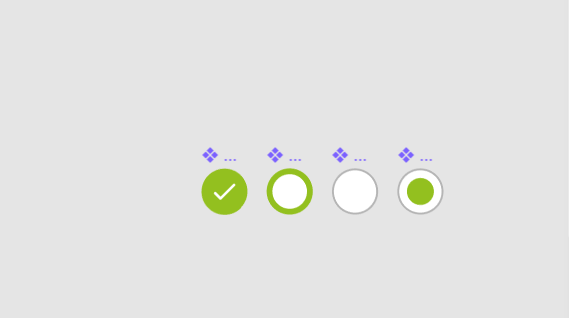

- You can either style the `::after` of `input` or the `::before` of `label`
- It has to be able to show styles when we Tab to the input

With `::before` pattern i can't do a this design



By default you can't really style the `checkbox` and `radio` inputs.. What you can do is create your own.

You can add styles to the `::before` and `::after` to show the box or circle and change its colors.

There are two different ways you can write your HTML

```html
<!-- 
  Input and Label next to each other
  You have to manually link these two using `id` and `for`
  -->
<input id="pizza" type="checkbox" />
<label for="pizza">Full pizza?</label><br />
<input id="coke" type="checkbox" />
<label for="coke">Coke bottle too?</label><br />
```

```html
<!-- 
  Input inside Label
  these get automatically linked together, clicking the label will click the input
  -->
<label><input type="checkbox" />Extra cheese? </label><br />
<label><input type="checkbox" />Burger? </label><br />
```

Notice the `<br />`, `input` is `display: inline-block` and `label` is `display: inline` by default.

### Can't style `checkbox` and `radio` directly

If you try to style `checkbox` and `radio` input types directly, you'll fail. The code below will never work and is entirely useless..

```css
/* Checbox */
input[type='checkbox'] {
  background: red;
  color: yellow;
}

input[type='checkbox']:checked {
  background: green;
  color: blue;
}

/* Radio */
input[type='radio'] {
  background: orange;
  color: orangered;
}

input[type='radio']:checked {
  padding: 2em;
  background: thistle;
  color: plum;
}
```

### Using `label`, `span`, `::before`, `::after` or `+`

the `+` is for sibling elements. `checkbox[type='radio']:checked + label` will actually select the `label` next to the `radio` input that is `checked`.

Here's a quick run down of child and sibling selectors

- `>` child combinator selector (direct descendant)
- `+` adjacent sibling combinator (directly after)
- `~` general sibling combinator (anywhere after as long as it's on the same level)

### The `::before` and `::after`

These styles don't care if your code was `<label><input></label>` (`input` inside of `label`) or `<label></label><input>` (`label` and `input` next to each other)..

```scss
/* Checbox */
input[type='checkbox'] {
  position: relative;
}

input[type='checkbox']:checked::before {
  position: absolute;
  width: 1em;
  height: 1em;
  content: '';
  top: 0;
  left: 0;
  background: salmon;
}
```

We have now something that looks like this image


To make this work for both `radio` and `checkbox`, just combine them

```scss
/* Checbox & Radio */
input[type='radio'],
input[type='checkbox'] {
  position: relative;
}

input[type='radio'],
input[type='checkbox']:checked::before {
  position: absolute;
  width: 1em;
  height: 1em;
  content: '';
  top: 0;
  left: 0;
  background: salmon;
}
```

Now you're set to style them however you want
