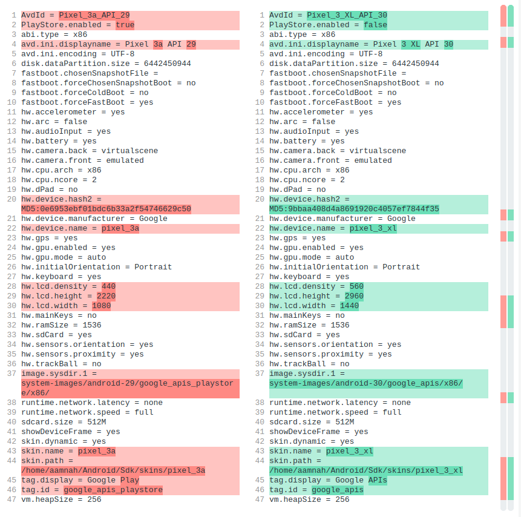
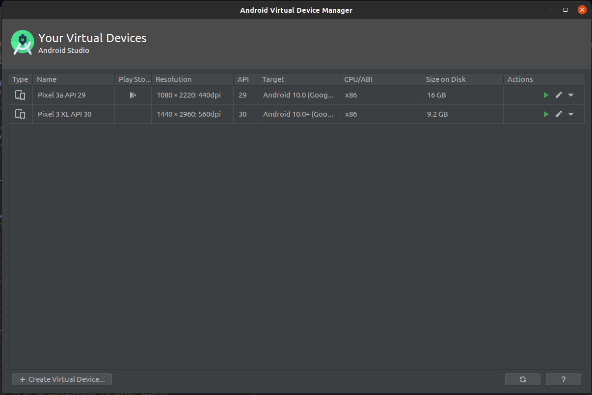
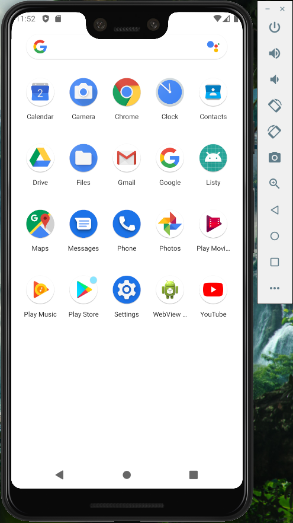

Why?
Not all AVD profiles come with Play Store installed. I needed a phone with a notch, and decided on Google Pixel XL, but turns out it didn't have Play Store installed

I found the answer on StackOverflow, and it's pretty straight forward. Compare the `config.ini` file with another AVD device that does has Play Store installed and then update the one for Google Pixel XL after figuring out the change

```bash
~/.android/avd/DEVICE_ID/config.ini
```

This is from the config that had Play Store installed (Pixel 3a)

```ini
image.sysdir.1 = system-images/android-29/google_apis_playstore/x86/
tag.display = Google Play
tag.id = google_apis_playstore
```

And this is how it was in Pixel 3 XL

```ini
image.sysdir.1 = system-images/android-30/google_apis/x86/
tag.display = Google APIs
tag.id = google_apis
```



All i had to do was update the config and restart the device

```ini
image.sysdir.1 = system-images/android-30/google_apis_playstore/x86/
tag.display = Google Play
tag.id = google_apis_playstore
```

If you're moving to another API version (like i was from 29 to 30) and it's not already installed, you may have to re-download the system image for the device

_Android Studio > Tools > AVD Manager_. Click Download for your device so that it installs the system image with Google Play


Otherwise, you'll get the following when trying to run the emulator

```
PANIC: Cannot find AVD system path. Please define ANDROID_SDK_ROOT
```

Keep in mind that even though your device will now have Play Store, the Play Store icon will not appear next to your device in Device Manager




## Links

- [How to install Google Play app in Android Studio emulator?](https://stackoverflow.com/a/62436883/890814)
