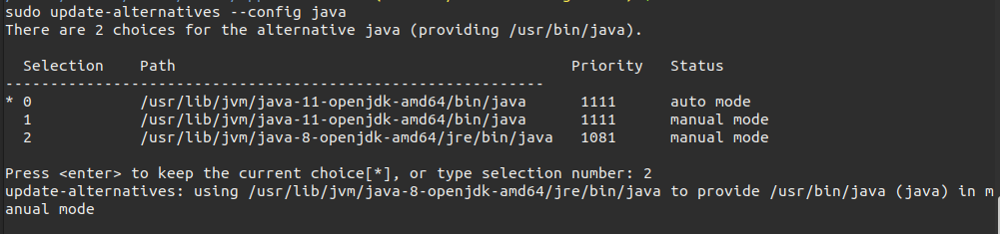

Right now when you run the expo build command, it puts you into a queue, and stores the build on Expo servers. I obviously don't want that because a queue slows me down (the build keeps failing..) and once the build is done i have to manually download it in order to be able to upload it somewhere else..

The answer to this is [turtle](https://github.com/expo/turtle), the standalone app builder service by Expo

```bash
npm install -g turtle-cli

turtle setup:android --sdk-version 37.0.0
```

On first run it'll start downloading and installing Android SDK, which will take a good while (download took 4 minutes.. install for Android SDK went on for ~70 minutes.. after which i gave gave up.. ).

## Export app

Run a local server and note the URL, i used `http-server` whose default URL is `http://127.0.0.1:8080`

```bash
npx http-server
```

```bash
expo export --dev --public-url http://127.0.0.1:8080
```

```
dist
├── android-index.json
├── assets
│   ├── 02bc1fa7c0313217bde2d65ccbff40c9
│   ├── 0886a6b127c6057cee83f9c65c7ffd62
│   ├── 09dd345dbd4ec5a0874841d5749ac153
│   ├── fdc01171a7a7ea76b187afcd162dee7d
│   └── ff31215218cf59699e34b7db3a479e6c
├── bundles
│   ├── android-28379830c4e0f74b22adc7bd243f273d.js
│   └── ios-802a95f67ffeeffac160346ff41e54a1.js
└── ios-index.json
```

Run the exported app on local server and confirm sure it's running ..

```bash
cd dist/
npx http-server
curl http://127.0.0.1:8080/android-index.json
```

## Build

If you have previously published an Android app with Expo, get the keystore

```bash
expo fetch:android:keystore
```

```
Keystore credentials
  Keystore password: xx299bxxxxxxxx98a9a42e1cxxxxxxxx
  Key alias:         xxxxxxxlc3BlbxxxxxxxxnBwcmVhY3Ruxxxxxxxx
  Key password:      3d1xxxxxxxx744xxxxxxxx9bcxxxxxxx

  Path to Keystore:  /media/aamnah/Files/Sites/fppreactnative/fppreactnative.jks
```

```bash
EXPO_ANDROID_KEYSTORE_PASSWORD="XXXX" \
EXPO_ANDROID_KEY_PASSWORD="XXXX" \
turtle build:android \
  --keystore-path /PATH/TO/YOUR/KEYSTORE_FILE.jks \
  --keystore-alias PUT_KEYSTORE_ALIAS_HERE
  --public-url http://127.0.0.1:8080/android-index.json
```

- The `--public-url` here is the local server we ran inside `dist/` with `http-server`
- This will generate an app bundle `.aab` file. To get an APK, pass it as a flag `--type apk`

## Java 8

You need to install Java 8 SDK as `turtle-cli` [only works with JDK 8](https://github.com/expo/turtle/issues/45#issuecomment-484444687). I had 11.0.7 (openjdk) installed on my Ubuntu machine..


The easy way is to install `openjdk` and change your Java version

```bash
sudo apt install -y openjdk-8-jdk-headless openjdk-8-jre
```

```bash
sudo update-alternatives --config java
```



The more complicated way is to download it from the Oracle website. See [this gist] for instructions on how to download without having to create and login to an Oracle account. Basically, you go to the downloads page, click the download you want, accept the checkbox for license, and instead of clicking the green download button you copy link location, and then you change the `otn` part to `otn-pub` and open that link in order to download.. (blekh)

```
https://download.oracle.com/otn-pub/java/jdk/8u251-b08/3d5a2bb8f8d4428bbe94aed7ec7ae784/jdk-8u251-linux-x64.tar.gz
https://download.oracle.com/otn-pub/java/jdk/8u251-b08/3d5a2bb8f8d4428bbe94aed7ec7ae784/jdk-8u251-windows-x64.exe
```

## Links

- [Building Standalone Apps on Your CI](https://docs.expo.io/distribution/turtle-cli/)
- [Turtle CLI](https://github.com/expo/turtle)
- [Build Standalone Expo .apk and .ipa with Turtle CLI](https://www.robincussol.com/build-standalone-expo-apk-ipa-with-turtle-cli/)
