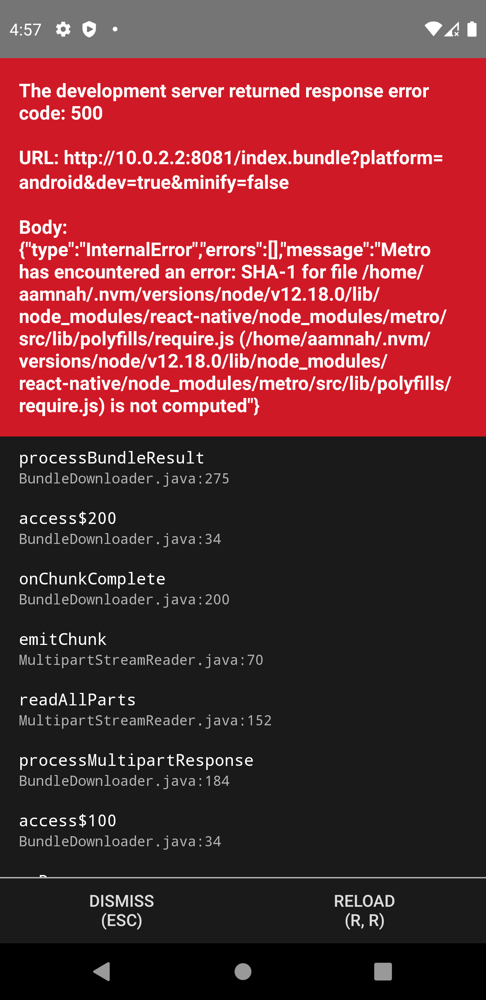

### console.log

Enable `console.log`s for React Native

```bash
# run this command (when the app is running) to enable React Native logging
# You only need to run this once and it'll be enabled for all future apps as well

npx react-native log-ios
npx react-native log-android
```

### adb logs

You can start `adb` logging in another Terminal window

```bash
# For a steady stream of constant logging
adb logcat

# filter React related logs
adb logcat '*:S ReactNative:V ReactNativeJS:V'
```

## Common Errors

### White screen of death


You get an empty blank screen and no errors..

Chances are you ran `react-native run-android` first and then `react-native start`.

What you gotta do is close the app. Run `react-native start` and then in another terminal, run `react-native run-android`. You have to run `react-native run-android` in a separate terminal because you don't get the prompt back when running `react-native start`

### Could not connect to development server 500 or SHA-1 ReferenceError



```
The development server returned response error code: 500
```

```
error: ReferenceError: SHA-1 for file node/v12.18.0/lib/node_modules/react-native/node_modules/metro/src/lib/polyfills/require.js (node/v12.18.0/lib/node_modules/react-native/node_modules/metro/src/lib/polyfills/require.js) is not computed
```

Turns out i had `react-native` insatlled globally instead of `react-native-cli`. If you have both `react-native` and `react-native-cli` installed, it'll be messed up..

Solution is simple

```bash
npm uninstall -g react-native
npm i -g react-native-cli

# OR

yarn global remove react-native
yarn global add react-native-cli
```

Or just use `npx`.

## Links

- [Docs: Debugging](https://reactnative.dev/docs/debugging)
