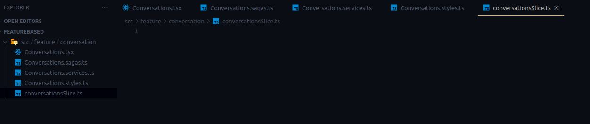
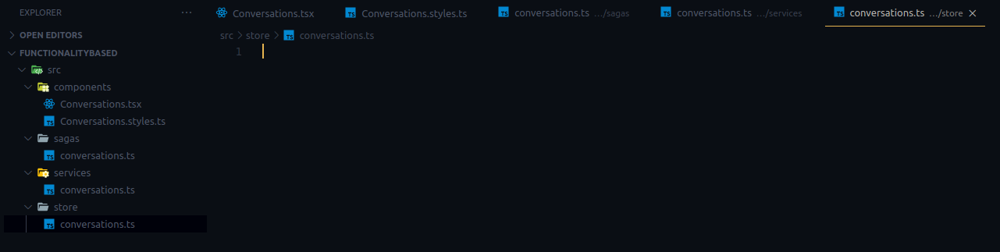

## The original cruft

a `store` folder with separate `actions` and `reducers` folder inside.

```
src
└── store
    ├── actions
    │   ├── activity.ts
    │   ├── conversations.ts
    │   ├── index.ts
    │   ├── report.ts
    │   └── search.ts
    ├── index.ts
    └── reducers
        ├── activity.ts
        ├── conversations.ts
        ├── index.ts
        ├── report.ts
        └── search.ts
```

```
src
├── components
│   ├── Activity.tsx
│   ├── Conversations.tsx
│   ├── index.ts
│   ├── Report.tsx
│   └── Search.tsx
└── store
    ├── actions
    │   ├── activity.ts
    │   ├── conversations.ts
    │   ├── index.ts
    │   ├── report.ts
    │   └── search.ts
    ├── index.ts
    └── reducers
        ├── activity.ts
        ├── conversations.ts
        ├── index.ts
        ├── report.ts
        └── search.ts
```

## The Redux toolkit

### Feature based: one folder for one feature

Following is based on the [offical Redux template](https://github.com/reduxjs/cra-template-redux) for Create React App

```
src
└── features
    ├── activity
    │   ├── Activity.js
    │   ├── Activity.styles.scss
    │   └── activitySlice.js
    ├── conversations
    │   ├── Conversations.js
    │   ├── Conversations.styles.scss
    │   └── conversationsSlice.js
    ├── report
    │   ├── Report.js
    │   ├── Report.styles.scss
    │   └── reportSlice.js
    └── search
        ├── Search.js
        ├── Search.styles.scss
        └── searchSlice.js
```

If i were to include services and sagas

```
src
└── features
    ├── activity
    │   ├── Activity.js
    │   ├── Activity.sagas.ts
    │   ├── Activity.services.ts
    │   ├── Activity.styles.ts
    │   └── activitySlice.js
    ├── conversations
    │   ├── Conversations.js
    │   ├── Conversations.sagas.ts
    │   ├── Conversations.services.ts
    │   ├── Conversations.styles.ts
    │   └── conversationsSlice.js
    ├── report
    │   ├── Report.js
    │   ├── Report.sagas.ts
    │   ├── Report.services.ts
    │   ├── Report.styles.ts
    │   └── reportSlice.js
    └── search
        ├── Search.js
        ├── Search.sagas.ts
        ├── Search.services.ts
        ├── Search.styles.ts
        └── searchSlice.js
```

Not only is this less scrolling through to get to relevant functionality, it also has the major benefit of having the functionality in the filename. This makes it very easy to know what file it is by looking at the filename in VS Code tabs.

When all files are named `activity.ts`, it is hard to differentiate them when selecting the tab.

An interesting read is Kent C. Dodds' article on [colocation](https://kentcdodds.com/blog/colocation), i agree with his argument of placing code as close to where it's relevant as possible. In other words, things that change together should stay together. Keep the styles, state, tests for your component in one folder.

### Functionality based: one file for all redux

This is what i have been following up till now, but plan on moving to the feature based structure

```
src
├── components
│   ├── Activity.tsx
│   ├── Conversations.tsx
│   ├── index.ts
│   ├── Report.tsx
│   └── Search.tsx
└── store
    ├── activity.ts
    ├── conversations.ts
    ├── index.ts
    ├── report.ts
    ├── rootReducer.ts
    └── search.ts
```

```
src
├── components
│   └── counter
│       └── Counter.jsx
└── store
     └── counter.js
```

if you're creating separate files for component styles (e.g. `Counter.module.css`, or `Counter.styles.ts`)

```
src
├── components
│   └── counter
│       ├── Counter.js
│       └── Counter.module.css
└── store
     └── counter.js
```

An example when you're using Redux Saga and making API calls, you'll have folders called `services` for APIs and `sagas` for your saga-related code.

```
src
├── components
│   ├── Activity.tsx
│   ├── Conversations.tsx
│   ├── index.ts
│   ├── Report.tsx
│   └── Search.tsx
├── sagas
│   ├── activity.ts
│   ├── conversations.ts
│   ├── index.ts
│   ├── report.ts
│   └── search.ts
├── services
│   ├── activity.ts
│   ├── conversations.ts
│   ├── index.ts
│   ├── report.ts
│   └── search.ts
└── store
    ├── activity.ts
    ├── conversations.ts
    ├── index.ts
    ├── report.ts
    ├── rootReducer.ts
    └── search.ts
```

## Feature vs. Functionalty

```
featureBased
└── src
    └── feature
        └── conversation
            ├── Conversations.sagas.ts
            ├── Conversations.services.ts
            ├── conversationsSlice.ts
            ├── Conversations.styles.ts
            └── Conversations.tsx

3 directories, 5 files
```



```
functionalityBased
└── src
    ├── components
    │   ├── Conversations.styles.ts
    │   └── Conversations.tsx
    ├── sagas
    │   └── conversations.ts
    ├── services
    │   └── conversations.ts
    └── store
        └── conversations.ts

5 directories, 5 files
```



## Links

- [Colocation](https://kentcdodds.com/blog/colocation)
- [State Colocation will make your React app faster](https://kentcdodds.com/blog/state-colocation-will-make-your-react-app-faster)
