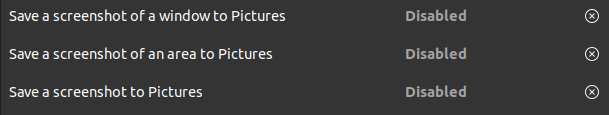

## Syntax differences between dconf and gsettings

`dconf write` vs. `gsettings set`

```bash
# dconf
dconf write /org/gnome/terminal/legacy/profiles:/:b1dcc9dd-5262-4d8d-a863-c897e6d979b9/use-theme-colors "false"
dconf write /org/gnome/terminal/legacy/profiles:/:b1dcc9dd-5262-4d8d-a863-c897e6d979b9/background-color "'rgb(0,43,54)'"
dconf write /org/gnome/terminal/legacy/profiles:/:b1dcc9dd-5262-4d8d-a863-c897e6d979b9/foreground-color "'rgb(131,148,150)'"
```

```bash
# gsettings
gsettings set org.gnome.Terminal.Legacy.Profile:/org/gnome/terminal/legacy/profiles:/:b1dcc9dd-5262-4d8d-a863-c897e6d979b9/ use-theme-colors false
gsettings set org.gnome.Terminal.Legacy.Profile:/org/gnome/terminal/legacy/profiles:/:b1dcc9dd-5262-4d8d-a863-c897e6d979b9/ background-color 'rgb(0,43,54)'
gsettings set org.gnome.Terminal.Legacy.Profile:/org/gnome/terminal/legacy/profiles:/:b1dcc9dd-5262-4d8d-a863-c897e6d979b9/ foreground-color 'rgb(131,148,150)'
```

## dconf

### View and backup all dconf settings

```bash
dconf dump / > dconf_settings_backup.sh
```

If you save it as a `.sh` file, you'll get syntax highlighting when you open it with a code editor

### Search for a key/value being used in settings

```bash
dconf dump / | grep SEARCH-TERM
```

### Finding all keys with `list`

```bash
dconf list /org/gnome/settings-daemon/plugins/media-keys/custom-keybindings/custom0/
```

```
binding
command
name
```

### Finding the value of a key with `read`

```bash
# dconf read <KEY>
dconf read /org/gnome/settings-daemon/plugins/media-keys/custom-keybindings/custom0/name
```

```
'Save a screenshot to ~/Pictures/screenshots'
```

Another example, to get the picture being used as background:

```bash
# Ubuntu desktop background
dconf read /org/gnome/desktop/background/picture-uri
```

```
'file:///home/aamnah/.local/share/backgrounds/2020-07-20-10-57-02-edit-ballai-utopia.jpg'
```

## gsettings

### Search for a key/value being used in settings

```bash
gsettings list-recursively | grep SEARCH-TERM
```

### Get a list of all keyboard shortcuts

You can get a list of ALL keyboard shortcuts (their keys and values) with `list-recursively`

```bash
gsettings list-recursively org.gnome.settings-daemon.plugins.media-keys
```

```bash
org.gnome.settings-daemon.plugins.media-keys custom-keybindings ['/org/gnome/settings-daemon/plugins/media-keys/custom-keybindings/custom0/', '/org/gnome/settings-daemon/plugins/media-keys/custom-keybindings/custom1/', '/org/gnome/settings-daemon/plugins/media-keys/custom-keybindings/custom2/']
org.gnome.settings-daemon.plugins.media-keys media ['']
org.gnome.settings-daemon.plugins.media-keys stop-static ['XF86AudioStop']
org.gnome.settings-daemon.plugins.media-keys eject-static ['XF86Eject']
org.gnome.settings-daemon.plugins.media-keys rotate-video-lock ['']
org.gnome.settings-daemon.plugins.media-keys screen-brightness-cycle ['']
org.gnome.settings-daemon.plugins.media-keys toggle-contrast ['']
org.gnome.settings-daemon.plugins.media-keys rotate-video-lock-static ['<Super>o']
org.gnome.settings-daemon.plugins.media-keys www ['']
org.gnome.settings-daemon.plugins.media-keys window-screenshot-clip ['<Ctrl><Alt>Print']
org.gnome.settings-daemon.plugins.media-keys battery-status-static ['XF86Battery']
org.gnome.settings-daemon.plugins.media-keys volume-down ['']
org.gnome.settings-daemon.plugins.media-keys playback-repeat ['']
org.gnome.settings-daemon.plugins.media-keys hibernate ['']
org.gnome.settings-daemon.plugins.media-keys volume-down-precise ['']
org.gnome.settings-daemon.plugins.media-keys next ['']
org.gnome.settings-daemon.plugins.media-keys suspend ['']
org.gnome.settings-daemon.plugins.media-keys touchpad-toggle-static ['XF86TouchpadToggle', '<Ctrl><Super>XF86TouchpadToggle']
org.gnome.settings-daemon.plugins.media-keys volume-up-quiet ['']
org.gnome.settings-daemon.plugins.media-keys active true
org.gnome.settings-daemon.plugins.media-keys play-static ['XF86AudioPlay', '<Ctrl>XF86AudioPlay']
org.gnome.settings-daemon.plugins.media-keys search-static ['XF86Search']
org.gnome.settings-daemon.plugins.media-keys magnifier-zoom-in ['<Alt><Super>equal']
org.gnome.settings-daemon.plugins.media-keys area-screenshot-clip ['<Ctrl><Shift>Print']
org.gnome.settings-daemon.plugins.media-keys mic-mute ['']
org.gnome.settings-daemon.plugins.media-keys screen-brightness-up-static ['XF86MonBrightnessUp']
org.gnome.settings-daemon.plugins.media-keys previous ['']
org.gnome.settings-daemon.plugins.media-keys volume-up ['']
org.gnome.settings-daemon.plugins.media-keys control-center ['']
org.gnome.settings-daemon.plugins.media-keys search ['']
org.gnome.settings-daemon.plugins.media-keys calculator ['']
org.gnome.settings-daemon.plugins.media-keys volume-step 6
org.gnome.settings-daemon.plugins.media-keys pause-static ['XF86AudioPause']
org.gnome.settings-daemon.plugins.media-keys rfkill-static ['XF86WLAN', 'XF86UWB', 'XF86RFKill']
org.gnome.settings-daemon.plugins.media-keys stop ['']
org.gnome.settings-daemon.plugins.media-keys volume-up-static ['XF86AudioRaiseVolume', '<Ctrl>XF86AudioRaiseVolume']
org.gnome.settings-daemon.plugins.media-keys calculator-static ['XF86Calculator']
org.gnome.settings-daemon.plugins.media-keys home-static ['XF86Explorer']
org.gnome.settings-daemon.plugins.media-keys touchpad-on ['']
org.gnome.settings-daemon.plugins.media-keys volume-mute-static ['XF86AudioMute']
org.gnome.settings-daemon.plugins.media-keys volume-mute-quiet-static ['<Alt>XF86AudioMute']
org.gnome.settings-daemon.plugins.media-keys magnifier-zoom-out ['<Alt><Super>minus']
org.gnome.settings-daemon.plugins.media-keys volume-down-quiet-static ['<Alt>XF86AudioLowerVolume', '<Alt><Ctrl>XF86AudioLowerVolume']
org.gnome.settings-daemon.plugins.media-keys window-screenshot @as []
org.gnome.settings-daemon.plugins.media-keys power ['']
org.gnome.settings-daemon.plugins.media-keys play ['']
org.gnome.settings-daemon.plugins.media-keys max-screencast-length uint32 30
org.gnome.settings-daemon.plugins.media-keys power-static ['XF86PowerOff']
org.gnome.settings-daemon.plugins.media-keys terminal ['<Primary><Alt>t']
org.gnome.settings-daemon.plugins.media-keys volume-down-static ['XF86AudioLowerVolume', '<Ctrl>XF86AudioLowerVolume']
org.gnome.settings-daemon.plugins.media-keys keyboard-brightness-up ['']
org.gnome.settings-daemon.plugins.media-keys playback-forward ['']
org.gnome.settings-daemon.plugins.media-keys www-static ['XF86WWW']
org.gnome.settings-daemon.plugins.media-keys playback-random-static ['XF86AudioRandomPlay']
org.gnome.settings-daemon.plugins.media-keys pause ['']
org.gnome.settings-daemon.plugins.media-keys screen-brightness-cycle-static ['XF86MonBrightnessCycle']
org.gnome.settings-daemon.plugins.media-keys media-static ['XF86AudioMedia']
org.gnome.settings-daemon.plugins.media-keys hibernate-static ['XF86Suspend', 'XF86Hibernate']
org.gnome.settings-daemon.plugins.media-keys screenshot-clip ['<Ctrl>Print']
org.gnome.settings-daemon.plugins.media-keys eject ['']
org.gnome.settings-daemon.plugins.media-keys email-static ['XF86Mail']
org.gnome.settings-daemon.plugins.media-keys screen-brightness-up ['']
org.gnome.settings-daemon.plugins.media-keys rfkill-bluetooth ['']
org.gnome.settings-daemon.plugins.media-keys touchpad-toggle ['']
org.gnome.settings-daemon.plugins.media-keys keyboard-brightness-toggle ['']
org.gnome.settings-daemon.plugins.media-keys priority 0
org.gnome.settings-daemon.plugins.media-keys help ['', '<Super>F1']
org.gnome.settings-daemon.plugins.media-keys playback-random ['']
org.gnome.settings-daemon.plugins.media-keys logout ['<Control><Alt>Delete']
org.gnome.settings-daemon.plugins.media-keys area-screenshot @as []
org.gnome.settings-daemon.plugins.media-keys decrease-text-size ['']
org.gnome.settings-daemon.plugins.media-keys volume-up-quiet-static ['<Alt>XF86AudioRaiseVolume', '<Alt><Ctrl>XF86AudioRaiseVolume']
org.gnome.settings-daemon.plugins.media-keys screencast ['<Ctrl><Shift><Alt>R']
org.gnome.settings-daemon.plugins.media-keys screensaver-static ['XF86ScreenSaver']
org.gnome.settings-daemon.plugins.media-keys email ['']
org.gnome.settings-daemon.plugins.media-keys volume-down-quiet ['']
org.gnome.settings-daemon.plugins.media-keys screen-brightness-down-static ['XF86MonBrightnessDown']
org.gnome.settings-daemon.plugins.media-keys increase-text-size ['']
org.gnome.settings-daemon.plugins.media-keys touchpad-off-static ['XF86TouchpadOff']
org.gnome.settings-daemon.plugins.media-keys home ['']
org.gnome.settings-daemon.plugins.media-keys playback-rewind-static ['XF86AudioRewind']
org.gnome.settings-daemon.plugins.media-keys screenreader ['<Alt><Super>s']
org.gnome.settings-daemon.plugins.media-keys playback-repeat-static ['XF86AudioRepeat']
org.gnome.settings-daemon.plugins.media-keys magnifier ['<Alt><Super>8']
org.gnome.settings-daemon.plugins.media-keys volume-up-precise ['']
org.gnome.settings-daemon.plugins.media-keys playback-rewind ['']
org.gnome.settings-daemon.plugins.media-keys suspend-static ['XF86Sleep']
org.gnome.settings-daemon.plugins.media-keys volume-mute ['']
org.gnome.settings-daemon.plugins.media-keys keyboard-brightness-toggle-static ['XF86KbdLightOnOff']
org.gnome.settings-daemon.plugins.media-keys mic-mute-static ['XF86AudioMicMute']
org.gnome.settings-daemon.plugins.media-keys volume-up-precise-static ['<Shift>XF86AudioRaiseVolume', '<Ctrl><Shift>XF86AudioRaiseVolume']
org.gnome.settings-daemon.plugins.media-keys keyboard-brightness-up-static ['XF86KbdBrightnessUp']
org.gnome.settings-daemon.plugins.media-keys screen-brightness-down ['']
org.gnome.settings-daemon.plugins.media-keys rfkill ['']
org.gnome.settings-daemon.plugins.media-keys playback-forward-static ['XF86AudioForward']
org.gnome.settings-daemon.plugins.media-keys rfkill-bluetooth-static ['XF86Bluetooth']
org.gnome.settings-daemon.plugins.media-keys keyboard-brightness-down ['']
org.gnome.settings-daemon.plugins.media-keys screensaver ['<Super>l']
org.gnome.settings-daemon.plugins.media-keys on-screen-keyboard ['']
org.gnome.settings-daemon.plugins.media-keys control-center-static ['XF86Tools']
org.gnome.settings-daemon.plugins.media-keys volume-mute-quiet ['']
org.gnome.settings-daemon.plugins.media-keys touchpad-off ['']
org.gnome.settings-daemon.plugins.media-keys screenshot @as []
org.gnome.settings-daemon.plugins.media-keys battery-status ['']
org.gnome.settings-daemon.plugins.media-keys touchpad-on-static ['XF86TouchpadOn']
org.gnome.settings-daemon.plugins.media-keys next-static ['XF86AudioNext', '<Ctrl>XF86AudioNext']
org.gnome.settings-daemon.plugins.media-keys previous-static ['XF86AudioPrev', '<Ctrl>XF86AudioPrev']
org.gnome.settings-daemon.plugins.media-keys keyboard-brightness-down-static ['XF86KbdBrightnessDown']
org.gnome.settings-daemon.plugins.media-keys volume-down-precise-static ['<Shift>XF86AudioLowerVolume', '<Ctrl><Shift>XF86AudioLowerVolume']
```

### check the values of a custom shortcut

You can check the keys and values for a custom command (e.g. `custom1`) with `list-recursively`

```bash
gsettings list-recursively org.gnome.settings-daemon.plugins.media-keys.custom-keybinding:/org/gnome/settings-daemon/plugins/media-keys/custom-keybindings/custom1/
```

```bash
org.gnome.settings-daemon.plugins.media-keys.custom-keybinding command 'gnome-screenshot -a'
org.gnome.settings-daemon.plugins.media-keys.custom-keybinding name 'Save a screenshot of an area to ~/Pictures/screenshots'
org.gnome.settings-daemon.plugins.media-keys.custom-keybinding binding '<Shift>Print'
```

### Restore default values

with `reset`

```bash
# Restore default Screenshot shortcut
gsettings reset org.gnome.settings-daemon.plugins.media-keys window-screenshot
gsettings reset org.gnome.settings-daemon.plugins.media-keys area-screenshot
gsettings reset org.gnome.settings-daemon.plugins.media-keys screenshot
```

### Reset all keyboard shortcuts

There's a **Reset All...** button in the GUI (Settings > Keyboard Shortcuts)

```bash
gsettings reset-recursively  org.gnome.settings-daemon.plugins.media-keys
```

### Disable certain keyboard shortcuts

You can use `set` and pass it an empty `[]` as value

```bash
# Restore default Screenshot shortcuts
# You can do it by passing an empty array
gsettings set org.gnome.settings-daemon.plugins.media-keys window-screenshot []
gsettings set org.gnome.settings-daemon.plugins.media-keys area-screenshot []
gsettings set org.gnome.settings-daemon.plugins.media-keys screenshot []
```



## Links

- [How to search dconf for keys or values?](https://askubuntu.com/questions/169704/how-to-search-dconf-for-keys-or-values)
- [Disable all Unity keyboard shortcuts using the command line](https://askubuntu.com/questions/461701/disable-all-unity-keyboard-shortcuts-using-the-command-line)
