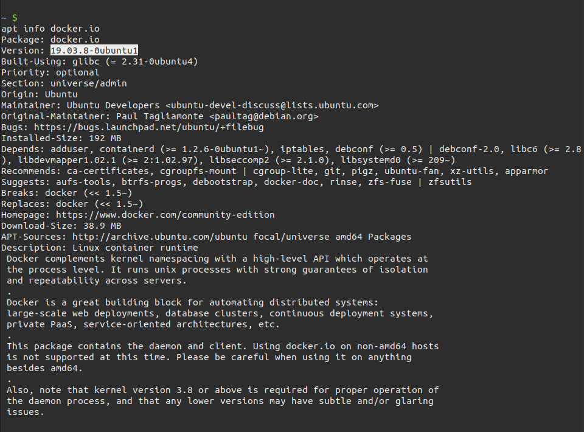

## Install on Ubuntu (easy way)

```bash
sudo apt install -y docker.io docker-compose
```

You don't need to install the long manual way, `docker.io` is already provided as a package in the Ubuntu repos and the version is fairly up to date (`19.03.8-0ubuntu1` as of this writing, which is the latest [version](https://docs.docker.com/engine/release-notes/)). You can check which version comes with the command`apt info docker.io`



note that in Ubuntu `docker` is a tray plugin, while `docker.io` is the Docker containerization software. the name `docker` wasn't available so they went with `docker.io`

## Install on Ubuntu (hard way)

Since i had already written this, i'm keeping the content. But the one-liner command above is good enough

```bash
# uninstall any existing docker
sudo apt-get remove docker docker-engine docker.io containerd runc

# enable https repos
sudo apt-get install -y apt-transport-https ca-certificates curl gnupg-agent software-properties-common

# Add Docker’s official GPG key
curl -fsSL https://download.docker.com/linux/ubuntu/gpg | sudo apt-key add -

# add repo
sudo add-apt-repository "deb [arch=amd64] https://download.docker.com/linux/ubuntu bionic stable"

# install Docker
sudo apt-get update && sudo apt-get install -y docker-ce docker-ce-cli containerd.io
```

Since the release for 20.04 LTS is not available as of this writing, i'm adding the bionic repo instead [ref](https://askubuntu.com/a/1230190). `bionic` instead of `$(lsb_release -cs)`

## Links

- [Install Docker Engine on Ubuntu](https://docs.docker.com/engine/install/ubuntu/)
- [How to install docker community on Ubuntu 20.04 LTS?](https://askubuntu.com/questions/1230189/how-to-install-docker-community-on-ubuntu-20-04-lts)
- [Docker Engine release notes](https://docs.docker.com/engine/release-notes/)
- [StackOverflow: What is the difference between docker and docker-compose](https://stackoverflow.com/a/37966689)
