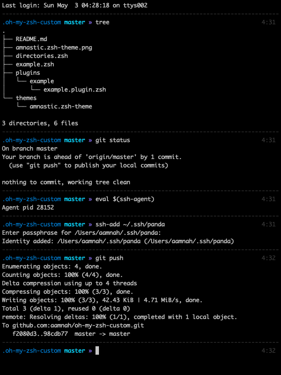

Now that Zsh is now the default shell on macOS, i figured it was a good time to install [oh-my-zsh](https://github.com/ohmyzsh/ohmyzsh) and give it another go. And obviously, i immediately wanted to customize my prompt. So i ended up going through the process of creating a custom Zsh theme..

I need a minimalist prompt with

- timestamp
- git branch name and status
- no username and hosts on local machine
- a line break at the beginning of prompt to give visual separation between commands
- no need for username and host. It's my laptop, i know what my name and host is.

Something like this:

```
--------------------------------------------------------------------------------
$ mysite.com (master)                                               Sat 2, 15:39


```

and i ended up with this



code is [here on Github](https://github.com/aamnah/oh-my-zsh-custom)

### Gameplan

set the theme to random

```bash
# ~/.zshrc
ZSH_THEME="random"
```

every time you like a prompt, run `echo $PROMPT` to get the prompt string value for the current theme and copy it. If you want to check the name of the theme, run `echo -e ${ZSH_THEME}`

I immediately liked [af-magic](https://github.com/ohmyzsh/ohmyzsh/blob/master/themes/af-magic.zsh-theme) when i came across it, it was similar to what i wanted so i based my custom theme on it

### Where do i put my theme?

Themes are located in a `themes` folder and must end with `.zsh-theme`. The basename of the file is the name of the theme.

```
zsh_custom
└── themes
    └── amnastic.zsh-theme
```

Then edit your `.zshrc` to use that theme.

```bash
ZSH_THEME="amnastic"
```

### Prompt and such

You can find all of these under the _Login information_ heading when you `man zshmisc`. Here's a quick cheatsheet

```
%n - username
%m - short name of curent host
%M - name of curent host
%# - a `%` or a `#`, depending on whether the shell is running as root or not
%~ - relative path
%/ or %d - absolute path
%c or %C - Trailing  component of the current working directory.
%t - time 12hr am/pm format
%T - time 24hr format
%w - day and date (day-dd)
%D - Date (default: yy-mm-dd)
%D{%f} - day of the month
%l or %y - The  line  (tty)  the  user is logged in on, without `/dev/' prefix.
```

You can check the value of any of these arguments with `-P` to the `print` command

```bash
print -P %n # aamnah
print -P %m # Serenity
print -P %M # Serenity.local

print -P %# # %
print -P '%(!.#.$)' # $

print -P %~ # ~/Documents
print -P %c # Documents
print -P %/ # /Users/aamnah/Documents

print -P %t # 8:44PM
print -P %T # 20:44
print -P %w # Sat 2
print -P %D # 20-05-02 yy-mm-dd
print -P %W # 05/02/20 mm/dd/yy
print -P %D{%f} # 2

print -P %l # s001
```

You can have a prompt to the right with `RPROMPT` or `RPS1`

```bash
RPROMPT=' %{$gray%}%T%{$reset_color%}'
```

### A splash of colors

You can use 256-colors if supported, which they are on macOS Cataline (what i am on right now). You can create an `if` block to set fallbacks. Use 256 color if available, or use these..

```bash
#use extended color palette if available
if [[ $terminfo[colors] -ge 256 ]]; then
    turquoise="%F{81}"
    orange="%F{166}"
    purple="%F{135}"
    hotpink="%F{161}"
    limegreen="%F{118}"
else
    turquoise="%F{cyan}"
    orange="%F{yellow}"
    purple="%F{magenta}"
    hotpink="%F{red}"
    limegreen="%F{green}"
fi
```

- Colors are represented as `%F{237}` or `%F{red}` or `$FG[237]` or `$fg[red]`. All are valid formats. The reset for the color value can change based on the format you use

  - `%F{237}` 256 color number
  - `%F{red}` 8 color name (black, red, green, yellow, blue, magenta, cyan, white)
  - `$FG[237]` (notice the `$` sign instead of `%`) 256 color number
  - `$fg[red]` (notice the `$` and lower case `fg`) 8 color name (black, red, green, yellow, blue, magenta, cyan, white)
  - `%{$fg_bold[blue]%}` bold variants

- `%F` is Foreground color, `$f` for resetting foreground color
- `%K` is bacKground color, `%k` for resetting background color
- `$reset_color` is a Zsh variable that resets the color of output
- You can use unicode for symbols
- `%E` Clear to end of line.
- `%U` `(%u)` to Start (stop) underline mode.

You can check out how a color looks with:

```bash
# change the value of 237 below to any one of 256-color
print -P '%F{237} %m %f'
```

### Git

You can use `$(git_prompt_info)` to show git branch and whether it is _dirty_ or not. It's a function that comes buit in with oh-my-zsh.

You can find all git functions in `~/.oh-my-zsh/lib/git.zsh`

```bash
$(git_prompt_info) # Outputs current branch info in prompt format
$(parse_git_dirty) # Checks if working tree is dirty
$(git_remote_status) # Gets the difference between the local and remote branches
$(git_current_branch) # Outputs the name of the current branch
$(git_commits_ahead) # Gets the number of commits ahead from remote
$(git_commits_behind) # Gets the number of commits behind remote
$(git_prompt_ahead) # Outputs if current branch is ahead of remote
$(git_prompt_behind) # Outputs if current branch is behind remote
$(git_prompt_remote) # Outputs if current branch exists on remote or not
$(git_prompt_short_sha) # Formats prompt string for current git commit short SHA
$(git_prompt_long_sha) # Formats prompt string for current git commit long SHA
$(git_prompt_status) # Get the status of the working tree
$(git_current_user_name) # Outputs the name of the current user
$(git_current_user_email) # Outputs the email of the current user
$(git_repo_name) # Output the name of the root directory of the git repository
```

`git_prompt_info` can further be customized with plenty of `ZSH_THEME_GIT_PROMPT_` variables that let you customize things like prefix and suffix and much more

```bash
ZSH_THEME_GIT_PROMPT_PREFIX="$FG[075]($FG[078]"
ZSH_THEME_GIT_PROMPT_CLEAN=""
ZSH_THEME_GIT_PROMPT_DIRTY="$my_orange*%{$reset_color%}"
ZSH_THEME_GIT_PROMPT_SUFFIX="$FG[075])%{$reset_color%}"

ZSH_THEME_GIT_PROMPT_ADDED="%{$fg[cyan]%} ✈"
ZSH_THEME_GIT_PROMPT_MODIFIED="%{$fg[yellow]%} ✭"
ZSH_THEME_GIT_PROMPT_DELETED="%{$fg[red]%} ✗"
ZSH_THEME_GIT_PROMPT_RENAMED="%{$fg[blue]%} ➦"
ZSH_THEME_GIT_PROMPT_UNMERGED="%{$fg[magenta]%} ✂"
ZSH_THEME_GIT_PROMPT_UNTRACKED="%{$fg[grey]%} ✱"
```

Here is a list of all the variables that you can use to customize `$(git_prompt_info)`

```bash
ZSH_THEME_GIT_COMMITS_AHEAD_PREFIX
ZSH_THEME_GIT_COMMITS_AHEAD_SUFFIX
ZSH_THEME_GIT_COMMITS_BEHIND_PREFIX
ZSH_THEME_GIT_COMMITS_BEHIND_SUFFIX
ZSH_THEME_GIT_PROMPT_ADDED
ZSH_THEME_GIT_PROMPT_AHEAD
ZSH_THEME_GIT_PROMPT_AHEAD_REMOTE
ZSH_THEME_GIT_PROMPT_AHEAD_REMOTE_COLOR
ZSH_THEME_GIT_PROMPT_BEHIND
ZSH_THEME_GIT_PROMPT_BEHIND_REMOTE
ZSH_THEME_GIT_PROMPT_BEHIND_REMOTE_COLOR
ZSH_THEME_GIT_PROMPT_CLEAN
ZSH_THEME_GIT_PROMPT_DELETED
ZSH_THEME_GIT_PROMPT_DIRTY
ZSH_THEME_GIT_PROMPT_DIVERGED
ZSH_THEME_GIT_PROMPT_DIVERGED_REMOTE
ZSH_THEME_GIT_PROMPT_EQUAL_REMOTE
ZSH_THEME_GIT_PROMPT_MODIFIED
ZSH_THEME_GIT_PROMPT_PREFIX
ZSH_THEME_GIT_PROMPT_REMOTE_EXISTS
ZSH_THEME_GIT_PROMPT_REMOTE_MISSING
ZSH_THEME_GIT_PROMPT_REMOTE_STATUS_DETAILED
ZSH_THEME_GIT_PROMPT_REMOTE_STATUS_PREFIX
ZSH_THEME_GIT_PROMPT_REMOTE_STATUS_SUFFIX
ZSH_THEME_GIT_PROMPT_RENAMED
ZSH_THEME_GIT_PROMPT_SHA_AFTER
ZSH_THEME_GIT_PROMPT_SHA_BEFORE
ZSH_THEME_GIT_PROMPT_STASHED
ZSH_THEME_GIT_PROMPT_SUFFIX
ZSH_THEME_GIT_PROMPT_UNMERGED
ZSH_THEME_GIT_PROMPT_UNTRACKED
```

### Single vs. Double Quotes

You need to set the prompt string with single quotes `' '`

```bash
PS1='%{$blue%}%c %{$purple%}%(!.#.») %{$reset_color%}'
```

above code will work just fine, whereas

```bash
PS1="%{$blue%}%c %{$purple%}%(!.#.») %{$reset_color%}"
```

will show proper syntax highlighting in code editor, but will [not update git when directory is changed](https://github.com/olivierverdier/zsh-git-prompt/issues/55). The double quotes make the variables in PROMPT to get evaluated when sourcing `.zshrc` and that's an issue.

That's a big issue to be honest, because it applies for not just the theme, it applies for _all files_ in the `custom/` folder. This gave me a hard time after having copied over code from my `.bash_aliases`. Some aliases there defined with double quotes made my git prompt stopped working again.

The following will cause issues

```bash
## Recursively delete `.DS_Store` files
alias cleanup="find . -type f -name '*.DS_Store' -ls -delete"

## Kill all the tabs in Chrome to free up memory
# [C] explained: http://www.commandlinefu.com/commands/view/402/exclude-grep-from-your-grepped-output-of-ps-alias-included-in-description
alias chromekill="ps ux | grep '[C]hrome Helper --type=renderer' | grep -v extension-process | tr -s ' ' | cut -d ' ' -f2 | xargs kill"
```

Had to flip the single and double arrangement: single quote outside, double quote inside

```bash
## Recursively delete `.DS_Store` files
alias cleanup='find . -type f -name "*.DS_Store$" -ls -delet'

## Kill all the tabs in Chrome to free up memory
# [C] explained: http://www.commandlinefu.com/commands/view/402/exclude-grep-from-your-grepped-output-of-ps-alias-included-in-description
alias chromekill='ps ux | grep "[C]hrome Helper --type=renderer" | grep -v extension-process | tr -s " " | cut -d " " -f2 | xargs kill'
```

## Links

- [Prompting](http://zsh.sourceforge.net/Intro/intro_14.html)
- [How to Customize Your Command Prompt](https://code.tutsplus.com/tutorials/how-to-customize-your-command-prompt--net-24083)
- [Prompt Expansion](http://zsh.sourceforge.net/Doc/Release/Prompt-Expansion.html)
- [Consistent terminal colors with 16-ANSI-color Vim themes](https://jeffkreeftmeijer.com/vim-16-color/)
- [Zsh: Available ZSH*THEME_GIT_PROMPT*\* variables](https://gist.github.com/vergenzt/33a45a9a9218b38bd4bf)
- [How do I create a zsh theme?](https://github.com/ohmyzsh/ohmyzsh/issues/6887)
- [Customization](https://github.com/ohmyzsh/ohmyzsh/wiki/Customization#overriding-and-adding-themes)
- [256 Colors](https://jonasjacek.github.io/colors/)
- [Zsh custom git prompt cheatsheet](https://gist.github.com/aamnah/b50b081a752f6e193f9202c2c445b740)
