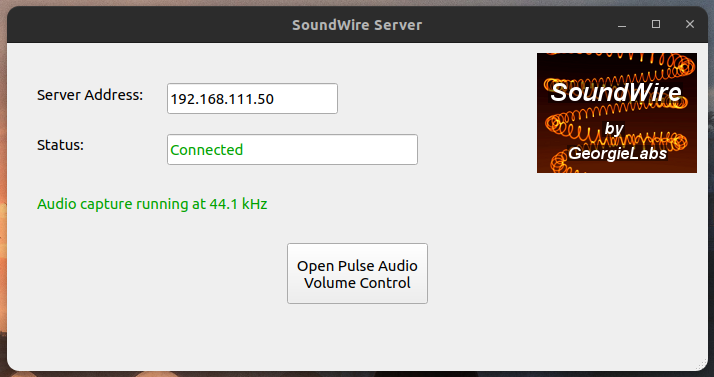

Why?
Because i have more Android phones lying around than speakers.. I am using an Android phone as a wireless speaker for my PC

SoundWire by GeorgieLabs is an audio streaming system that lets you stream audio between devices be it Windows/macOS/Linux PCs or Android phones. You need to install the _server_ on your PC from which you want to stream the audio, and the _client_ in my case was the android app.

- [SoundWire Audio server](https://georgielabs.net/) 
- [Android app](https://play.google.com/store/apps/details?id=com.georgie.SoundWireFree)


Download the appropriate Linux version of SoundWire Audio server for your machine (32 or 64 bit).

Download location: `~/Downloads`
Install location: `/opt/SoundWireServer/`

```bash
# Download and extract SwoundWire Server
wget https://georgielabs.net/SoundWire_Server_linux64.tar.gz -O ~/Downloads/SoundWireServer.tar.gz

tar xvf ~/Downloads/SoundWireServer.tar.gz
```

```bash
# Move to a place that is in PATH
sudo mv ~/Downloads/SoundWireServer /opt/
```

```bash
# install required dependencies
sudo apt-get install -y pavucontrol libportaudio2 libqt5widgets5
```

You can run the software directly from the command line by specifying the full path, or you can create a menu entry for it (instructions below) and start from there. 

```bash
# run
/opt/SoundWireServer 
```



### Create Desktop shortcut / Menu entry
A desktop shortcut file comes with the download. You need to update it to change the paths to the location of the executable and the icon for it. And move the file to the right location (Desktop entry files go in `/usr/share/applications`).

```bash
# create Desktop shortcut / Menu entry
mv /opt/SoundWireServer/SoundWire-Server.desktop /usr/share/applications 
```

Here are the contents of the `SoundWire-Server.desktop` file after updating the paths for the executable and the icon.

```bash
#!/usr/bin/env xdg-open
# SoundWire-Server.desktop

[Desktop Entry]
Name=SoundWire Server
Comment=Server program for SoundWire Android app

# Path should be set properly to find executable, or give full pathname here
Exec=/opt/SoundWireServer/SoundWireServer

# Place icon file in ~/.local/share/icons or similar, or give full pathname
Icon=/opt/SoundWireServer/sw-icon.xpm

# The following should match the executable basename
StartupWMClass=SoundWireServer

Terminal=false
Type=Application
Categories=AudioVideo;Audio;
```

```bash
#!/usr/bin/env xdg-open

[Desktop Entry]
Name=SoundWire Server
Comment=Server program for SoundWire Android app
Exec=/opt/SoundWireServer/SoundWireServer
Icon=/opt/SoundWireServer/sw-icon.xpm
StartupWMClass=SoundWireServer
Terminal=false
Type=Application
Categories=AudioVideo;Audio;
```

### Connecting with the Client
SoundWire server shows an IP address that you need to connect by entering it on the Android app. Both devices (the server and the client) need to be connected to the same WiFi network.