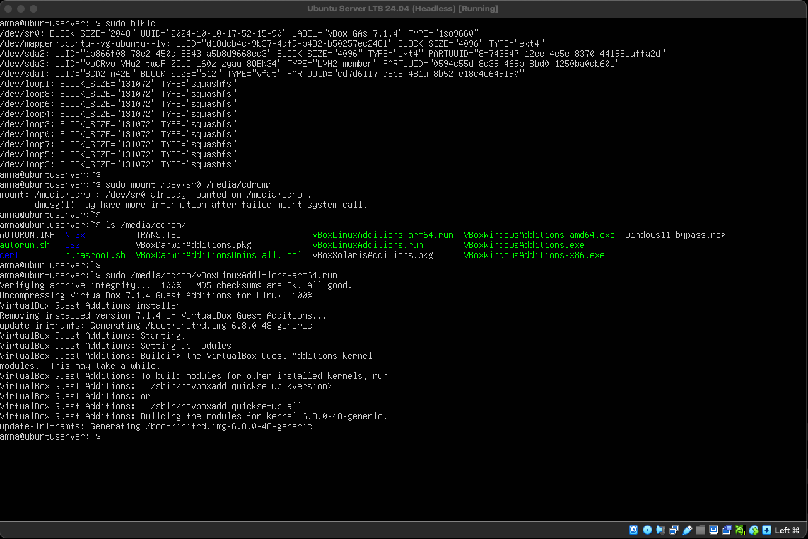

tl;dr

- You need to install VirtualBox Guest Additions (CD image provided) on the guest server in order for copy/paste to work
- However, it  does not work for Ubuntu Server without a GUI. Assumption is that it doesn't work because it needs to have an X server running for copy/paste to work
- Workaround: Install `openssh-server` on your guest instance and SSH into it. I personally prefer [`tailscale`](https://tailscale.com/)

If you wanted to install Guest Additions from the terminal, you can do so by mounting the CD image and running the `.run` script meant for your guest. For example, I have an Ubuntu server for ARM devices installed inside VirtualBox on my Apple Silicon Mac, i will run `sudo /media/cdrom/VBoxLinuxAdditions-arm64.run`

**Insert the CD image**: From the VirtualBox VM window menu select: _Devices > Insert Guest Additions CD image_...

```bash
# install dependencies
# DKMS is for Dynamic Kernel Module Support
sudo apt install dkms

# use `blkid` to identify CD-ROM device
# usually `/dev/sr0` - will have TYPE="iso9660"
sudo blkid

# mount the CD image
sudo mount /dev/sr0 /media/cdrom

# run the script
sudo /media/cdrom/VBoxLinuxAdditions-arm64.run

# reboot the guest
sudo reboot
```



Links
---

- [How do I install Guest Additions in a VirtualBox VM?](https://askubuntu.com/a/526203/897311)