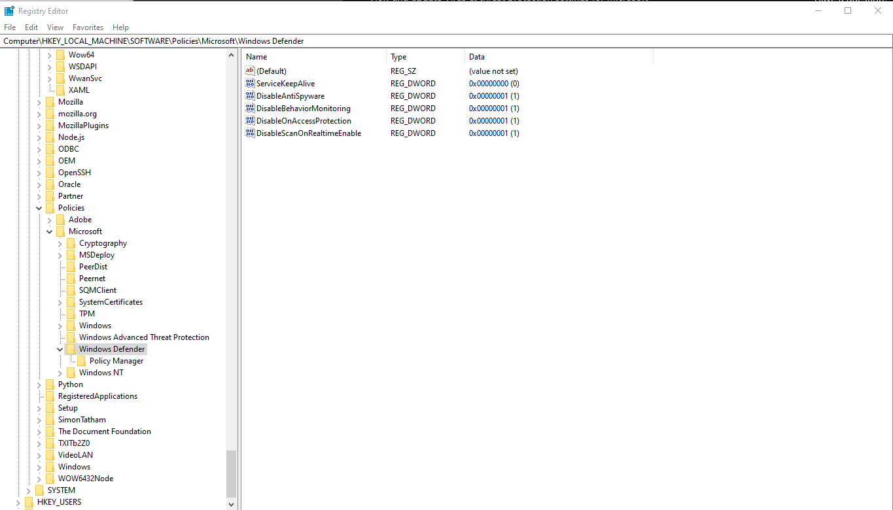

**tl;dr**
Open `regedit` as Administrator and add a bunch of hexadecmial values here: `Computer\HKEY_LOCAL_MACHINE\SOFTWARE\Policies\Microsoft\Windows Defender`

1. Open `regedit` (Registry Editor) from the start menu. I did it as an Administrator just to make sure it works
2. Go here: `Computer\HKEY_LOCAL_MACHINE\SOFTWARE\Policies\Microsoft\Windows Defender`
3. Right click on _Windows Defender_ and add the following as **DWORD (32-bit) Value**

| Value Name                  | Value Data | Base        |
| --------------------------- | ---------- | ----------- |
| DisableBehaviorMonitoring   | 1          | Hexadecimal |
| DisableOnAccessProtection   | 1          | Hexadecimal |
| DisableScanOnRealtimeEnable | 1          | Hexadecimal |

You may have to add a value and then double-click it again to set it's data.

