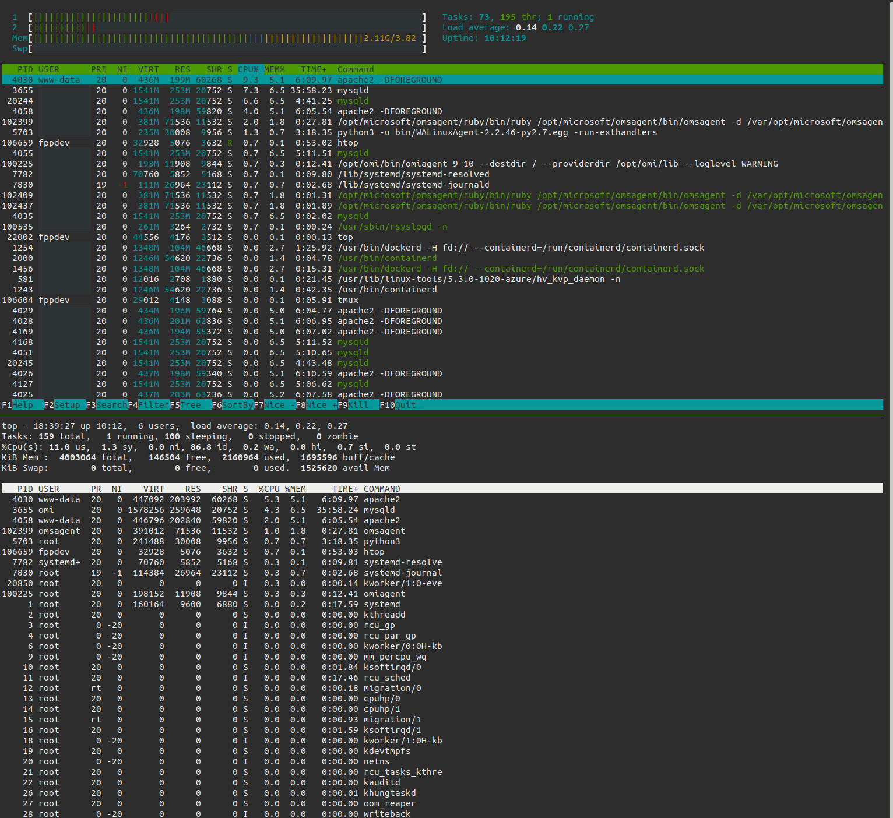

Basically, i'm looking for answers to these:

- Why did the server go down?
- What process was taking so many resources that the server crashed?

## CPU utilization history and logs with System Activity Reporter (SAR)

The `sar` command can give you CPU utilization history. It's a part of a software bundle called `sysstat` which you'll need to install on Debian/Ubuntu

```bash
# install
sudo apt install -y sysstat

# enable data collection
# Set ENABLED="true" in "/etc/default/sysstat"
sudo sed -i 's/ENABLED="false"/ENABLED="true"/g' /etc/default/sysstat

# change the collection interval from every 10 minutes to every 2 minutes.
sudo sed -i 's/5-55\/10/*\/2/g' /etc/cron.d/sysstat

# restart sysstat for the change to take effect and data collection to start working
sudo service sysstat restart


# check cpu utilization
sar
```

The logs are saved in `/var/log/sa/`

By default only activity of last 7 days are saved, to change it, please check:

```
/etc/sysconfig/sysstat
```

To check for example yesterday (05 October):

```bash
sar -P ALL -f /var/log/sa/sa05
```

You can script the above for configuring all new Ubuntu machines to have `sysstat` from the get go

```bash
sudo apt-get install sysstat -y
sudo sed -i 's/ENABLED="false"/ENABLED="true"/g' /etc/default/sysstat
sudo sed -i 's/5-55\/10/*\/2/g' /etc/cron.d/sysstat
sudo service sysstat restart
```

## Real-time CPU and memory usage

- `htop` and `top`. `htop` is definitely an improvement over `top`



## Links

- [manpage: sar](http://manpages.ubuntu.com/manpages/xenial/man1/sar.sysstat.1.html)
- [nixCraft: How do I Find Out Linux CPU Utilization?](https://www.cyberciti.biz/tips/how-do-i-find-out-linux-cpu-utilization.html)
- [Re: CPU utilization history](https://www.redhat.com/archives/redhat-list/2011-October/msg00010.html)
- [5 commands to check memory usage on Linux](https://www.binarytides.com/linux-command-check-memory-usage/)
- [sysstat on new machine provision](https://stackoverflow.com/a/61457940)
- [Munin](http://munin-monitoring.org/) and [Monit](https://mmonit.com/monit/)
