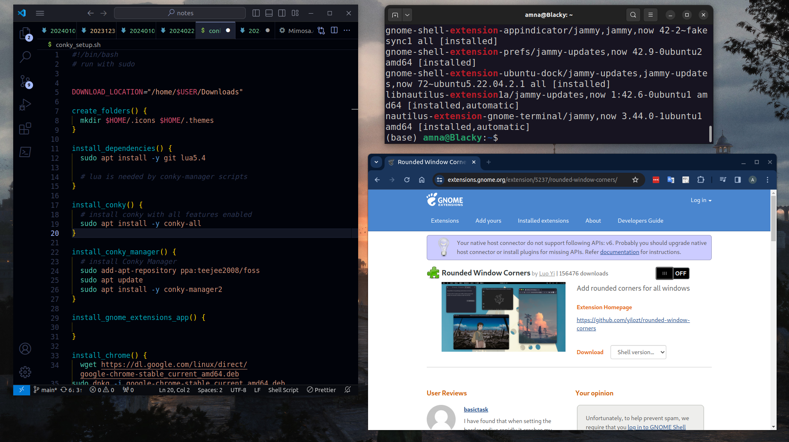
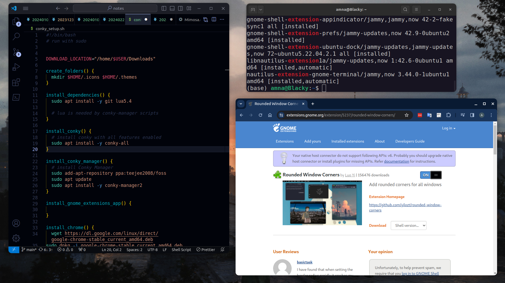

```bash
# install dependencies
# lua is needed by conky-manager scripts
sudo apt install -y git curl lua5.4

# install conky with all features enabled
sudo apt install conky-all

# install Conky Manager
sudo add-apt-repository ppa:teejee2008/foss
sudo apt update
sudo apt install -y conky-manager2

# install Lua
sudo apt install lua5.4

# Gnome Extensions and Tweaks
sudo apt install gnome-tweaks chrome-gnome-shell
```

mpd - Music Player Daemon
playerctl - utility to control media players via MPRIS
fc-cache - build font information cache files

```bash
# after installing fonts, run this command:
fc-cache -fv
```

## Extensions
Application Menu, User Theme, Blur my shell

Dash to dock, 

## Rounded window corners

Default Ubuntu theme has rounded top corners for most app windows. Third party apps like VS Code still have sharp corners without an border radius for app windows.

[mutter-rounded](https://github.com/yilozt/mutter-rounded) is a patched window manager that lets you add background blur and roundeed corners for Windows. It will [no longer be updated](https://github.com/yilozt/mutter-rounded/issues/103). The developer has moved to creating a [rounded corners GNOME extension](https://extensions.gnome.org/extension/5237/rounded-window-corners/) instead, which provided rounded corners but no blur.

You need to have Chrome installed in order to install GNOME extensions






Configuration file: ~/.conkyrc

Links
---

- [Conky](https://conky.cc/)
https://wiki.archlinux.org/title/conky
- [Rounded Window Corners by Luo Yi](https://extensions.gnome.org/extension/5237/rounded-window-corners/)