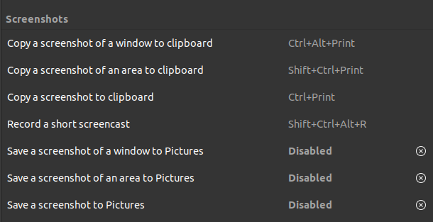
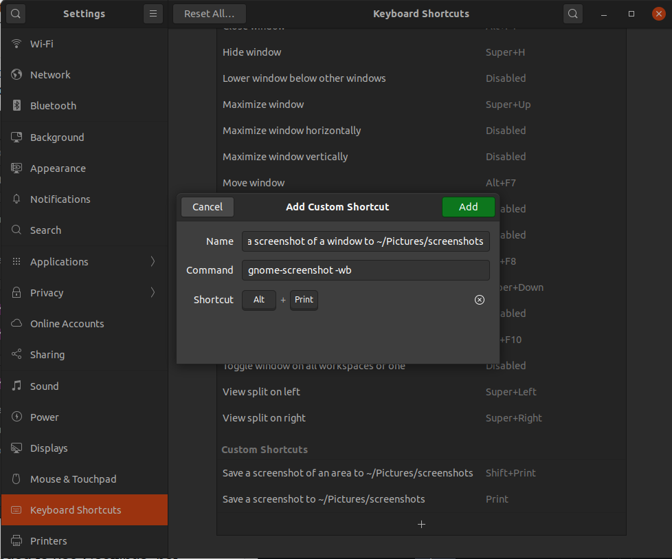
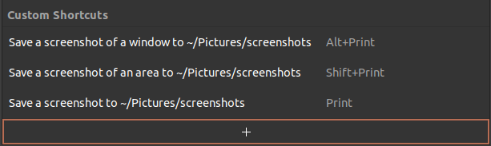

NOTE: Ubuntu 22.04 saves screenshots in `~/Pictures/Screenshots` by default. The new interactive utility that let's you specify the location when you save. If for some reason it is not saving in `~/Pictures/Screenshots` when you use the keyboard shortcuts, try using the GUI interface and save a screenshot to your desired location (the keyboard shortcuts appear to use the _last saved_ location)

**tl;dr**

```bash
# sudo apt install gnome-screenshot
gsettings set org.gnome.gnome-screenshot auto-save-directory "/home/aamnah/Pictures/Screenshots"
```

This will only work if you add a custom keyboard shortcut as well and use that to take the screenshots.

---

System settings are saved in the `dconf` configuration system, and you can either set them with `gsettings set` or `dconf write`. Updating `gsettings` (high-level configuration system ) is preferred over directly writing to `dconf` (back end). Alternatively, you can edit them in a GUI with `dconf-editor`.

You can update the `auto-save-directory` for `gnome-shortcut` with the `gsettings set org.gnome.gnome-screenshot auto-save-directory "/home/aamnah/Pictures/Screenshots"` command. But the setting no longer works in Gnome 3.8. It's a known bug considered as `RESOLVED WONTFIX` [ref](https://bugzilla.gnome.org/show_bug.cgi?id=699642). As a result of the bug, it still saves in `~/Pictures` folder even after updating the directory setting.

Just editing `dconf` values for `gnome-screenshot` won't work. There are two workarounds: Either create a custom keyboard shortcut that uses `gnome-screenshot` after setting the path in `dconf-editor`, or use `gnome-tweaks` with an extension called [Screenshot Locations](https://extensions.gnome.org/extension/1179/screenshot-locations/).

Below are details on how to update the `auto-save-directory` setting and how to create custom keyboard shortcuts

### Update path for save location

Run the following command in the Terminal

```bash
gsettings set org.gnome.gnome-screenshot auto-save-directory "/home/aamnah/Pictures/Screenshots"
```

Replace `/home/aamnah/Pictures/Screenshots` with your desired path.

The location needs to be an absolute path, i.e. `/home/YOUR_USERNAME/Pictures/Screenshots`. (Try adding `file://` at the beginning of the path if this doesn't work). Do NOT use environment variables like `$HOME` or `$USER` in the path, variable expansion doesn't work.

Logout and login again for the change to take effect.

Alternatively, you can use a GUI interface like `dconf-editor`

```bash
sudo apt install dconf-editor
```

Start dconf Editor. Go to **org / gnome / gnome-screenshot** and edit **auto-save-directory** and add your desired location. Follow the path rules mentioned above.

Logout and login again for the change to take effect.

### Add a custom keyboard shortcut

> You can use gnome-screenshot to save wherever you want, just create a custom keyboard shortcut for it in the keyboard settings panel.
> There won't be a configuration option to do this in gnome-settings-daemon, as it's already trivially possible to work-around this lack of configuration.
> [Bastien Nocera](https://bugzilla.gnome.org/show_bug.cgi?id=699642#c17)

meh.. So, create a custom keyboard shortcut, shall we?

Go to **Settings > Keyboard Shortcuts**, there will be an entire section for **Screenshots**. You can either override these or create new ones with different key bindings.. If you are overriding an existing key combination, make sure you have disabled it first by clicking on it and pressing `Backspace` (In Ubuntu 22.04 you don't have to worry about this. Adding an existing key binding again will disable the old one).



Scroll down to the bottom and click the `+` button



| Name                                                    | Command                  | Shortcut                          |
| ------------------------------------------------------- | ------------------------ | --------------------------------- |
| Save a screenshot of a window to ~/Pictures/Screenshots | `gnome-screenshot -w`    | <kbd>Alt</kbd>+<kbd>Print</kbd>   |
| Save a screenshot of an area to ~/Pictures/Screenshots  | `gnome-screenshot -a -p` | <kbd>Shift</kbd>+<kbd>Print</kbd> |
| Save a screenshot to ~/Pictures/Screenshots             | `gnome-screenshot`       | <kbd>Print</kbd>                  |

I also updated all names to say `~/Pictures/Screenshots` instead of `Pictures`.

To check what flags are available, run `gnome-screenshot --help`. Here are some common ones:

- `-a` or `--area` is for selecting an area of the screen
- `-w` or `--window` is for grabbing a window instead of an entire screen
- `-p` or `--include-pointer` is for including the pointer with the screenshot

Update: The `-b` option to include border (shown in the screenshot) is now deprecated. The border is always included now.



Re-login for the change in location to take effect.

## Links

- [CHAPTER 3. GSETTINGS AND DCONF](https://access.redhat.com/documentation/en-us/red_hat_enterprise_linux/7/html/desktop_migration_and_administration_guide/gsettings-dconf)
- [CHAPTER 9. CONFIGURING DESKTOP WITH GSETTINGS AND DCONF](https://access.redhat.com/documentation/en-us/red_hat_enterprise_linux/7/html/desktop_migration_and_administration_guide/configuration-overview-gsettings-dconf)
- [How can I specify the default save directory for gnome-screenshot?](https://askubuntu.com/questions/114429/how-can-i-specify-the-default-save-directory-for-gnome-screenshot)
- [Bug 699642 - Change Autosave Location](https://bugzilla.gnome.org/show_bug.cgi?id=699642)
- [How to install Gnome Shell Extensions on Ubuntu 20.04 Focal Fossa Linux Desktop](https://linuxconfig.org/how-to-install-gnome-shell-extensions-on-ubuntu-20-04-focal-fossa-linux-desktop)
