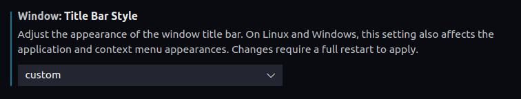

Changing the color is an excellent visual cue when you have multiple VS Code instances open and switch between them constantly. For me, having 3 VS code instances open is fairly common. One for my notes, one for the project i am coding in, one for something related to that project.

You can change the title bar to the brand color of the project. That way you can quickly differentiate between different client projects

```bash
mkdir .vscode/
touch .vscode/settings.json
```

Your `settings.json` would look like this

```json
{
  "workbench.colorCustomizations": {
    "titleBar.activeForeground": "#000",
    "titleBar.inactiveForeground": "#000000CC",
    "titleBar.activeBackground": "#FFC600",
    "titleBar.inactiveBackground": "#FFC600CC"
  }
}
```

Make sure you set `window.titleBarStyle` to `custom` in VS Code settings. By default the value is set to `native`.



```json
"window.titleBarStyle": "custom"
```