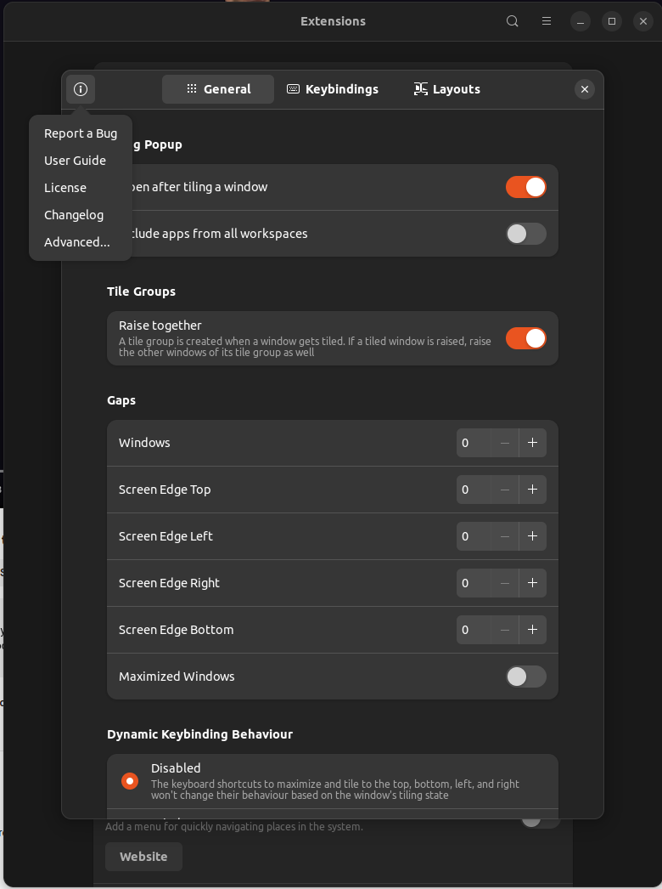
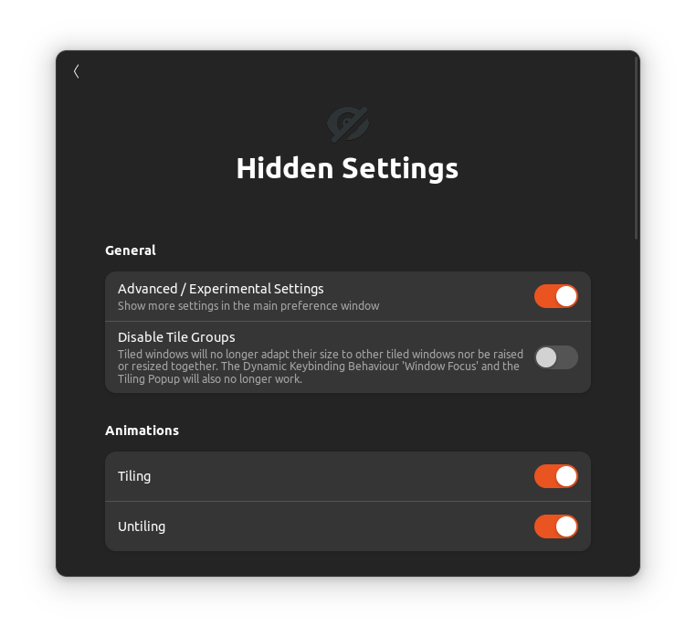
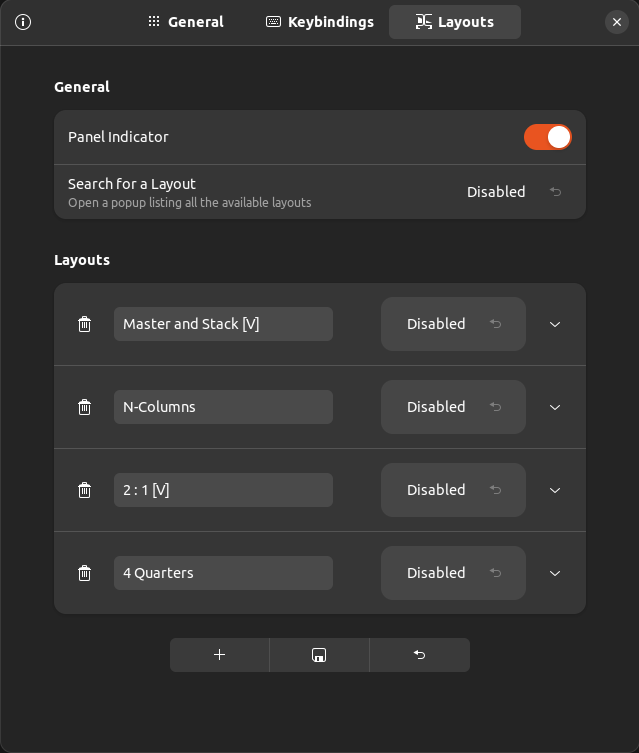

### Features

These are the features i want

- **Edge snapping** (i want to be able to drag windows to rearrange+resize them. that's faster for me than remembering different keyboard shortcut and is basically the same way on all operating systems: you drag, you drop.)
- **Quarters** (i have 4K screens, plenty of space for me to have 1/4 or 1/6 of the screen area and still have full view of the app)
- **Custom layouts** (i'd like creating my own custom layouts by defining and saving _zones_. Not everything needs to be a quarter of the screen..)

My top 3 tools for resizing and arranging windows are as follows (all of these are free):

### Windows - FancyZones

I LOVE [FancyZones](https://docs.microsoft.com/en-us/windows/powertoys/fancyzones) on Windows. It's part of the [Microsoft PowerToys](https://docs.microsoft.com/en-us/windows/powertoys/) package and is completely free to use. Simple, powerful and easily customizable. You can create your own customized layouts and every monitor can have it's own layout.

- [maxto](https://maxto.net/en) €29

### Ubuntu - Tiling Assistant

For my use case, i settled on [Tiling Assistant](https://github.com/Leleat/Tiling-Assistant) which is a GNOME extension and not an entirely new display manager. (Ubuntu uses GNOME by default). 

Tiling Assistant adds Windows like snap assist to GNOME. A [user guide](https://github.com/Leleat/Tiling-Assistant/blob/main/GUIDE.md) is available explaining mouse and keyboard based functionality 

[Tiling Assistant](https://github.com/Leleat/Tiling-Assistant) lets you split windows to quarter and lower/upper half. There are keyboard shortcuts, and edge snapping if you drag the window while pressing `Ctrl`

By default you get 8 zones (halves + quarters) accessible by keyboard shortcuts as well as edge snapping when dragging with mouse.

You can also setup _Layouts_ which is the linux equivalent of _Fancy Zones_.

Setting it up is more complicated than 

Find extension configurations under _Extensions_. The application is a GNOME _extension_ and not a standalone app.

Find layout configurations by clicking the _i_ icon in the top left of the Tiling Assistant settings window. From there click _Advanced_, and then enable _Advanced / Experimental Settings_. Now you should see a third settings tab called _Layouts_

Others:

- [x-tile](https://www.giuspen.com/x-tile/)
- [shelltile](https://github.com/emasab/shelltile) - no longer works with GNOME 40 on Ubuntu 22.04 

### macOS - Rectangle

[Rectangle](https://rectangleapp.com/) on macOS is a no-fuss tool that is free to use and has keyboard shortcuts

Others:

- [Amethyst](https://github.com/ianyh/Amethyst) free (Amethyst doesn't require scripting injection and therefore you don't have to disable System Integrity Protection on your Mac.)
- [yabai](https://github.com/koekeishiya/yabai) free
- [Tiles](https://www.sempliva.com/tiles/) free
- [divvy](https://mizage.com/divvy/) $14 available for Windows too
- [emmetapp](https://emmetapp.com/) $10
- [Magnet](https://magnet.crowdcafe.com/) $8

### Other cool stuff

- [DisplayFusion](https://www.displayfusion.com/)
- [barrier](https://github.com/debauchee/barrier) Open-source KVM software
