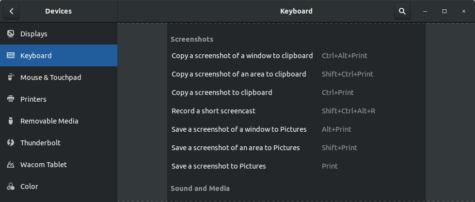

## macOS

### Screenshots

- `Cmd` + `Shift` + `3` capture the entire screen
- `Cmd` + `Shift` + `4` capture selected portion of the screen
- `Cmd` + `Shift` + `5` see all screenshot/screencast controls on screen
- `Cmd` + `Shift` + `6` capture the Touch Bar

- Files ares saved as `.png` on your `Desktop`

### Screencasts

- `Cmd` + `Shift` + `5`

## Ubuntu

### Screenshots

In Ubuntu 22.04 and GNOME 42 the default shortcuts for using the screenshots are:

- `Prt Scrn` to take a screenshot interactively
- `Alt` + `Prt Scrn` take a screenshot of current application window
- `Shift` + `Prt Scrn` to take a screenshot of entire screen (all monitors)

The images will be saved in your `~/Picture/Screenshots` folder.

Ubuntu 22.04 introduced a screenshot utility that allows you to take a screenshot interactively instead of taking a screenshot directly with the shortcuts. You can change this behaviour under _Settings > Keyboard > View and Customize Shortcuts > Screenshots_

You can also enable the old screenshot utility to save screen selections. You'll have to install `gnome-screenshot` and add a custom shortcut for the command `gnome-screenshot -a`. (The `-a` or `--area` option lets you grab an area of the screen instead of the entire screen). You should also then disable the interactive utility shortcut if needed

The old shortcuts used to be:

- `Prt Scrn` to take a screenshot of entire screen (all monitors)
- `Alt` + `Prt Scrn` take a screenshot of current application window
- `Shift` + `Prt Scrn` to take a screenshot of an area you select

And the images were be saved in the `~/Pictures` folder. Holding `Ctrl` with above shortcuts would copy to clipboard instead of saving images.
### Screencasts

- `Ctrl` + `Alt` + `Shift` + `R` start/stop recording your screen

The screencasts will be saved in your `~/Videos` folder.

## Windows

### Screenshots

- `Prt Scrn` - entire screen, copied to clipboard
- `Win` + `Prt Scrn` - entire screen, saved to _Pictures > Screenshots_
- `Alt` + `Prt Scrn` - active window, copied to clipboard
- `Win` + `Shift` + `S` - selected area, copied to clipboard

### Screencasts & Game bar

- `Win` + `G` - Game bar (will bother you most times asking if the app is a game)
- `Win` + `Alt` + `Prt Scrn` - take screenshot
- `Win` + `Alt` + `R` - sart/stop recording

Recordings are saved in _Username > Videos > Captures_ in MP4 format. Screenshots are saved in PNG

## Links

- [macOS: How to take a screenshot on your Mac](https://support.apple.com/en-us/HT201361)
- [Ubutu Docs: Screenshots and screencasts](https://help.ubuntu.com/stable/ubuntu-help/screen-shot-record.html)
- [How to use Windows 10's Game bar to record a game or even your screen](https://www.polygon.com/2015/7/31/9081715/windows-10-game-bar-how-to-record-screen-video)
